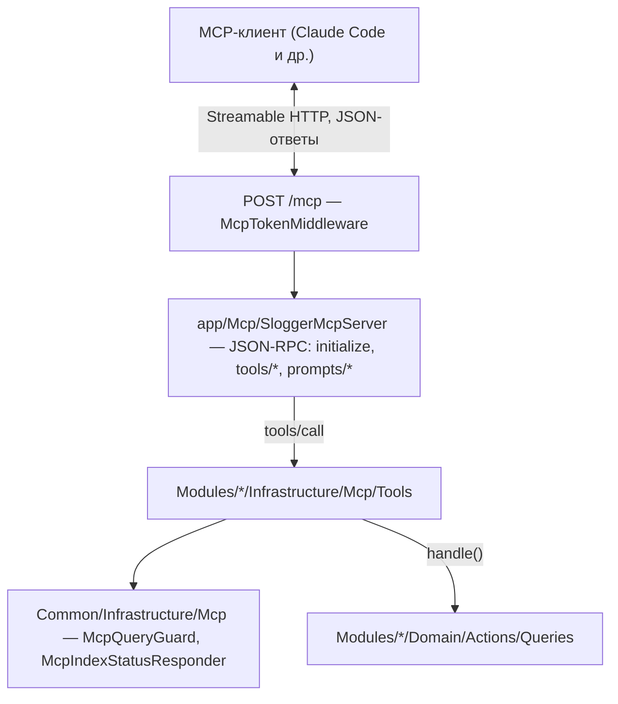

# План: MCP-сервер SLogger

Сверено с кодом ветки `master` (после слияния `feature/logs-view-files`): `app/Modules/Trace/**`,
`app/Modules/Watcher/Domain/Actions/**`, `app/Modules/Service/Domain/Actions/**`,
`app/Modules/Auth/**`, `app/Modules/User/Repositories/**`, `app/Modules/Service/Repositories/**`,
`routes/admin-api.php`,
`config/module-trace.php`, `config/module-logs.php`, `code-analyse/deptrac-layers.yaml`,
`servers/receiver/internal/services/trace_sharding_service/service.go`,
`frontend/src/utils/router.ts`.

## Цель

SLogger отдаёт свои данные LLM-клиентам (Claude Code, Claude Desktop, Cursor и т. п.) по
протоколу MCP. Пользователь подключает сервер к своему клиенту и спрашивает в свободной
форме: «проанализируй, почему у сервиса 1 иногда падают API-запросы». Модель, цикл агента,
чат и оплата токенов — на стороне клиента. SLogger даёт инструменты, инструкции и шаблоны
сценариев.

Встроенный ИИ в интерфейсе SLogger в этот план не входит. Слой инструментов делается так,
чтобы его потом можно было переиспользовать во встроенном агенте.

## Жёсткие ограничения

- Все инструменты только читают. Никаких удалений, закрытия инцидентов, изменения
  смотрителей и индексов.
- Единственный допустимый побочный эффект — тот же, что при работе в UI: построение
  динамического индекса и кэша дерева трейса. Оба ограничены (см. «Защита от дорогих
  запросов»).
- Каждый запрос к трейсам требует сервис и период. Запроса без периода не бывает.
- Инструкции для модели — рекомендация. Всё, что влияет на нагрузку, проверяется в коде.

## Как устроены трейсы и индексы

От этого зависит дизайн инструментов.

- Трейсы лежат в почасовых коллекциях `traces_Y_m_d_HH_HH`. Имя строит
  `TraceShardingService::makeCollNameByDate` в receiver, в UTC.
- Список коллекций периода выбирает `PeriodicTraceCollectionNameService::filterCollectionNamesByPeriod`.
  Без `from` и `to` возвращаются все коллекции.
- Перед запросом к трейсам вызывается `TraceDynamicIndexInitializer::init`. Его зовут
  `FindTracesAction`, `FindTraceIdsAction`, `FindTypesAction`, `FindTagsAction`,
  `FindStatusesAction`, `FindTraceTimestampsAction`.
- Индекс определяется набором полей фильтра и набором коллекций периода:
  `TraceDynamicIndexRepository::findOneOrCreate`, имя `dyn_{fields}_{collections}`.
  Поля: `sid`, `tss.<step>`, `tid`, `lat`, `tp`, `tgs.nm`, `st`, `dur`, `mem`, `cpu`,
  `hpr`, `cl` и поля фильтра по `data`.
- Пока индекс строится, `init` бросает `TraceDynamicIndexInProcessException` с `indexId`.
  Строит индекс фон (`BuildPendingTraceDynamicIndexesAction`), UI ждёт broadcast.
- Индекс живёт 12 часов (`TraceDynamicIndexInitializer::$timeLifeIndexInHours`).
- `tags` вместе с фильтром по `data` запрещены: `TraceDynamicIndexParallelArraysException`.
- `FindTraceTimestampsAction` добавляет в индекс `tss.<step>`: разный шаг — разный индекс.
- `FindTracesAction` отдаёт не больше 20 трейсов на страницу.
- `FindTraceTreeAction` при первом открытии дерева (`state === null`) запускает построение
  кэша через событие `TraceTreeCacheDeleteRequestedEvent` и возвращает состояние без узлов.
  Больше `module-trace.tree.full_load_limit` узлов дерево не отдаётся целиком, только
  ветками через `FindTraceTreeChildrenAction`.

Что из этого следует для агента:

- Стоимость запроса — примерно число новых комбинаций полей × число часов периода.
  7 дней × 5 комбинаций = 840 построений индекса.
- Период, который не выровнен по часу и сдвигается между вызовами, может задеть другой
  набор коллекций и потребовать новый индекс. Выравнивание по часу даёт переиспользование.
- Типичная стратегия модели «добавлю ещё фильтр» здесь дорогая. Выгоднее выбрать набор
  полей один раз и менять только значения.
- Ответ «индекс строится» модель склонна воспринять как повод переформулировать запрос,
  что запускает ещё один индекс. Инструмент должен ждать сам и явно говорить «повтори тот
  же вызов».

Модуль Logs читает логи самого SLogger (Laravel, nginx, receiver) по `module-logs.sources`,
а не логи сервисов клиентов. Для расследований по сервисам он не нужен, только для
вопросов о работе самого SLogger.

## Архитектура



### Размещение кода

- Каждый модуль держит свои инструменты у себя: `app/Modules/<Module>/Infrastructure/Mcp/Tools/*Tool.php`.
  Инструмент — адаптер уровня контроллера: проверяет аргументы, собирает `Parameters`,
  вызывает Action, превращает результат в компактный ответ. Слой `Infrastructure`, правила
  Deptrac те же, что для контроллеров, новых межмодульных связей нет.
- Общие части MCP — в `app/Modules/Common/Infrastructure/Mcp/`: интерфейс инструмента,
  описание схемы аргументов, результат вызова, ошибки, `McpQueryGuard`, `McpIndexStatusResponder`.
- Сервер, реестр инструментов и промптов, инструкции — в `app/Mcp/`. Он собирает
  инструменты всех модулей, поэтому живёт вне `app/Modules`, как `app/Http`. Deptrac
  `app/Mcp` не проверяет (`paths` — только `app/Modules` и `app/Models`).
- Маршрут — `routes/mcp.php`, подключается в `bootstrap/app.php` рядом с `admin-api.php`.
- Подключения и их токены — модуль `app/Modules/Mcp`, см. «Авторизация».

### Своя реализация протокола

Решение: пишем своё, без `laravel/mcp` и сторонних SDK. Нужная часть протокола небольшая,
и так мы полностью контролируем поведение под sconcur.

Транспорт — Streamable HTTP без SSE:

- `POST /mcp` — одно JSON-RPC 2.0 сообщение в теле. Ответ — `application/json`.
- Запрос (есть `id`) — ответ `200` с `result` или `error`.
- Уведомление (нет `id`, например `notifications/initialized`) — `202` без тела.
- `GET /mcp` — `405`: поток сервер → клиент не поддерживаем.
- `DELETE /mcp` — `405`: сессий нет.
- Заголовок `Mcp-Session-Id` не выдаём. Каждый запрос самодостаточен, состояния между
  запросами нет.
- Заголовок `MCP-Protocol-Version` читаем. Неподдерживаемая версия — `400`.
- Массив сообщений (batch) — ошибка `-32600`.

Методы:

| Метод | Что делает |
|---|---|
| `initialize` | согласует версию протокола, отдаёт `serverInfo`, `capabilities` (`tools`, `prompts`) и `instructions` |
| `notifications/initialized` | ничего, `202` |
| `ping` | пустой `result` |
| `tools/list` | инструменты: `name`, `title`, `description`, `inputSchema`, `annotations.readOnlyHint: true` |
| `tools/call` | проверка аргументов по схеме, вызов инструмента, `result.content` (text с JSON) и `result.structuredContent`, `isError` для ошибок инструмента |
| `prompts/list`, `prompts/get` | промпты и их аргументы |

Версия протокола: поддерживаем актуальную на момент реализации ревизию спецификации MCP,
на `initialize` с другой версией отвечаем своей, как требует спецификация. Точную ревизию и
формат полей сверить со спецификацией в фазе 0.

Ошибки разделены на два вида:

- Ошибки протокола — JSON-RPC `error`: `-32700` не разобран JSON, `-32600` неверный запрос,
  `-32601` неизвестный метод, `-32602` неверные параметры (в том числе неизвестный
  инструмент или аргументы не по схеме), `-32603` внутренняя ошибка.
- Ошибки инструмента — `result` с `isError: true` и текстом для модели: период слишком
  широкий, индекс в ошибке, трейс не найден и т. п. Модель их видит и может исправиться.

Классы в `app/Mcp`:

- `SloggerMcpController` — принимает HTTP, отдаёт JSON или `202`.
- `McpMessageParser` — тело → объект запроса или уведомления, ошибки `-32700`/`-32600`.
- `SloggerMcpServer` — диспетчер методов.
- `McpToolRegistry`, `McpPromptRegistry` — списки инструментов и промптов, собираются в
  `McpServiceProvider` из модулей.
- `McpArgumentsValidator` — проверка аргументов по `inputSchema` через Laravel Validator:
  схема инструмента описывается один раз объектами, из них строятся и JSON Schema для
  `tools/list`, и правила валидации.
- `instructions.md` — инструкции сервера.

Интерфейс инструмента — в `Common/Infrastructure/Mcp`: имя, заголовок, описание, схема
аргументов, `call(McpToolArguments $arguments): McpToolResult`.

## Авторизация

Сейчас `AuthMiddleware` принимает Bearer-токен сессии из `user_tokens`
(`UserTokenRepository::findUserIdByToken`). У токена скользящий срок `expires_at`, его
продлевает `touch` в `terminate`. Для MCP такой токен не годится: он истекает при простое
и выдаётся логином.

MCP-подключение — отдельная сущность со статическим токеном, по образцу сервисов
(`services.api_token`, `Str::random(50)` в `ServiceRepository`). К пользователю не
привязано: ролей нет, любой пользователь видит всё (комментарий в `routes/channels.php`),
так что привязка ничего бы не ограничила. Модули `Auth` и `User` не меняются.

### Таблица `mcps` (MySQL)

| Колонка | Тип | Что это |
|---|---|---|
| `id` | bigint, PK | |
| `name` | string | подпись в UI: «Claude Code — Вася», «CI-агент» |
| `token` | string, unique | токен открытым текстом, 50 символов |
| `enabled` | boolean | выключенное подключение получает `401` |
| `last_used_at` | timestamp, nullable | когда подключением пользовались последний раз |
| `created_at`, `updated_at` | timestamp | |

Токен хранится открытым текстом, как `services.api_token`: UI показывает его и готовую
команду подключения в любой момент. Цена — токены видны в дампе базы, как и токены сервисов.

### Модуль `app/Modules/Mcp`

- Модель `App\Models\Mcps\Mcp`, фабрика.
- `Repositories/McpRepository`: `create`, `find`, `findOneById`, `findOneByToken`, `update`
  (имя, `enabled`), `updateToken`, `touch` (`last_used_at`), `delete`. Токен генерирует
  Action и передаёт в репозиторий, репозиторий сам его не придумывает.
- `Repositories/Dto/McpDto`, `Entities/McpObject`.
- `Domain/Actions/Mutations`: `CreateMcpAction`, `UpdateMcpAction`, `RegenerateMcpTokenAction`,
  `DeleteMcpAction`, `TouchMcpAction` (не чаще раза в минуту: сравнивает с `last_used_at`).
- `Domain/Actions/Queries`: `FindMcpsAction`, `FindMcpAction`, `FindMcpByTokenAction`
  (только `enabled`).
- `Infrastructure/Http/Middlewares/McpTokenMiddleware`: Bearer-токен →
  `FindMcpByTokenAction`, нет или выключено — `401`. Кладёт `McpObject` в атрибуты запроса,
  `TouchMcpAction` вызывает в `terminate`, как `AuthMiddleware`.
- `Infrastructure/Http/Controllers/McpController`, запросы, ресурсы — admin API.
- `Infrastructure/McpServiceProvider` (регистрация в `ModulesConfig`).

Сервер протокола остаётся в `app/Mcp`, а не в модуле: он собирает инструменты всех
модулей. Модуль `Mcp` отвечает только за подключения.

`SloggerMcpController` берёт `McpObject` из атрибутов запроса и передаёт его id в контекст
вызова инструмента (`McpCallContext` в `Common/Infrastructure/Mcp`). По этому id считается
бюджет индексов.

### Admin API

Под `AuthMiddleware`, как остальной `routes/admin-api.php`:

| Маршрут | Что делает |
|---|---|
| `GET /mcps` | список: имя, токен, `enabled`, `last_used_at` |
| `POST /mcps` | создать: `name` (`string`, `min:1`, `max:255`) |
| `GET /mcps/{id}` | одно подключение |
| `PATCH /mcps/{id}` | изменить `name`, `enabled` |
| `PATCH /mcps/{id}/token` | перевыпустить токен, старый сразу перестаёт работать |
| `DELETE /mcps/{id}` | удалить |

После — `make oa-generate`.

### Фронт

Страница `/mcps` и пункт в шапке:

- таблица подключений: имя, переключатель `enabled`, `last_used_at`, действия;
- создание, переименование, удаление с подтверждением;
- токен с кнопкой копирования и готовая команда подключения, тоже с копированием. Имя
  сервера в команде берётся из `mcp.server_name` (см. «Несколько серверов SLogger»):

  ```bash
  claude mcp add --transport http --scope user slogger-<server_name> <APP_URL>/mcp \
    --header "Authorization: Bearer <token>"
  ```

- рядом вариант для `.mcp.json` проекта, где токен берётся из переменной окружения;
- перевыпуск токена с подтверждением: подключённые клиенты перестанут работать.

Команду и JSON строит бэкенд: ресурс подключения отдаёт `server_name` и `endpoint_url`, фронт
только подставляет их в шаблон.

OAuth 2.1, который нужен коннекторам claude.ai, в план не входит (см. «Вне плана»).

## Несколько серверов SLogger

Обычно у команды несколько инсталляций: `local`, `dev`, `stand`, `prod`. У каждой свои
сервисы, трейсы, id, индексы и свои подключения `mcps`. В клиенте это разные MCP-серверы, и
пользователь может подключить сразу несколько.

### Имя инсталляции

- `config/mcp.php` → `server_name`, из `MCP_SERVER_NAME`, по умолчанию `APP_ENV`.
  Формат `^[a-z0-9-]{1,32}$`: имя попадает в имя MCP-сервера в клиенте, а Claude Code
  строит из него имена инструментов вида `mcp__slogger-prod__find_traces`.
  Неверный формат — исключение при старте, а не молчаливая замена.
- `initialize` отдаёт `serverInfo.name = "slogger-<server_name>"` и `serverInfo.title`
  вида `SLogger (prod)`.
- Имя подставляется в команду подключения на странице `/mcps`, так что у каждой инсталляции
  своя команда и имена серверов в клиенте не пересекаются.
- Имя показывается в шапке UI рядом с логотипом: пользователь видит, с какой инсталляции
  копирует команду. Если в шапке уже есть признак окружения — используем его.

### Что говорим модели

Инструкции сервера начинаются с блока, в который подставляются имя и адрес инсталляции:

```
This is the SLogger installation "<server_name>" at <APP_URL>.
Several SLogger installations (for example local, dev, stand, prod) may be
connected at the same time as separate MCP servers. They do not share data:
service ids, trace ids, incidents and indexes of one installation mean nothing
in another.
- Use the installation the user names. If the user does not name one and more
  than one is connected, ask which one before querying.
- Never combine ids from different installations in one call.
- In the answer, say which installation every finding comes from.
```

Каждый ответ инструмента несёт поле `installation` с `server_name`. Это страхует от
смешения, когда модель в одном разговоре ходит в два сервера: трейс из ответа всегда
подписан.

### Лимиты по инсталляциям

Лимиты в `config/mcp.php` читаются из env, чтобы на `prod` их можно было сделать строже,
чем на `local`, без правки кода: `MCP_INDEX_BUDGET_PER_HOUR`,
`MCP_MAX_PERIOD_HOURS_*`. `MCP_ENABLED=false` выключает MCP на инсталляции целиком.

## Защита от дорогих запросов

`McpQueryGuard` вызывается каждым трейсовым инструментом до Action'а.

- Сервис обязателен. Проверяется, что он существует (`FindServicesAction`).
- Период обязателен. `from` округляется вниз до часа, `to` вверх до часа (UTC). Скользящие
  окна от модели превращаются в стабильные наборы коллекций.
- Максимальная длина периода — по инструменту (таблица ниже), значения в `config/mcp.php`.
- Запрет `tags` вместе с фильтром по `data` проверяется до Action'а с понятной ошибкой.
- Бюджет новых индексов: не больше `mcp.index_budget_per_hour` новых индексов на одно
  подключение `mcps` в час, счётчик в Redis по id подключения. Считаются только индексы, которых ещё нет. Для этого
  нужен метод репозитория, который по `TraceDynamicIndexDataDto` вычисляет имя индекса и
  проверяет, есть ли он, не создавая его. Сейчас имя вычисляется внутри `findOneOrCreate`,
  вычисление выносится в отдельный метод.

Ошибки защиты возвращаются как результат инструмента с `isError: true` и текстом, который
объясняет модели, что сделать:

```json
{"error":"period_too_wide","max_hours":24,
 "hint":"Find the anomalous window with trace_timeseries first, then query at most 24 hours."}
```

### Ожидание индекса

Сервер не ждёт. Индекс строит фон (`BuildPendingTraceDynamicIndexesAction`), инструмент
сразу отвечает статусом, а опрашивает готовность агент. Запрос не держится открытым, в
Fiber нет `sleep`, дедлайн обработчика не важен. Пока индекс строится, агент может делать
другое: смотреть инциденты, разбирать уже найденные трейсы.

`McpIndexStatusResponder` (`Common/Infrastructure/Mcp`) оборачивает вызов Action'а:

1. Вызывает Action.
2. `TraceDynamicIndexInProcessException` — сразу возвращает статус (не `isError`):

   ```json
   {"status":"index_building","index_id":"…","progress":0.4,"retry_after_seconds":20,
    "hint":"Call get_index_status with this index_id until it is ready, then repeat the SAME call. Changing filters or period starts another index."}
   ```

3. `TraceDynamicIndexErrorException` и `TraceDynamicIndexNotInitException` — ошибка
   инструмента с текстом.

`retry_after_seconds` — оценка: по прогрессу и числу коллекций индекса, не меньше 10 и не
больше 60 секунд. Модель её не обязана соблюдать, это подсказка.

#### Инструмент `get_index_status`

| Аргументы | Источник | Ответ |
|---|---|---|
| `index_id` | `FindTraceDynamicIndexAction`, прогресс — `FindTraceDynamicIndexStatsAction` | `building` с `progress` и `retry_after_seconds`, `ready`, `error` с текстом, `not_found` (индекс удалён или истёк) |

- Сам индексов не строит и в бюджет индексов не входит: это чтение одного документа.
- Прогресс: `TraceDynamicIndexStatsObject::$indexesInProcess` — это `TraceIndexInfoObject`
  (`collectionName`, `name`, `progress`) из `currentOp` MongoDB, по одной записи на
  коллекцию, где индекс строится сейчас. Прогресс индекса собирается из записей с его
  `name` и числа его `collectionNames`. Формулу уточнить в фазе 2. Если записей нет, а
  индекс не готов (ещё в очереди) — `progress: null`.
- Частые опросы не ограничиваем: ответ крошечный, а каждый вызов — ход модели, то есть
  несколько секунд сам по себе.

#### Дерево трейса

Для дерева отдельного инструмента статуса нет: повторный `get_trace_tree` с тем же
`trace_id` дешёвый. `FindTraceTreeAction` с `fresh: false` при существующем состоянии не
запускает построение заново, а возвращает состояние.

- `InProcess` — `{"status":"tree_building","retry_after_seconds":10,"hint":"Repeat the same get_trace_tree call later."}`.
- `Finished` — узлы (или верхние узлы и ветки, если дерево большое).
- `Failed`, `Canceled` — ошибка инструмента с текстом. Перестраивать (`fresh: true`) MCP
  не может: это решение пользователя в UI.

#### Асинхронные задачи MCP

В спецификации MCP есть экспериментальные задачи (tasks) для долгих вызовов. Не используем:
поддержку в клиентах не проверяли, а обычный ответ со статусом работает в любом клиенте.

## Инструменты

Имена в snake_case: их видит модель. Все ответы — компактный JSON: только нужные поля,
длинные строки обрезаны до `mcp.max_string_length` с пометкой, что значение обрезано.
Исключение — `get_trace_data`: `data` отдаётся как есть. Время — ISO 8601 UTC.

### Уровень 0 — без динамических индексов

| Инструмент | Аргументы | Источник | Ответ |
|---|---|---|---|
| `list_services` | `query?` | `Service\Domain\Actions\FindServicesAction` | `id`, `name` |
| `get_data_range` | — | `PeriodicTraceService` → список коллекций `traces_*` (новый Action `FindTraceDataRangeAction`) | первый и последний час, за которые есть трейсы |
| `list_incidents` | `service_id?`, `status?`, `type?`, `limit` | `Watcher\Domain\Actions\Queries\FindIncidentsAction` | инцидент, смотритель, тип, открыт/закрыт, время |
| `get_incident_events` | `incident_id`, `limit` | `FindIncidentAction`, `FindIncidentEventsAction` | события с числами по типу смотрителя |
| `list_dynamic_indexes` | — | `Trace\Domain\Actions\Queries\FindTraceDynamicIndexesAction` | поля, период (первая и последняя коллекция), статус, `actual_until_at` |
| `get_index_status` | `index_id` | `FindTraceDynamicIndexAction`, `FindTraceDynamicIndexStatsAction` | `building`, `ready`, `error`, `not_found` (см. «Ожидание индекса») |

`list_incidents` фильтрует по сервису через `trace_match.service_ids` смотрителя. Проверить,
умеет ли это `FindIncidentsAction`. Если нет — фильтр делается в инструменте или добавляется
параметр.

### Уровень 1 — обзор, один индекс на комбинацию

| Инструмент | Аргументы | Источник | Макс. период |
|---|---|---|---|
| `trace_facets` | `service_id`, `from`, `to`, `types?`, `statuses?` | `FindTypesAction`, `FindStatusesAction`, `FindTagsAction` | 7 дней |
| `trace_timeseries` | `service_id`, `period` (enum), `to?`, `step?`, `fields?`, `types?`, `statuses?`, `tags?`, `duration_from?`, `duration_to?` | `FindTraceTimestampsAction` | 7 дней |

- `trace_facets` возвращает три списка `{value, count}`, отсортированных по количеству,
  не больше `mcp.facets_limit` элементов в каждом.
- `trace_timeseries`: `period` — значения `TraceTimestampPeriodEnum` до `7 days`. `step` по
  умолчанию подбирается так, чтобы точек было не больше 100: `1 hour` → `min`, `1 day` →
  `min30`, `7 days` → `h4` (таблица в `McpQueryGuard`). Модель может задать шаг сама, но
  не мельче, чем даёт 100 точек. Агрегаты: `count` (sum), `duration` (avg, p50, p95, p99).
  `memory` и `cpu` — только по запросу.
- Ответ `trace_timeseries` — точки без нулевых интервалов и сводка: всего, максимум, в какой
  точке максимум. Сводку модель читает первой.

### Уровень 2 — выборки, узкий период

| Инструмент | Аргументы | Источник | Макс. период |
|---|---|---|---|
| `find_traces` | `service_id`, `from`, `to`, `types?`, `statuses?`, `tags?`, `duration_from?`, `duration_to?`, `data_filter?`, `data_fields?`, `page` | `FindTracesAction` | 24 часа |
| `list_trace_data_fields` | `service_id`, `type`, `from`, `to` | новый Action | 24 часа |

- `find_traces` отдаёт на трейс: `trace_id`, `parent_trace_id`, `type`, `status`, `tags`,
  `duration`, `logged_at`, `has_profiling`, значения `data_fields`. Страница до 20
  (ограничение самого Action'а), `has_more` по полной странице.
- `data_filter` — подмножество `TraceDataFilterParameters`: поле и одно условие
  (numeric/string/boolean/exists/null). Не больше 3 полей, чтобы не плодить индексы.
- `list_trace_data_fields`: берёт до 20 трейсов типа через `FindTracesAction` и собирает
  плоский список ключей `data` с примером значения. Без него модель угадывает имена полей.

### Уровень 3 — один трейс, без динамических индексов

| Инструмент | Аргументы | Источник |
|---|---|---|
| `get_trace` | `trace_id` | `FindTraceDetailAction` |
| `get_trace_data` | `trace_id` | `FindTraceDetailAction` |
| `get_trace_tree` | `trace_id`, `parent_trace_id?`, `cursor?` | `FindTraceTreeAction` (`fresh: false`), `FindTraceTreeChildrenAction` |
| `find_in_trace_tree` | `trace_id`, фильтр | `FindTraceTreeFilteredAction` |
| `get_trace_profiling` | `trace_id` | `FindTraceProfilingAction` |

- `get_trace` возвращает всё, что отдаёт `TraceDetailResource`, кроме `data`: сервис,
  `trace_id`, `parent_trace_id`, `type`, `status`, `tags`, `duration`, `memory`, `cpu`,
  `has_profiling`, время.
- `get_trace_data` возвращает `data` трейса так же, как его получает клиент в
  `TraceDetailResource` → `TraceDataResource`: без маскирования и без обрезки. Отдельный
  инструмент, чтобы модель запрашивала `data` только у трейсов, которые разбирает, а не
  получала его с каждой деталью. Формат ответа строится тем же маппингом, что и
  `TraceDataResource`, чтобы модель и UI видели одно и то же.
- `get_trace_tree` всегда вызывается с `fresh: false`. Если узлов больше `mcp.tree_nodes_limit`
  (по умолчанию 300), отдаются верхние узлы и дальше ветками через `parent_trace_id` и `cursor`.
  На узел: `trace_id`, `service`, `type`, `status`, `duration`, число детей.
- `get_trace_profiling` возвращает топ узлов по собственному времени, а не всё дерево
  профиля.

### Уровень 4 — составные инструменты (фаза 3)

Новый код в `Trace\Repositories` поверх `TracePipelineBuilder`. Оба инструмента проходят
через `TraceDynamicIndexInitializer` и `McpQueryGuard`, как остальные.

| Инструмент | Аргументы | Что делает | Макс. период |
|---|---|---|---|
| `top_trace_groups` | `service_id`, `from`, `to`, `statuses?` | группировка по `type` + `status`: количество, p95 длительности, пример `trace_id` | 24 часа |
| `compare_trace_groups` | `service_id`, `from`, `to`, `group_a`, `group_b`, `by` | распределение двух групп (например, `status=failed` и остальные) по `type`, тегу или полю `data`, с долями | 24 часа |

Они заменяют десяток вызовов `find_traces` одним запросом и одним индексом.

### Диагностика самого SLogger (фаза 3)

| Инструмент | Аргументы | Источник |
|---|---|---|
| `slogger_logs` | `source`, `levels?`, `from`, `to`, `query?`, `limit` | поиск по индексам файлов из модуля Logs |

В описании инструмента прямо сказано, что это логи SLogger, а не логи сервисов.

## Инструкции сервера

Отдаются в `initialize.result.instructions`, лежат в `app/Mcp/instructions.md` и читаются
при старте. Текст на английском: он для модели. Перед ним идёт блок про инсталляцию с
подставленными `server_name` и `APP_URL` (см. «Несколько серверов SLogger»).

```
SLogger stores traces of client services in hourly MongoDB collections (UTC).
Every trace query needs a dynamic index for (set of filter fields × hours of the
period). Building one is slow, and every new combination of filter fields or a
wider period builds a new one. Queries are cheap only when they reuse an index.

Method:
1. list_services to resolve the service. get_data_range to see which hours exist.
2. list_incidents: a watcher may already know when the problem started.
3. trace_timeseries over a coarse period (up to 7 days) to find WHEN.
4. Narrow to the anomalous window (a few whole hours) and use trace_facets to find
   WHAT: types, statuses, tags.
5. find_traces in that window, failing and successful ones with the same filter
   fields, then get_trace / get_trace_tree / get_trace_profiling on 2-5 examples
   to find WHY. Call get_trace_data only for the traces you actually examine.

Rules:
- Always pass a service and a period. Align periods to whole hours and reuse the
  same period across calls.
- Choose filter fields once and change only their values. Check
  list_dynamic_indexes to reuse an index that already exists.
- tags cannot be combined with data filters.
- Status "index_building" means the index is being built in the background.
  Do something else useful meanwhile (incidents, traces already found), poll
  get_index_status with the index_id, and once it is "ready" repeat the
  IDENTICAL call. Do not rephrase it: other filters or another period start
  another index.
- Status "tree_building": repeat the same get_trace_tree call later.
- Several indexes may build at once: start the queries you know you will need,
  then poll.
- Do not page through find_traces to count things; use trace_facets or
  trace_timeseries.
- In the answer, cite trace ids for every claim and state what was not checked.
- slogger_logs are SLogger's own logs, not the client services' logs.
```

Описание каждого инструмента дополнительно называет его стоимость («builds a dynamic
index», «no index needed») и максимальный период.

## Промпты

`prompts/list` и `prompts/get`. В клиенте это слэш-команды.

- `investigate_errors(service, period)` — почему у сервиса падают запросы.
- `investigate_latency(service, period, type?)` — почему медленно.
- `explain_incident(incident_id)` — разбор инцидента смотрителя.
- `explain_trace(trace_id)` — разбор одного трейса.

Каждый промпт — сообщение пользователя с подставленными аргументами и порядком шагов,
согласованным с инструкциями сервера.

## Ссылки на UI

Сейчас у фронта нет ссылок на конкретный трейс: маршруты в `frontend/src/utils/router.ts`
без параметров, `route.query` не читается. В фазах 1–2 ответ цитирует `trace_id`.

Фаза 4: страница `/trace-aggregator` принимает `?trace_id=` и открывает трейс, инструменты
добавляют `url` (`APP_URL` + путь). Модель ставит ссылки в отчёт, и каждый вывод
проверяется одним кликом.

## Конфигурация

`config/mcp.php`, значения из env:

- `enabled` (`MCP_ENABLED`, `true`) — выключает маршрут целиком.
- `server_name` (`MCP_SERVER_NAME`, по умолчанию `APP_ENV`) — имя инсталляции.
- `index_budget_per_hour` (`MCP_INDEX_BUDGET_PER_HOUR`) — 20 новых индексов на подключение.
- `max_period_hours` (`MCP_MAX_PERIOD_HOURS_*`) — по инструментам: `facets` 168,
  `timeseries` 168, `find_traces` 24, `groups` 24.
- `max_string_length` — 500.
- `facets_limit` — 50.
- `tree_nodes_limit` — 300.

## Фазы

### Фаза 0 — каркас протокола

- [ ] Сверить со спецификацией MCP ревизию протокола, формат `initialize`, `tools/list`,
      `tools/call`, коды ответов Streamable HTTP. Зафиксировать ревизию здесь.
- [ ] `app/Mcp`: контроллер, парсер, сервер, реестры, валидатор аргументов, `instructions.md`.
- [ ] Интерфейс инструмента и результат в `Common/Infrastructure/Mcp`.
- [ ] Подключить к Claude Code один инструмент `list_services` с временной проверкой токена
      и убедиться, что клиент видит инструкции и инструмент.

### Фаза 1 — подключения и инструменты уровней 0 и 3

- [ ] Миграция `mcps`, модель `App\Models\Mcps\Mcp`, фабрика.
- [ ] Модуль `app/Modules/Mcp`: репозиторий, DTO, объект, Action'ы, `McpTokenMiddleware`,
      сервис-провайдер.
- [ ] Admin API `/mcps`, `make oa-generate`.
- [ ] Страница `/mcps` на фронте, `make frontend-npm-build`.
- [ ] `routes/mcp.php` с `McpTokenMiddleware` вместо временной проверки, `McpCallContext`.
- [ ] `server_name`: конфиг с проверкой формата, `serverInfo`, блок инсталляции в
      инструкциях, поле `installation` в ответах, имя в шапке UI и в команде подключения.
- [ ] Короткий раздел «MCP» в `README.md` и `README.ru.md` — только команда подключения из
      UI, чтобы фазу 2 можно было прогонять не только автору.
- [ ] Инструменты уровня 0: `list_services`, `get_data_range`, `list_incidents`,
      `get_incident_events`, `list_dynamic_indexes`.
- [ ] Инструменты уровня 3: `get_trace`, `get_trace_data`, `get_trace_tree`,
      `find_in_trace_tree`, `get_trace_profiling`.
- [ ] Тесты.

### Фаза 2 — трейсовые запросы с индексами

- [ ] `McpQueryGuard`: сервис, период, выравнивание, лимиты, `tags` + `data`.
- [ ] Вынести вычисление имени индекса из `TraceDynamicIndexRepository::findOneOrCreate`,
      добавить проверку существования, бюджет индексов в Redis.
- [ ] `McpIndexStatusResponder`, `get_index_status`, статусы `tree_building` в `get_trace_tree`.
- [ ] `trace_facets`, `trace_timeseries`, `find_traces`, `list_trace_data_fields`.
- [ ] Промпты.
- [ ] Прогон на реальных данных из Claude Code: сценарии из «Промптов». Поправить описания
      и формат ответов по тому, где модель ошибается или тратит лишние вызовы.

### Фаза 3 — составные инструменты

- [ ] `top_trace_groups`, `compare_trace_groups`: репозиторий, Action'ы, инструменты.
- [ ] `slogger_logs`.
- [ ] Обновить инструкции сервера: сначала составные инструменты, потом `find_traces`.

### Фаза 4 — ссылки и документация

- [ ] `?trace_id=` на `/trace-aggregator`, `url` в ответах инструментов.
- [ ] Полный раздел «MCP» в `README.md` и `README.ru.md` по черновику из «Документация:
      подключение клиента».
- [ ] Раздел про `app/Mcp` и `Infrastructure/Mcp` в `.ai/README.md`.

## Документация: подключение клиента

Раздел `MCP` в `README.md` и `README.ru.md`, обе версии одновременно. Черновик русской
версии ниже. Флаги и поведение Claude Code при написании сверить с его документацией:
`--scope`, подстановку `${VAR}` в `.mcp.json`, команду `/mcp`.

````markdown
## MCP

SLogger работает как MCP-сервер: LLM-клиент (Claude Code и другие) подключается к нему и
расследует проблемы по трейсам сам — «почему у сервиса billing иногда падают запросы».
Все инструменты только читают данные.

### Подключение

1. В SLogger откройте страницу MCP и создайте подключение, например «Claude Code — Иван».
2. Скопируйте команду со страницы подключения и выполните её:

   ```bash
   claude mcp add --transport http --scope user slogger-prod https://slogger.example.com/mcp \
     --header "Authorization: Bearer <token>"
   ```

3. Проверьте: `claude mcp list` или `/mcp` внутри сессии Claude Code — сервер
   `slogger-prod` должен быть в статусе connected.

`--scope user` подключает сервер во всех проектах. Без него (`local`) — только в текущем.

### Несколько инсталляций

У каждой инсталляции SLogger своё имя (`MCP_SERVER_NAME`, по умолчанию `APP_ENV`), и
команда на её странице MCP подключает сервер под именем `slogger-<имя>`. Подключите нужные
инсталляции по очереди:

```bash
claude mcp add --transport http --scope user slogger-local http://localhost:8097/mcp \
  --header "Authorization: Bearer <token-local>"
claude mcp add --transport http --scope user slogger-dev https://slogger.dev.example.com/mcp \
  --header "Authorization: Bearer <token-dev>"
claude mcp add --transport http --scope user slogger-stand https://slogger.stand.example.com/mcp \
  --header "Authorization: Bearer <token-stand>"
claude mcp add --transport http --scope user slogger-prod https://slogger.example.com/mcp \
  --header "Authorization: Bearer <token-prod>"
```

Данные инсталляций не пересекаются: id сервисов и трейсов у каждой свои. Называйте
инсталляцию в вопросе — «на prod», «на stand». Если подключено несколько и инсталляция не
названа, модель спросит, где искать.

Лишние серверы в конкретном проекте можно отключить через `/mcp`.

### Общая настройка для команды

Чтобы вся команда подключалась одинаково, положите в корень проекта `.mcp.json`. Токены в
репозиторий не коммитятся: каждый держит свой в переменной окружения.

```json
{
  "mcpServers": {
    "slogger-stand": {
      "type": "http",
      "url": "https://slogger.stand.example.com/mcp",
      "headers": { "Authorization": "Bearer ${SLOGGER_STAND_TOKEN}" }
    },
    "slogger-prod": {
      "type": "http",
      "url": "https://slogger.example.com/mcp",
      "headers": { "Authorization": "Bearer ${SLOGGER_PROD_TOKEN}" }
    }
  }
}
```

### Доступ

- Токен подключения даёт чтение всех сервисов инсталляции. Для prod заводите отдельное
  подключение на человека или агента, чтобы его можно было выключить, не задев остальных.
- Выключить подключение или перевыпустить токен можно на странице MCP; клиент со старым
  токеном сразу получит `401`.
- `MCP_ENABLED=false` выключает MCP на инсталляции целиком.

### Как задавать вопросы

- Называйте сервис и примерный период: «за последние сутки», «вчера с 14 до 16».
- Большие периоды дороже: SLogger строит индекс под каждый новый запрос. Модель сначала
  смотрит графики за длинный период, а потом детали за несколько часов — не просите у неё
  выборки трейсов за неделю.
- Команды-сценарии: `/mcp__slogger-prod__investigate_errors`,
  `/mcp__slogger-prod__investigate_latency`, `/mcp__slogger-prod__explain_incident`,
  `/mcp__slogger-prod__explain_trace`.
````

Имена слэш-команд промптов в Claude Code сверить при написании: формат
`/mcp__<server>__<prompt>` — по текущей документации, проверить на живом клиенте.

## Тесты

- `tests/Modules/Common/Infrastructure/Mcp`: `McpQueryGuard` — выравнивание периода, лимиты,
  `tags` + `data`, бюджет; `McpIndexStatusResponder` — индекс готов, строится (статус без `isError`), ошибка индекса; `get_index_status` — все четыре статуса.
- `tests/Mcp` — протокол:
  - `initialize` отдаёт версию, `capabilities` и инструкции; неподдерживаемая версия в
    `initialize` — ответ своей версией;
  - уведомление — `202` без тела; `GET` и `DELETE` — `405`; batch — `-32600`;
  - битый JSON — `-32700`, неизвестный метод — `-32601`, неизвестный инструмент и
    аргументы не по схеме — `-32602`;
  - ошибка инструмента — `result` с `isError: true`, а не JSON-RPC `error`;
  - `tools/list` отдаёт все инструменты, схемы валидны как JSON Schema;
  - `serverInfo.name` — `slogger-<server_name>`, инструкции начинаются с блока инсталляции,
    ответ любого инструмента несёт `installation`;
  - неверный `MCP_SERVER_NAME` — ошибка при загрузке конфигурации;
  - запрос без токена — `401`.
- `get_trace_data` отдаёт `data` в том же виде, что `TraceDataResource`.
- По тесту на инструмент: аргументы → Parameters → формат ответа, на заглушках Action'ов.
- `tests/Modules/Mcp` — подключения:
  - создание генерирует уникальный токен из 50 символов;
  - запрос к `/mcp` с токеном выключенного, удалённого или перевыпущенного подключения — `401`;
  - `last_used_at` обновляется после запроса и не чаще раза в минуту;
  - admin API `/mcps` без сессии — `401`.

## Открытые вопросы

- Нужно ли ограничивать подключение списком сервисов (колонка `service_ids` в `mcps`).
  Сейчас ролей нет, любой пользователь видит всё. В этом плане подключение видит всё.
- Значения лимитов в `config/mcp.php` — подобрать по фазе 2.

## Принятые решения

- Протокол реализуем сами, без `laravel/mcp` и сторонних SDK.
- Доступ — через подключения в таблице `mcps` со статическим токеном открытым текстом, без
  привязки к пользователю.
- `data` трейса отдаётся без маскирования, так же как клиенту, но только отдельным
  инструментом `get_trace_data`. Остальные инструменты `data` не отдают, кроме явно
  запрошенных `data_fields` в `find_traces`, как колонки в списке UI.

## Вне плана

- Встроенный ИИ-чат в интерфейсе SLogger.
- OAuth 2.1 для коннекторов claude.ai и Claude Desktop.
- Инструменты, которые что-то меняют: закрытие инцидентов, смотрители, очистка.
