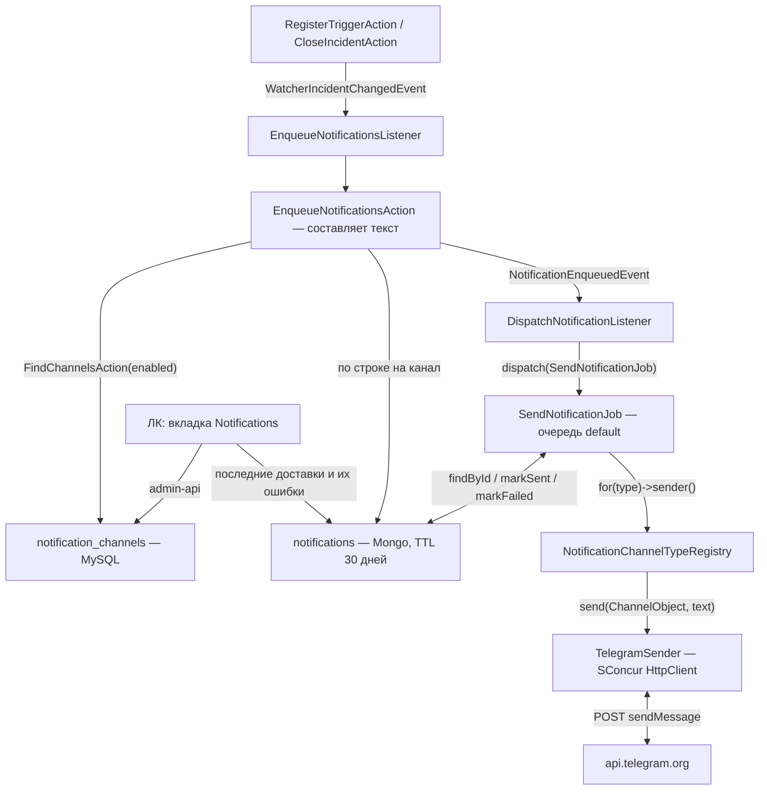

# План: каналы уведомлений

Ветка: продолжение `feature/watchers` (или отдельная от неё).

Сверено с кодом: `app/Modules/Watcher/**`, `app/Modules/Dashboard/Domain/Services/SconcurStatClient.php`,
`config/sconcur.php`, `code-analyse/deptrac-layers.yaml`, `composer.json`,
`vendor/sconcur/sconcur/src/Features/HttpClient/**`, `vendor/sconcur/laravel/src/Tasks/**`.

## Цель

Смотритель нашёл проблему — об этом узнают в мессенджере, а не при следующем заходе в
панель. Первый канал — Telegram; остальные (почта, вебхук) добавляются классом, не
переписыванием.

## Что уже готово и чем это ограничено

**Точка расширения есть.** `WatcherIncidentChangedEvent` (`app/Modules/Watcher/Domain/Events`)
диспатчится и при срабатывании (`RegisterTriggerAction`), и при закрытии
(`CloseIncidentAction`). План смотрителей прямо называет её местом для внешних
уведомлений.

**В пуле тасков один воркер.** `config/sconcur.php`, группа `tasks`: `workerCount => 1`.
Блокирующий HTTP-запрос из таска встаёт поперёк всего пула — проверок смотрителей,
`schedule:run`, сборки динамических индексов. Telegram отвечает медленно, а иногда не
отвечает вовсе. Это главное ограничение, из которого следует всё остальное.

**Неблокирующий клиент уже в зависимостях.** `SConcur\Features\HttpClient\HttpClient` —
PSR-18: внутри корутины он её приостанавливает, а не блокирует воркер. Конструктор просит
`ResponseFactoryInterface` (PSR-17) и необязательные `HttpClientOptions` с таймаутами
(`requestTimeoutMs`, `connectTimeoutMs`). Фабрика в проекте уже есть —
`GuzzleHttp\Psr7\HttpFactory` реализует PSR-17. Новых пакетов не нужно.

`SconcurStatClient` ходит блокирующим Guzzle. Это существующее место, к этой задаче
отношения не имеет и здесь не трогается.

**Шаблон «тип — один класс» проверен.** `WatcherTypeRegistry` плюс определение на тип плюс
маршрут на тип. У каналов та же задача: свои настройки, своя форма, свой отправитель.

**Куда класть периодические данные — решено.** Mongo и TTL-индекс, как у инцидентов и
линий смотрителей.

**Адресатов нет.** В `app/Models/Users/User.php` нет ролей, трейсы не делятся по
пользователям. Канал может быть только общим, «отправить вот этому человеку» выразить
нечем.

## Разделение ролей

| Кто | Что делает |
|---|---|
| `Watcher` | находит проблему и поднимает событие; про уведомления не знает ничего |
| `Notification` | слушает событие, составляет текст, складывает в исходящие, отправляет |

Зависимость односторонняя: `Notification` знает про `Watcher`, `Watcher` про
`Notification` — нет. Слушатель лежит в `Notification/Infrastructure/Listeners`, это
`Infrastructure → Domain`, deptrac такое разрешает, а его глобы (`/app/Modules/\w+/...`)
подхватывают новый модуль без правки конфига.

## Схема потока



## Почему исходящие, а не отправка на месте

Слушатель работает внутри прохода проверок. Синхронный запрос к чужому сервису на этом
пути — то же самое, от чего план смотрителей уводил проверки в пул тасков: подсистема,
которая обязана работать, когда всё плохо, не должна зависеть от того, отвечает ли сейчас
Telegram.

Строка в исходящих переживает перезапуск, даёт повтор без дублей и делает отправку тупой.

**Текст составляется в момент срабатывания, а не в момент отправки.** Сообщение о
вчерашнем инциденте, собранное сегодня, описывало бы сегодняшнее состояние — не то, что
случилось. Поэтому слушатель кладёт в исходящие готовую строку, а отправителю остаётся
доставить её.

## Почему очередь

Доставляет джоба, а не задача пула. `QUEUE_CONNECTION=sconcur_rabbitmq`, очередь
`default` — она уже объявлена и потребляется, новой топологии не нужно.

Первая редакция плана уводила отправку в пул тасков, чтобы уведомления не зависели от
брокера. Довод был записан сильнее, чем есть: путь диспатченой джобы — публикация в
RabbitMQ и консьюмер, два звена, а не четыре (`schedule:run` в нём нет, эта формулировка
перекочевала из плана смотрителей, где речь про расписание). Взамен пул требовал своей
таблицы откатов, своего лимита попыток и колонок под них — второй механизм повторов рядом
с тем, что фреймворк уже даёт.

Повторы теперь целиком на джобе: `$tries = 6`, `$backoff = [15, 60, 300, 900, 3600]`,
отказ навсегда — `fail()`, а `retry_after` от Telegram — `release()`.

**Чем платим.** Если брокер лежит в момент срабатывания, `dispatch()` бросает, слушатель
это ловит и логирует, а строка остаётся неотправленной, и переотправить её некому. Пул
тасков в этом случае продолжал бы пытаться. Если это окажется важно — нужен подметальщик,
который раз в N минут переставляет в очередь строки с `sentAt = null` старше минуты; пока
его нет сознательно.

## Хранение

### `notification_channels` — MySQL

Единственная таблица модуля. Настройки канала — запись: они живут ровно столько, сколько
живёт канал.

| Колонка | Тип | Смысл |
|---|---|---|
| `id` | bigint | |
| `name` | string(255) | человеческое имя |
| `type` | string(64) | `NotificationChannelTypeEnum` |
| `enabled` | bool, index | выключенный не получает ничего |
| `settings` | text | каст `encrypted:array`: там боевой токен бота |
| `on_opened`, `on_event`, `on_closed` | bool | что именно слать |
| `created_at` / `updated_at` / `deleted_at` | timestamp | мягкое удаление, как у смотрителей |

**Колонки `watcher_ids` пока нет.** Решено начать с «канал получает всё от всех
смотрителей». Когда фильтр понадобится, он появится здесь, а не на смотрителе: смотритель
— про наблюдение, а не про то, кому рассказывать, и добавление канала не должно означать
правку каждого смотрителя.

**`settings` шифруются.** Дамп базы не должен утекать вместе с боевым ботом. Цена
известна: токен нельзя показать обратно в форме — наружу уходит маска, а правка означает
перезапись.

### `notifications` — Mongo, коллекция в `mongodb.traces`

Исходящие. Данные периодические: копятся, пока система работает, и убираются TTL —
`createdAt`, 30 дней, как у инцидентов.

```
{ _id: ObjectId,
  channelId: int,
  watcherId: int | null,
  incidentId: string | null,
  kind: "opened" | "event" | "closed",
  text: string,          // готовый текст, составленный при срабатывании
  sentAt: UTCDateTime | null,
  error: string | null,
  createdAt: UTCDateTime }
```

Счётчика попыток и срока следующей нет: повторы держит очередь. Строка — журнал доставок,
и всё, что в ней есть про исход, это `sentAt` и последняя ошибка.

Индексы: TTL на `createdAt`; `{channelId: 1, _id: -1}` — для списка последних доставок в
панели.

## Типы каналов

`NotificationChannelTypeDefinitionInterface` — ровно тот же приём, что у смотрителей, и по
той же причине: всё, что зависит от типа, собрано в одном классе, а реестр —
единственный `match` по енуму в модуле.

```php
makeSettings(array $settings): ChannelSettingsInterface   // прочитать колонку
describe(): ChannelTypeObject                             // заголовок, поля, границы — для формы
sender(): NotificationSenderInterface                     // кто отправляет
```

Первый и пока единственный тип — `telegram`. `email` и `webhook` добавляются классом,
реквестом, ресурсом и строкой в реестре.

### Telegram

- `POST https://api.telegram.org/bot<token>/sendMessage`, тело — `chat_id`, `text`,
  `parse_mode: HTML`, `disable_web_page_preview: true`.
- Настройки канала: `bot_token`, `chat_id`. `chat_id` строкой: у групп он отрицательный, у
  каналов бывает `@username`.
- Текст экранируется под HTML: `&`, `<`, `>`. Имя смотрителя приходит от человека.
- Лимит сообщения — 4096 символов; длинное режется с многоточием, а не отправляется в
  отказ.

Разбор ответа:

| Что пришло | Что делаем |
|---|---|
| `200 {"ok":true}` | `sentAt`, строка закрыта |
| `429` с `parameters.retry_after` | ждём ровно столько, сколько просят |
| `400`, `401`, `403` | постоянная ошибка: повторы прекращаются, причина остаётся на строке и видна в списке доставок |
| `5xx`, таймаут, обрыв | откат по возрастанию |

## Отправка

Строка пишется в исходящие, дальше `EnqueueNotificationsAction` поднимает
`NotificationEnqueuedEvent`, а `DispatchNotificationListener` кладёт в очередь
`SendNotificationJob`. Событие посередине — правило проекта: очередь дёргают из
`Infrastructure/Listeners`, а не из домена, тем же приёмом, что
`TraceTreeCacheBuildRequestedEvent`.

В джобе едет только `notificationId`: текст уже лежит в строке, и копия его в теле джобы
была бы вторым экземпляром того же сообщения.

```php
public int $tries = 6;

public array $backoff = [15, 60, 300, 900, 3600];
```

`SendNotificationAction` делает одну попытку и записывает исход в строку, а решает,
пробовать ли ещё, джоба, читая `SendResultObject`:

| Что вернулось | Что делает джоба |
|---|---|
| доставлено | выходит |
| отказ навсегда (`permanent`) | `fail()`, повторов нет |
| `retry_after` от Telegram | `release($seconds)` |
| всё остальное | бросает, дальше решает `$backoff` |

Джоба, пережившая TTL строки или её доставку, выходит молча: `sentAt` уже стоит, и
потерянный по дороге ответ не должен слать сообщение дважды.

## Что отправляется

Три переключателя на канал:

| Событие | По умолчанию | Почему |
|---|---|---|
| инцидент открыт | да | это и есть повод |
| очередное событие в открытом инциденте | нет | cooldown придерживает поток, но чат всё равно жалко |
| инцидент закрыт | да | одна строка, зато видно, что разобрались |

Текст сообщения: имя смотрителя, заголовок его типа, что именно увидели (значение против
порога), время, и — если свёртка есть — самый заметный вид трейсов с его `trace_id`.

## Структура модуля

```text
app/Modules/Notification/
├── Enums/
│   └── NotificationChannelTypeEnum.php
├── Entities/
│   ├── ChannelObject.php
│   ├── ChannelTypeObject.php
│   ├── NotificationObject.php            — строка исходящих
│   ├── SendResultObject.php              — доставлено / подождать столько-то / отказ навсегда
│   └── Settings/
│       ├── ChannelSettingsInterface.php
│       └── TelegramSettingsObject.php
├── Parameters/
│   ├── CreateChannelParameters.php
│   ├── UpdateChannelParameters.php
│   └── FindNotificationsParameters.php
├── Repositories/
│   ├── Dto/ChannelDto.php
│   ├── ChannelRepository.php             — MySQL
│   └── NotificationRepository.php        — Mongo: findDue, create, markSent, markFailed
├── Domain/
│   ├── Actions/Mutations/
│   │   ├── CreateChannelAction.php
│   │   ├── UpdateChannelAction.php
│   │   ├── DeleteChannelAction.php
│   │   ├── EnqueueNotificationAction.php — составить текст и разложить по каналам
│   │   ├── SendNotificationAction.php    — одна строка, одна попытка
│   │   └── SendTestNotificationAction.php
│   ├── Actions/Queries/
│   │   ├── FindChannelsAction.php
│   │   ├── FindChannelAction.php
│   │   ├── FindChannelTypesAction.php
│   │   ├── FindChannelsForWatcherAction.php
│   │   └── FindNotificationsAction.php   — последние доставки канала
│   ├── Services/Types/
│   │   ├── NotificationChannelTypeDefinitionInterface.php
│   │   ├── TelegramChannelType.php
│   │   └── NotificationChannelTypeRegistry.php
│   ├── Services/Senders/
│   │   ├── NotificationSenderInterface.php
│   │   └── TelegramSender.php
│   ├── Services/ChannelFactory.php       — ChannelDto -> ChannelObject
│   └── Services/IncidentMessageFactory.php — событие смотрителя -> текст
└── Infrastructure/
    ├── Jobs/SendNotificationJob.php
    ├── Listeners/EnqueueNotificationsListener.php           — смотритель -> исходящие
    ├── Listeners/DispatchNotificationListener.php           — исходящие -> очередь
    ├── Http/Controllers/NotificationChannelController.php      — список, типы, удаление, тест
    ├── Http/Controllers/TelegramChannelController.php          — создание и правка
    ├── Http/Controllers/AbstractChannelTypeController.php
    ├── Http/Requests/CreateTelegramChannelRequest.php          — токен обязателен
    ├── Http/Requests/UpdateTelegramChannelRequest.php          — токен необязателен
    ├── Http/Resources/ChannelResource.php                      — без настроек
    ├── Http/Resources/TelegramChannelSettingsResource.php      — токен маской
    ├── Http/Resources/ChannelTypeResource.php
    ├── Http/Resources/NotificationResource.php
    └── NotificationServiceProvider.php
```

Модели: `app/Models/Notifications/NotificationChannel.php` (MySQL, `AbstractModel`,
`SoftDeletes`) и `Notification.php` (Mongo, `AbstractTraceModel`).

## HTTP API

В `routes/admin-api.php`, тем же приёмом, что у смотрителей — маршрут на тип, потому что
тело зависит от типа:

```php
Route::prefix('/notification-channels')->as('notification-channels.')->group(function () {
    Route::get('', [NotificationChannelController::class, 'index'])->name('index');
    Route::get('/types', [NotificationChannelController::class, 'types'])->name('types');
    Route::get('/{id}/deliveries', [NotificationChannelController::class, 'deliveries'])->name('deliveries');
    Route::post('/{id}/test', [NotificationChannelController::class, 'test'])->name('test');
    Route::delete('/{id}', [NotificationChannelController::class, 'delete'])->name('delete');

    // GET /notification-channels/telegram/{id}
    // POST /notification-channels/telegram
    // PATCH /notification-channels/telegram/{id}
});
```

`test` отправляет пробное сообщение прямо в запросе и отвечает результатом: канал, который
молчит, иначе не отличить от тишины по делу. Это единственное место, где отправка
синхронна — HTTP-воркеров два, и запрос делает именно то, о чём его попросили.

После изменений — `make oa-generate`, затем `make frontend-npm-build`.

## Фронт

Третья вкладка `Notifications` на странице смотрителей, рядом с `Incidents` и `Settings`.
Отдельного пункта меню нет: каналы сегодня существуют только ради смотрителей, а верхнее
меню и без них длинное. Когда появится источник уведомлений помимо смотрителей, вкладка
переедет в свою страницу — компонент для этого самодостаточен.

- Таблица каналов: имя, тип, включён, что слать, последняя ошибка.
- Диалог создания и правки: поля из `/notification-channels/types`, как у смотрителей.
  Токен приходит маской и записывается только если его тронули.
- Кнопка «Отправить тест» на строке, с результатом.
- Раскрытие строки — последние доставки: время, инцидент, статус, ошибка.

## Тесты

- `TelegramSenderTest` — разбор ответов: успех, `429` с `retry_after`, `400` как
  постоянный отказ, `5xx` как временный; экранирование HTML; обрезка длинного текста.
- `IncidentMessageFactoryTest` — текст для каждого типа смотрителя, включая тот, у
  которого нет свёртки.
- `EnqueueNotificationsListenerTest` — фильтр по смотрителям, три переключателя,
  выключенный канал не получает строки.
- `SendNotificationJobTest` — доставка заканчивает джобу; отказ навсегда — `fail()` без
  повторов; `retry_after` уходит в `release()`; остальное бросается под `$backoff`; строка,
  которой уже нет или которая доставлена, не шлётся дважды.
- `ChannelFactoryTest` — колонка настроек читается по типу, неизвестный тип пропускается,
  как в `WatcherFactory`.

## Этапы

1. ~~**Каналы.** Таблица, модель, реестр типов, `TelegramSender`, маршрут теста.
   Проверяется кнопкой «тест» без единого смотрителя.~~ Сделано: модуль
   `app/Modules/Notification`, миграция `2026_09_08_182727_create_notification_channels_table`,
   маршруты `/notification-channels`, тесты в `tests/Modules/Notification`.
2. ~~**Исходящие.** Коллекция с TTL, репозиторий, доставка, повторы и откаты.~~
   Сделано: коллекция `notifications` (TTL 30 дней), `NotificationRepository`,
   `SendNotificationAction`, `SendNotificationJob` с шестью попытками и откатом 15 с → 1 ч.
3. ~~**Связь со смотрителями.** Слушатель, `IncidentMessageFactory`, три переключателя.~~
   Сделано: `EnqueueNotificationsListener` на `WatcherIncidentChangedEvent`,
   `EnqueueNotificationsAction`, `IncidentMessageFactory`.
4. ~~**Фронт.** Вкладка, форма, доставки, `make oa-generate` и `make frontend-npm-build`.~~
   Сделано: третья вкладка `Notifications` на странице смотрителей, таблица каналов с
   раскрытием в доставки, диалог создания и правки, кнопка теста. Плюс бэкенд
   `GET /notification-channels/{id}/deliveries`.

Этапы 1–3 самостоятельны и проверяются без фронта.

Все четыре сделаны.

## Принятые решения

1. Отдельный модуль `Notification`; зависимость односторонняя.
2. Исходящие в Mongo с TTL 30 дней, текст составляется при срабатывании.
3. Отправляет джоба в очереди `default`. Повторы, откаты и `failed_jobs` — фреймворка, а не свои.
4. HTTP — неблокирующим клиентом SConcur: воркер очереди тоже один, и блокирующий запрос
   занимал бы его целиком.
5. Фильтр по смотрителям — на канале, но не сейчас: этап 1 сделан без `watcher_ids`.
6. `settings` шифруются, наружу токен уходит маской. Пустой токен в PATCH означает
   «оставить сохранённый» — форме нечего прислать обратно, кроме маски.
7. Тип канала — один класс плюс строка в реестре, как у смотрителей.
8. Повторные события (`on_event`) по умолчанию выключены: cooldown придерживает поток,
   но чат всё равно жалко.
9. Исходящие хранятся 30 дней, как инциденты.
10. Строка канала, которого больше нет или который выключили, не ждёт своего часа, а
    закрывается с причиной: выключенный канал не должен вывалить накопленное, когда его
    включат обратно.
11. Текст не различает типы смотрителей: печатается то, что чекер положил в payload, как
    есть. Новый тип рассказывает о себе сам, без правки модуля уведомлений.
12. Слушатель ловит и логирует свои ошибки: он работает внутри прохода проверок, инцидент
    к этому моменту уже записан, и неудача рассказать о нём не должна отменять запись.

## Вне рамок

- Почта и вебхуки: тот же реестр, отдельные типы, позже.
- Адресация конкретным людям: ролей и адресатов в модели пользователя нет.
- Расписание тишины («не будить ночью»): осмысленно, но это отдельный разговор про часовые
  пояса.
- Уведомления не от смотрителей (упавшая чистка, сломанный индекс): тот же слушатель на
  другое событие, но сначала нужен повод.

## Требуют решения

1. **Сломанный канал не помечается сам.** Отзванный токен даёт постоянный отказ на каждом
   инциденте: по одной упавшей джобе на инцидент на канал, и увидеть это можно только
   раскрыв доставки этого канала. Пометка на самом канале (`broken_at` плюс причина в
   `ChannelResource`) — отдельная работа; пока её нет, в плане не должно быть написано,
   что она есть.
