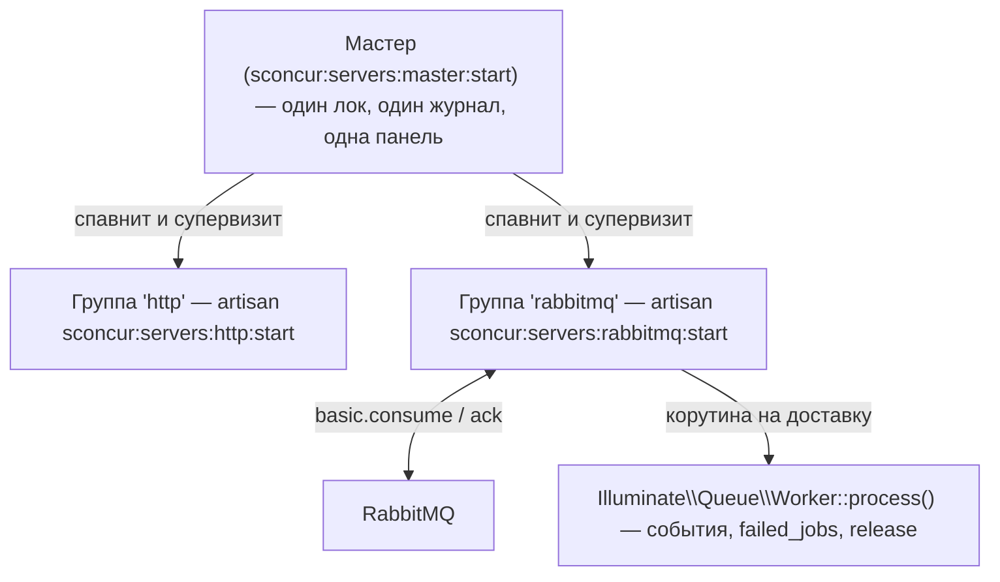

# План: нативная очередь SConcur AMQP для Laravel в `packages/sconcur/sconcur-laravel`

> **Сделано.** Очередь работает: группа `rabbitmq` мастера, драйвер
> `sconcur_rabbitmq`, код — в `packages/sconcur/sconcur-laravel/src/Queue/Rabbitmq/`.
> Всё ниже — запись проектных решений, а не описание текущего поведения: с момента
> реализации часть деталей изменилась. Источник истины — сам код пакета и секция
> `queue` в `config/sconcur.php`.

Цель работы — локальный пакет `packages/sconcur/sconcur-laravel` (path-репозиторий, не
вендорный). Всё ниже сверено с кодом SConcur `0.11.0` (`vendor/sconcur/sconcur`) и с
конфигурацией самого этого репозитория, а не взято из README библиотеки.

## 1. Цель

Дать пакету собственный транспорт очередей: драйвер очереди Laravel, публикующий через
AMQP-фичу SConcur, и пул консьюмеров, работающий под тем же мастером, который уже
супервизит HTTP-пул. Тогда очередь читается корутинами в одном процессе, а не одним
блокирующим процессом `queue:work` на воркера.

Выигрыш — только на стороне консьюмера. И у `ext-amqp`, и у `php-amqplib` чтение
очереди держит PHP-поток: воркер занят одной очередью и больше ничего не может.
`Features\Amqp\Consumer\QueueConsumer` подвешивает только свою корутину, поэтому один
процесс тянет сразу несколько очередей, а медленная джоба стоит одного сообщения, а не
воркера.

## 2. Где очереди находятся на самом деле

Это важно, потому что от этого зависит форма работы, а первое прочтение в этой ветке
было неверным.

| Очередь | Соединение (`.env`) | Кто потребляет |
| --- | --- | --- |
| `default` | `redis` (`QUEUE_CONNECTION`) | `queue:work --queue=default`, 5 процессов supervisor |
| `trace-tree` | `redis` (`QUEUE_TRACE_TREE_CONNECTION`) | `queue:work`, `QUEUE_TRACE_TREE_WORKERS_COUNT` процессов |
| `traces-clearing` | `redis` (`QUEUE_TRACES_CLEANER_CONNECTION`) | `queue:work`, 1 процесс |
| `slogger` | `rabbitmq` (`SLOGGER_DISPATCHER_QUEUE_CONNECTION`) | `slogger:dispatcher:start` |

Отсюда:

- Собственные джобы приложения — `ClearTracesJob`, `BuildTraceTreeCacheJob`,
  `RefreshDatabaseStatCacheJob` — ходят через Redis, а не через RabbitMQ.
- Единственная очередь на RabbitMQ, `slogger`, потребляется
  `vendor/slogger/laravel/src/Dispatcher/StartDispatcherCommand.php` — это внешний
  пакет, он вне этого репозитория и вне рамок работы.
- Соединение `rabbitmq` в `config/queue.php` — это
  `vladimir-yuldashev/laravel-queue-rabbitmq` поверх `php-amqplib`, и оно является
  стороной-публикатором очереди `slogger`.

Следствие: план добавляет транспорт, а перевод очередей приложения на него — отдельное
решение (§8), а не то, что изменение пакета подразумевает само собой.

## 3. Что даёт библиотека

`QueueConsumer` — сервер во всём, кроме сокета. Go-сторона открывает консьюмеров и
публикует доставки всех сразу одним потоком; тот же цикл, что крутит HTTP-, сокет- и
WebSocket-серверы, читает этот поток и отдаёт каждое сообщение отдельной корутине.



Что рантайм берёт на себя — проверено по `QueueConsumer::consume()` и
`runAndSettle()`:

- Обработчик не подтверждает сам: вернулся — подтверждено, бросил — отклонено согласно
  `requeueOnFailure`. Обработчика, который подтвердил доставку сам, рантайм не
  переопределяет, потому что `Delivery` отказывается быть подтверждённой дважды.
- `handlerTimeoutMs` разматывает обработчик, вышедший за срок, и отклоняет его
  сообщение; воркер берёт следующее.
- `SIGTERM` и пределы `maxMessages` / `maxRuntimeSeconds` / `maxMemoryBytes` отменяют
  консьюмеров и ждут работающие обработчики. Каналы остаются открытыми до возврата
  последнего, поэтому подтверждение в пути не теряется.
- Консьюмер, которого забрал брокер, переоткрывается, а не теряется вместе с очередью.
- Пул отчитывается в ту же панель телеметрии, что и серверы, — в секции `consumers`.
  Сторона дашборда для этого уже сделана в этой ветке (коммит `0a6aeb5a`), так что
  пул консьюмеров отобразится без дополнительной работы по фронтенду.

Чего он не делает: он ничего не объявляет. Топология принадлежит её владельцу, а
консьюмер, передекларировавший очередь с чужими флагами, уронил бы канал `406` вместо
того чтобы читать. `queueSpecs()` говорит воркер-скрипту, что именно он собирается
потреблять, и скрипт объявляет то, чем владеет, до передачи управления.

## 4. Изменения в пакете

### 4.1. Раскладка: транспорт — это каталог

Всё, что относится к одному транспорту очередей, лежит в своём каталоге, а не
различается префиксом в имени класса:

```text
src/Queue/
└── Rabbitmq/
    ├── Connector.php
    ├── Queue.php
    ├── Job.php
    └── ConsumerRunner.php
```

Неймспейс `SConcur\Laravel\Queue\Rabbitmq` сам несёт то, что иначе повторялось бы в
каждом имени, поэтому классы называются коротко. Второй транспорт становится соседним
каталогом, а не вторым набором префиксов.

Цена — три коллизии имён, все разрешаются алиасом в импорте и все локальны:
`Illuminate\Queue\Jobs\Job as BaseJob`, `Illuminate\Queue\Queue as BaseQueue`,
`SConcur\Features\Amqp\Queue as AmqpQueue`.

Команды остаются в `src/Console/` — там уже живут все команды пакета, и провайдер
регистрирует их одним списком; транспорт несёт имя команды, а не её расположение.
Раскладывать команды по каталогам транспортов значило бы держать в пакете сразу две
конвенции.

### 4.2. Продюсер — драйвер очереди `sconcur_rabbitmq`

| Файл | Что это |
| --- | --- |
| `src/Queue/Rabbitmq/Connector.php` | `ConnectorInterface`; собирает очередь из массива соединения `config/queue.php` |
| `src/Queue/Rabbitmq/Queue.php` | `extends Illuminate\Queue\Queue implements QueueContract` |
| `src/Queue/Rabbitmq/Job.php` | `extends Illuminate\Queue\Jobs\Job implements JobContract` |

`push`, `pushRaw` и `bulk` ложатся на `basic.publish` один в один; ничего не ждёт
брокера, поэтому никакой специфики корутин на этой стороне нет. `size()` — это
`declarePassive()->messageCount`, `pop()` — честный `basic.get`: он и делает рабочим
`queue:size`, и оставляет `queue:work` пригодным для разработки, просто без выигрыша по
конкурентности.

Payload — обычный JSON джобы Laravel, поэтому транспорт остаётся совместимым: всё, что
уже публикует в очередь, продолжает работать, а этот драйвер нужен процессам, где
расширение и так загружено.

`Rabbitmq\Job` — адаптер, который требуется `Illuminate\Queue\Worker::process()`. У
абстрактного `Job` два метода на заполнение — `getJobId()` и `getRawBody()`, — плюс
`attempts()`, `delete()` (ack) и `release()` (§4.4).

### 4.3. Консьюмер — пул под существующим мастером

| Файл | Что это |
| --- | --- |
| `src/Queue/Rabbitmq/ConsumerRunner.php` | по образцу `HttpServerRunner`: включает async-режим, собирает консьюмера, запускает его |
| `src/Console/RabbitmqConsumerStartCommand.php` | `sconcur:servers:rabbitmq:start`, `workerScript` группы |

Обработчик оборачивает `Delivery` в `Rabbitmq\Job` и передаёт в
`Illuminate\Queue\Worker::process($connectionName, $job, $options)` — публичную точку
входа, которая уже поднимает события джобы, соблюдает `maxTries` и `backoff` и пишет
`failed_jobs`. Ничего из этого мы не переписываем.

`Illuminate\Queue\Worker::daemon()` намеренно не используется: это строго
последовательный цикл (`getNextJob()` → `pop()` → `runJob()` → `sleep()`), одна джоба за
раз, причём его `sleep()` блокирует процесс. `process()` — та его половина, которая
здесь нужна.

Настройки консьюмера команда берёт из argv, как и задумано библиотекой
(`QueueConsumer::fromArgs($_SERVER['argv'])`). Значит, флаги надо объявить на
artisan-команде, иначе Symfony Console их отвергнет: `--queues`, `--prefetchCount`,
`--handlerTimeoutMs`, `--requeueOnFailure`, `--maxMessages`, `--maxRuntimeSeconds`,
`--maxMemoryBytes`, `--preemptionQuantumMs`, `--masterPid`.

### 4.4. Задержки: `later()` и `release()`

В AMQP нет отложенной публикации. Что есть — dead-letter и TTL, и
`RetryTopology::declare(channel, queue, delaysMs)` упаковывает стандартную форму: по
очереди ожидания на каждую задержку — `<queue>.wait.<ms>`, — каждая отправляет
сообщения dead-letter обратно в основную очередь. `Queue::publish($message, delayMs: N)`
адресует одну из них.

Очередь на задержку, а не одна очередь с per-message expiration, потому что
классическая очередь протухает только с головы: тридцатисекундное сообщение впереди
держит односекундное за собой все тридцать.

Цена в том, что задержка должна быть одной из объявленных. `later($delay)` и
`release($delay)` в Laravel принимают произвольную, поэтому драйвер округляет вверх до
ближайшей объявленной и публикует туда. `publishConfirmed(delayMs: …)` по умолчанию
mandatory, поэтому задержка, которую никто не обслуживает, бросит
`UnroutableMessageException`, а не потеряет сообщение, — этим стоит пользоваться, пока
топология не устоялась.

### 4.5. Топология

`sconcur:rabbitmq:declare` (`src/Console/RabbitmqDeclareCommand.php`) объявляет очереди,
названные в конфиге, durable, и вызывает для каждой `RetryTopology::declare` с
настроенной лестницей задержек. Команда выполняется до
старта пула: пул, запущенный раньше первого публикатора, иначе крутился бы в
перезапусках на `404`.

### 4.6. Конфиг

В `config/sconcur.php` появляется секция `queue.rabbitmq` — по секции на транспорт, тем
же делением, что и каталоги: DSN соединения, лестница задержек и группы консьюмеров. Группы — элементы того же списка `http_server.groups`, который
мастер уже читает, поэтому один мастер супервизит оба пула.

Здесь же нужна одна поправка. `AbstractSconcurCommand::masterConfigArray()` сейчас
вычищает `server` из каждой группы. Это было верно, пока единственной группой была
`http`, чей воркер — artisan, который отверг бы форварднутые флаги. Но группе
консьюмеров её блок `server` как раз нужен: именно его `QueueConsumer::fromArgs`
вычитывает из argv. Поправка — перестать вычищать его по группам и оставить `server`
http-группы там, где он уже лежит: на верхнем уровне, рядом с `groups`, откуда его
читает `HttpServerRunner` и откуда `masterConfigArray()` его и так убирает.

## 5. Совместимость: джоба, отправленная пакетом Юлдашева

Прочитает и выполнит — проверено по коду
`vendor/vladimir-yuldashev/laravel-queue-rabbitmq`, не принято на веру. Что именно
кладёт в брокер `RabbitMQQueue::pushRaw()` и `createMessage()`:

| Что | Значение у Юлдашева | Наша сторона |
| --- | --- | --- |
| тело | обычный JSON джобы Laravel (`createPayload`) | то же, читается как есть |
| exchange | `''` — дефолт `QueueConfig::$exchange`, у нас не переопределён | неважно: консьюмер читает очередь по имени |
| routing key | `'%s'` → имя очереди, то есть публикация прямо в очередь | то же |
| `content_type` | `application/json` | воспроизводим |
| `delivery_mode` | persistent | воспроизводим |
| `correlation_id` | `id` из payload | воспроизводим |
| попытки | заголовок `application_headers` → `laravel.attempts` (int) | читаем ровно его |
| объявление очереди | `durable: true, exclusive: false, autoDelete: false, arguments: []` при нашем конфиге | объявляем теми же флагами |

Три из этих строк — требования к реализации, а не наблюдения, и без них
совместимость будет только на вид:

1. `Rabbitmq\Job::attempts()` обязан читать `laravel.attempts` из заголовков и
   возвращать `+1`, как это делает `RabbitMQJob::attempts()`. Счётчик попыток лежит
   там, а не в `x-death`, и `Worker::process()` строит на нём `maxTries` и запись в
   `failed_jobs`. Наш `release()` соответственно публикует заново с инкрементом этого
   же заголовка.
2. `sconcur:rabbitmq:declare` обязана объявлять очередь теми же флагами, что и
   `declareDestination()`. Расхождение хотя бы в одном — `406`, закрывающий канал, и
   консьюмер не прочитает вообще ничего. При нашем `config/queue.php` аргументы пусты:
   `prioritize_delayed`, `reroute_failed` и `quorum` не заданы.
3. Продюсер публикует так же — в дефолтный exchange с routing key, равным имени
   очереди, — чтобы совместимость была симметричной и их консьюмер мог прочитать наши
   сообщения.

Отложенные джобы двух схем сосуществуют, не мешая друг другу. Их `later()` объявляет
на лету `<queue>.delay.<ttl>` с TTL на очередь и dead-letter обратно в основную; наша
`RetryTopology` — `<queue>.wait.<ms>`. Имена разные, очереди разные, но обе в итоге
кладут сообщение в одну и ту же основную очередь, откуда его и берёт консьюмер. Чья
задержка отработала, на чтении не сказывается.

## 6. Fiber-safety

Консьюмер работает внутри корутины, поэтому ему нужен тот же мост, что и HTTP-воркеру:
`AsyncApplication::enableAsyncMode()` и per-coroutine разрешение `auth`, `session`,
`cookie`, config-overlay, диспетчера и транслятора. `QueueConsumerRunner` включает его
ровно так же, как `HttpServerRunner`.

Правило про транзакции из README пакета действует без изменений и является здесь острым
углом: не вызывать sconcur-async (Mongo, `Sleeper`, sconcur-Sql, HttpClient) внутри
открытой MySQL-транзакции. Джоба, делающая и то и другое, — самый реальный способ на
это наткнуться.

## 7. Этапы

1. Драйвер (продюсер) и `Rabbitmq\Job`. Полезен сам по себе и не зависит от
   консьюмера.
2. `sconcur:rabbitmq:declare` и секция конфига.
3. `Rabbitmq\ConsumerRunner` и `sconcur:servers:rabbitmq:start`; поправка
   `masterConfigArray()` из §4.6.
4. Тесты: публикация и потребление против брокера из compose; две очереди в одном
   процессе с медленным обработчиком на одной — проверка, что вторая не ждёт первую;
   `handlerTimeoutMs`, отклоняющий зависшую джобу, пока воркер продолжает работу.
5. Документация: README пакета, а также `README.md` и `README.ru.md` вместе — они
   двуязычные и расходиться не должны.
6. Проводка в приложении — вне рамок по §8 (1). Оставлено на отдельное изменение:
   `config/queue.php`, `.env.example`, `docker/supervisor/conf/supervisor.conf`,
   `app/Console/Commands/QueuesDeclareCommand.php`.

## 8. Принятые решения

1. Объём — только пакет. Очереди приложения остаются на Redis; драйвер поставляется
   доступным, но неиспользуемым, поэтому ничего работающего не задевается, а перевод
   можно сделать позже и по одной очереди. Этап 6, соответственно, в эту работу не
   входит.
2. Задержки — фиксированные очереди ожидания через `RetryTopology`, с округлением
   задержки вверх до ближайшей объявленной.
3. Имя соединения — `sconcur_rabbitmq`, драйвер регистрируется под тем же именем,
   поэтому джоба выбирает транспорт через `'connection' => 'sconcur_rabbitmq'` в
   `config/queue.php`, как и любой другой.

Смысл работы, если сказать прямо: консьюмер должен выполнять джобы, которые Laravel уже
публикует. Это следует из того, что payload — обычный JSON джобы Laravel: джоба,
отправленная через `redis`, через `vladimir-yuldashev/laravel-queue-rabbitmq` или через
этот драйвер — один и тот же конверт, а выполняет его
`Illuminate\Queue\Worker::process()`. Чтобы консьюмер заработал, менять в продюсере не
нужно ничего.

## 9. Вне рамок

- Очередь `slogger` и `slogger:dispatcher:start`. Они принадлежат
  `vendor/slogger/laravel`, внешнему пакету.
- Замена `vladimir-yuldashev/laravel-queue-rabbitmq`. Он остаётся публикатором очереди
  `slogger`, пока эту очередь читает внешний диспетчер.
- Eloquent на `Features/Sql`. Отдельный вопрос, и этот транспорт его не поднимает.
