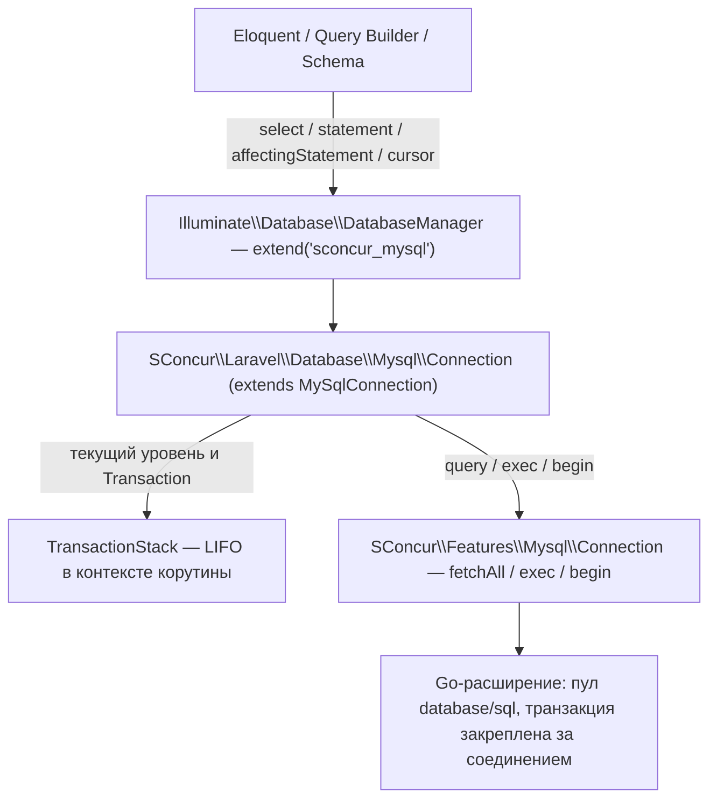

# План: соединение `sconcur_mysql` — Eloquent поверх SQL-фичи SConcur

Работа идёт в локальном пакете `packages/sconcur/sconcur-laravel` (path-репозиторий).
Всё ниже сверено с кодом: `vendor/sconcur/sconcur` (SQL-фича и контекст корутины),
`laravel/framework v12.62.0` (`Illuminate\Database`) и текущим состоянием ветки
`feature/sconcur-rabbitmq`.

## 1. Цель

Дать приложению обычный Laravel-коннекшен, за которым вместо PDO стоит
`SConcur\Features\Mysql\Connection`. Тогда Eloquent, query builder, пагинация,
`Auth`, `failed_jobs` и всё остальное, что ходит в MySQL через `DB`, работают
внутри корутины неблокирующе: запрос уходит в Go-расширение, корутина
приостанавливается, соседние корутины в этом же процессе продолжают работать.

Драйвер называется `sconcur_mysql`, соединение в `config/database.php` — тоже
`sconcur_mysql`. В корутинных рантаймах оно подменяет `database.default`
(см. 4.6). Штатный `mysql` (PDO) остаётся на месте: им продолжают пользоваться
миграции и всё, что запускается вне корутинного процесса.

## 2. Что есть сейчас

`app/Models/Concerns/HasSqlSconcurConnectionTrait.php` даёт модели статический
метод `sconcur()`, отдающий сырое соединение SConcur, а репозитории пишут SQL
руками:

- `app/Modules/Service/Repositories/ServiceRepository.php` — `SELECT`/`INSERT`
  строками, `$result->lastInsertId` из `ExecResult`;
- `app/Modules/User/Repositories/UserRepository.php` — то же самое, плюс ручная
  сборка `UserDetailObject` из ассоциативного массива.

То есть ORM в этих местах не участвует вовсе. Транзакций в `app/` и `packages/`
сегодня нет ни одной (`DB::transaction`, `beginTransaction` — пусто), поэтому
транзакционная часть плана — задел на будущее, а не починка существующего кода.

Перевод этих репозиториев на ORM в эту работу не входит — см. §8.

### 2.1 Почему транзакция на PDO-соединении опасна, а на этом — нет

В README пакета правило сформулировано как «не вызывай sconcur-async внутри
открытой MySQL-транзакции». Формулировка узкая: дело не в `await` как таковом, а
в любом переключении корутины, пока транзакция открыта. Блокирующий PDO — один
на процесс, поэтому стоит управлению уйти в другую корутину, как та сходит в то
же физическое соединение и окажется внутри чужой транзакции либо закроет её.

Переключение корутины происходит не только там, где написано что-то похожее на
`await`:

- любой вызов, уходящий в Go-расширение, — Mongo, SQL-фича, HTTP-клиент, AMQP,
  `Sleeper`; корутина подвешивается на время выполнения;
- `WaitGroup` — и на запуске дочерних корутин, и на ожидании их завершения;
- вытесняющее переключение по кванту (`SCONCUR_TASKS_PREEMPTION_QUANTUM_MS`,
  сейчас 1000): переключает даже чистый PHP-код, в котором нет ни одного вызова
  наружу;
- `Fiber::suspend()` где угодно в чужом коде — например, внутри вызванного
  пакета, о котором вызывающий не знает.

Практически это значит, что на PDO-соединении под конкуренцией безопасна только
транзакция, внутри которой не происходит вообще ничего, кроме SQL к тому же
PDO, и то при выключенном вытеснении.

На `sconcur_mysql` это ограничение снимается целиком: Go-сторона закрепляет
транзакцию за отдельным физическим соединением своего пула и адресует её по
идентификатору, поэтому переключение корутины к ней никакого отношения не имеет.
Побочно снимается и причина, по которой в `config/sconcur.php` рекомендуется
гасить `preemption_quantum_ms` для задачи, держащей транзакцию.

Ограничение, которое остаётся, другое и относится к одной транзакции, а не к
соединению: команды нескольких корутин внутри одной транзакции идут по одному
физическому соединению и сериализуются им (`database/sql` держит `*sql.Tx` на
одном `driverConn` под мьютексом). Порча данных отсюда не следует, следует
неопределённый порядок и риск встать на незакрытом курсоре — см. 4.3.

## 3. Общая схема



Ключевое отличие от обычного коннекшена: объект `Connection` один на процесс и
общий для всех корутин, поэтому вся изменяемая пер-запросная информация
(состояние транзакции, `lastInsertId`) хранится не в свойствах объекта, а в
контексте корутины (`SConcur\Context\Context::current()`).

## 4. Устройство

### 4.1 Регистрация драйвера

`DatabaseManager::makeConnection()` (строки 185–204) перед обращением к
`ConnectionFactory` смотрит `$this->extensions` сначала по имени соединения,
потом по имени драйвера. Значит, достаточно зарегистрировать расширение по
драйверу — фабрика с её PDO-коннекторами вообще не участвует:

```php
// SConcurServiceProvider::registerDatabaseDriver()
$this->app->resolving('db', static function (DatabaseManager $db): void {
    $db->extend(
        'sconcur_mysql',
        static fn(array $config, string $name): Connection => (new Connector())->connect($config, $name),
    );
});
```

`resolving()`, а не немедленное разрешение `db`, — по тому же соображению, что и
у существующего `registerQueueConnector()`: запрос, который не ходит в базу, не
должен платить за построение менеджера.

Регистрация безусловная, вне гейта корутинного рантайма. Драйвер сам по себе
ничего не ломает в обычном процессе — синхронный путь SConcur работает и там, —
а условная регистрация означала бы, что `artisan tinker` не может открыть то же
соединение, что рантайм.

### 4.2 `Connection`

`SConcur\Laravel\Database\Mysql\Connection extends Illuminate\Database\MySqlConnection`.
Наследование, а не `extends Connection`, — чтобы даром достались `MySqlGrammar`
(query и schema), `MySqlBuilder`, `MySqlProcessor` и `escapeBinary()`, и чтобы
`instanceof MySqlConnection` в чужом коде продолжал выполняться.

В конструктор `Illuminate\Database\Connection` первым аргументом уходит замыкание,
которое бросает исключение: `$this->pdo` тогда не `null` (важно для
`reconnectIfMissingConnection()`), а вызвавший `getPdo()` получит внятную ошибку
вместо `null`-обращения.

Переопределяем ровно то, что трогает PDO:

| Метод | Что делает у нас |
| --- | --- |
| `select` / `selectFromWriteConnection` | `fetchAll()` фичи, строки → `stdClass` |
| `selectOne`, `scalar` | наследуются, ходят через `select` |
| `cursor` | `query()` фичи, `yield` по батчам без буферизации |
| `statement` | `exec()`, возвращает `true` |
| `insert($query, $bindings, $sequence)` | `exec()`, кладёт `lastInsertId` в контекст корутины |
| `affectingStatement` | `exec()`, возвращает `affectedRows` |
| `unprepared` | `exec()` без биндингов |
| `getLastInsertId` | читает из контекста корутины |
| `getPdo` / `getReadPdo` | `RuntimeException` с объяснением |
| `reconnect` / `disconnect` / `reconnectIfMissingConnection` | no-op: пулом владеет Go |
| `getServerVersion` | `SELECT VERSION()`, мемоизация в свойстве |
| `isMaria` | по строке версии |
| `escapeString` | своё экранирование (см. 4.7) |
| `selectResultSets` | `RuntimeException`: фича не отдаёт несколько result set |
| `beginTransaction` / `commit` / `rollBack` / `transaction` / `transactionLevel` | через `TransactionStack` (см. 4.3) |
| `isUniqueConstraintError` | regex под сообщение go-драйвера (см. 4.7) |

Все они по-прежнему идут через `Connection::run()`, поэтому остаются: замер
времени, `QueryExecuted` (его слушает `SLoggerLaravel\Watchers\Children\DatabaseWatcher`),
`beforeExecuting`-колбэки, лог запросов, оборачивание ошибки в `QueryException`.

Точки, где код касается SConcur, вынесены в отдельные защищённые методы —
`fetchRows()`, `streamRows()`, `execStatement()`, `openTransaction()`. Это шов
для тестов: в тестах пакета уже принят приём с анонимным наследником, который
подменяет граничный метод (`tests/Packages/Sconcur/Queue/Rabbitmq/QueueTest.php`),
и здесь он позволяет проверить весь драйвер без загруженного расширения.

### 4.3 Транзакции: LIFO в контексте корутины

Счётчик `Connection::$transactions` — свойство общего объекта, под конкуренцией
он бессмысленен. Поэтому стек уровней живёт в контексте корутины, по ключу
`sconcur.db.tx.{имя соединения}`:

```php
[
    // Один объект на всю транзакцию, общий по ссылке со всеми корутинами,
    // которые её унаследовали: Transaction, id корутины-владельца, счётчик
    // савпоинтов.
    'state'  => TransactionState,
    // Список уровней текущей корутины: null на корневом, имя савпоинта выше.
    'levels' => [null, 'sc_sp_1', 'sc_sp_2'],
]
```

Деление именно такое, потому что записи в контекст копируют массив (`set()`
пишет в свою карту), а объект внутри массива остаётся общим. Уровни — своё дело
каждой корутины; `Transaction`, владелец и нумерация савпоинтов — общее на всех.

- `beginTransaction()` при пустом стеке — `begin()` фичи, создаёт
  `TransactionState` и кладёт первый уровень с `null`; при непустом — `SAVEPOINT`
  внутри той же транзакции и ещё один уровень. Ровно то, что делает
  `ManagesTransactions::createTransaction()`, только без общего счётчика.
- `commit()` на уровне 1 — `Transaction::commit()` и очистка ключа; на уровне
  выше — снятие верхнего уровня, без `RELEASE SAVEPOINT` (фреймворк тоже его
  не делает).
- `rollBack($toLevel)` до нуля — `Transaction::rollback()` и очистка ключа; до
  уровня N — `ROLLBACK TO SAVEPOINT` с именем уровня N+1 и усечение списка.
- `transactionLevel()` — длина списка уровней текущей корутины.
- `transaction(Closure $callback, $attempts)` переписываем целиком: наследуемая
  реализация читает и пишет `$this->transactions` напрямую. Повтор по дедлоку
  при этом сохраняется: `causedByConcurrencyError()` матчит текст сообщения
  (`ConcurrencyErrorDetector`), а go-драйвер отдаёт формулировку сервера как
  есть — `Error 1213 (40001): Deadlock found when trying to get lock...`
  попадает под первый же образец списка.

Мутации пишутся через `Context::current()->set($key, $state, replace: true)`.

Что это даёт по семантике контекста (`vendor/sconcur/sconcur/docs/coroutine-context.ru.md`):

- Соседние HTTP-запросы — сёстры, а не предки друг друга, поэтому транзакция
  одной корутины другой не видна вовсе. Это и есть изоляция, ради которой всё
  затевается.
- Дочерняя корутина, порождённая внутри транзакции, наследует её — подробно
  ниже.
- Контекст корутины освобождается вместе с ней (`State::releaseFiber`, строка
  123), поэтому брошенный стек не течёт; саму транзакцию Go-сторона в этом
  случае откатывает по отмене контекста задачи.

#### Транзакция в транзакции

Работает, и так же, как на PDO: настоящий `BEGIN` только на первом уровне, выше
— савпоинты. Это и есть механика `ManagesTransactions`, мы её не меняем, а
переносим счётчик уровней из свойства объекта в контекст. `MySqlGrammar`
савпоинты поддерживает (`Grammar::supportsSavepoints()`), `compileSavepoint()` и
`compileSavepointRollBack()` дают обычные `SAVEPOINT x` и
`ROLLBACK TO SAVEPOINT x`, которые уходят через `Transaction::exec()`.

Поэтому вложенный `DB::transaction()`, `Model::save()` внутри транзакции,
`firstOrCreate()` внутри `DB::transaction()` и прочая вложенность ведут себя как
обычно: внутренний откат снимает только свою часть, внешний откат снимает всё.

Одно место, где наивный перенос ломается, — имена савпоинтов. Laravel зовёт их
по глубине (`'trans'.($this->transactions + 1)`), а глубина у нас теперь
своя у каждой корутины. Две сестринские корутины, унаследовавшие одну
транзакцию и открывшие в ней по вложенному уровню, обе посчитали бы глубину как
2 и обе выполнили бы `SAVEPOINT trans2`. В MySQL повторный `SAVEPOINT` с тем же
именем удаляет прежний, так что `ROLLBACK TO SAVEPOINT trans2` одной корутины
откатил бы к савпоинту другой — молча и не туда.

Поэтому имя берётся не из глубины, а из счётчика в `TransactionState`, общего по
ссылке на всю транзакцию: `sc_sp_1`, `sc_sp_2`, … Имена уникальны в пределах
транзакции независимо от того, какая корутина и на какой глубине их открыла, а
уровень помнит своё имя, а не вычисляет его заново при откате.

Чего нет и на PDO тоже нет: настоящей независимой транзакции внутри другой.
`beginTransaction()` всегда вкладывается; чтобы получить вторую независимую,
нужен второй объект соединения. Отдельно это не делаем.

#### Наследование транзакции дочерними корутинами

Это не отдельная функция, которую надо писать, — это готовая семантика контекста:
`Context::find()` читает свою карту, потом вверх по цепочке породивших корутин.
Значит корутина, запущенная внутри открытой транзакции, видит тот же стек и тот
же `Transaction`, и её запросы уходят по тому же идентификатору транзакции в тот
же `*sql.Tx`.

Так и надо. Альтернатива — не наследовать — выглядит безопаснее, но на деле хуже:
`WaitGroup` из пяти обновлений внутри `DB::transaction()` тихо ушёл бы пятью
автокоммитами мимо транзакции, и атомарность сломалась бы молча. Наследование
даёт ожидаемую от `DB::transaction()` семантику: всё, что запущено изнутри,
внутри и остаётся.

Что при этом надо закрыть — владение. `Context::set()` пишет только в свою карту,
`forget()` удаляет только из своей. Поэтому дочерняя корутина, вызвавшая
`commit()`, реально закоммитит общий `Transaction` (он один объект на всех), но
стек родителя не тронет: родитель останется с закоммиченной транзакцией на
руках, его следующие запросы уйдут по мёртвому идентификатору, а его собственный
`commit()` окажется тихим no-op — `Transaction::finish()` идемпотентен. Это
ровно тот класс ошибок, ради которого всё затевалось, только с другой стороны.

Поэтому в состояние стека кладётся идентификатор корутины-владельца — той, что
выполнила корневой `begin()`:

- операции корневого уровня (`commit()` на уровне 1, `rollBack()` до нуля) из
  чужой корутины бросают исключение с внятным текстом. Транзакцию закрывает тот,
  кто её открыл;
- вложенный `beginTransaction()` из дочерней корутины разрешён: он кладёт
  савпоинт с уникальным именем из общего счётчика и, поскольку `set()` пишет
  локально, создаёт собственный список уровней, не трогая родительский. Такой
  уровень дочерняя корутина коммитит и откатывает сама — до корня она при этом
  не доберётся из-за проверки владельца;
- запросы без открытия и закрытия транзакции — то, ради чего наследование и
  нужно, — работают без ограничений.

Остаётся ограничение из §2.1, уже не про корректность, а про блокировки:
незакрытый курсор (`cursor()`, не дочитанный до конца) держит соединение
транзакции, и следующая команда любой корутины в этой транзакции будет его
ждать. В README: внутри транзакции не оставлять недочитанных курсоров, а при
фан-ауте пользоваться `fetchAll`/`select`, которые вычитывают выборку целиком.

Отдельно про `db.transactions`. `Illuminate\Database\DatabaseTransactionsManager`
— синглтон на процесс, и `afterCommit`-колбэки (в том числе
`dispatchAfterCommit` у джоб и события моделей) складываются в него без оглядки
на корутину. Мы вызываем его `begin/commit/rollback` ровно там, где это делает
базовый класс, но под конкуренцией он останется общим. Приложение сегодня
транзакций не открывает вообще, поэтому корутинную версию менеджера выношу в
отдельный необязательный этап (§7, этап 4) и до него в README пишу, что на
`afterCommit` на этом соединении полагаться нельзя.

### 4.4 `lastInsertId`

`MySqlProcessor::processInsertGetId()` вызывает `$connection->insert($sql, $values, $sequence)`
и следом `$connection->getLastInsertId()` — PDO там уже не участвует. Поэтому
свой процессор не нужен: достаточно, чтобы `insert()` клал id в контекст
корутины, а `getLastInsertId()` читал его оттуда.

Хранить id в свойстве объекта нельзя не теоретически: между записью и чтением
корутину может вытеснить по кванту (`SCONCUR_TASKS_PREEMPTION_QUANTUM_MS=1000`),
и соседняя перезапишет свойство, хотя в самом `processInsertGetId()` между двумя
строками нет ни одного вызова наружу.

### 4.5 DSN и конфигурация соединения

DSN собирается из привычных ключей соединения (`host`, `port`, `database`,
`username`, `password`), плюс параметры, которые PDO-коннектор выполняет
отдельными `SET`-ами после подключения, а go-драйвер принимает прямо в DSN:

| Ключ конфига | Куда едет |
| --- | --- |
| `charset`, `collation` | параметры драйвера `charset=`, `collation=` |
| `timezone` | системная переменная `time_zone=` (url-encoded) |
| `strict` / `modes` | системная переменная `sql_mode=`, значения один в один из `MySqlConnector::getSqlMode()` |
| `timeout_ms` | `timeoutMs` объекта соединения |
| `max_open_conns`, `max_idle_conns`, `conn_max_lifetime_ms` | размеры пула Go |

Запись системных переменных в DSN go-драйвера требует url-кодирования кавычек;
формат сверю по драйверу, зашитому в расширение, до реализации — это первый шаг
этапа 1, а не допущение.

`parseTime` намеренно не включаем (в отличие от текущего трейта). Без него
`DATE`/`DATETIME`/`TIMESTAMP` приходят строкой `Y-m-d H:i:s`, то есть ровно тем,
что ждёт `Model::getDateFormat()`. С `parseTime=true` приходит RFC3339, который
Eloquent тоже разберёт, но уже через запасной путь `Date::parse()`.

`max_open_conns` обязателен и по умолчанию не нулевой. Ноль в фиче означает пул
без предела, а корутинный фан-аут тогда упирается в `max_connections` сервера
(ошибка MySQL 1040). Ставлю дефолт 20 и выношу в `SCONCUR_DB_MAX_OPEN_CONNS`.

### 4.6 Подмена `database.default` в корутинных рантаймах

`sconcur_mysql` становится соединением по умолчанию там, где код исполняется
корутинами, и только там. Так модели, `Auth`, `failed_jobs` и прикладной код
попадают на него без единой правки, а `artisan migrate` и всё остальное в
обычном процессе продолжают ходить через PDO.

Гейт. Существующий `SConcurServiceProvider::isCoroutineWorker()` перечисляет
только `sconcur:servers:http:start` и `sconcur:servers:rabbitmq:start` — он про
async-адаптеры (`request`/`session`/`auth`/config/роутер/локаль), которые пулу
задач не нужны. Пулу задач нужна подмена соединения: `TaskPool::run()` крутит
задачи корутинами в `WaitGroup`. Поэтому добавляется второй, более широкий
предикат — `isCoroutineRuntime()`, включающий и `sconcur:tasks:start`.
`isCoroutineWorker()` остаётся как есть; это разные вопросы, и склеивать их
нельзя.

Место. Подмена делается в `register()` провайдера, через `config()->set()`, до
первого разрешения `db`: `DatabaseManager::getDefaultConnection()` читает
`database.default` лениво, в момент первого обращения. В HTTP- и очередном
воркере — после `registerConfigAdapter()`, чтобы запись легла в общую базу
`AsyncConfig`, а не в оверлей корутины.

Выключатель. Ключ `sconcur.database.default_connection` в конфиге пакета,
дефолт — `sconcur_mysql`; `null` отключает подмену. Значение — имя соединения,
а не булев флаг, чтобы приложение могло указать своё.

Что подменой не покрывается. `config/queue.php` в двух местах называет соединение
явно, а не через `database.default`:

```php
'batching' => ['database' => env('DB_CONNECTION', 'mysql'), ...],
'failed'   => ['database' => env('DB_CONNECTION', 'mysql'), ...],
```

При `DB_CONNECTION=mysql` в `.env` это остаётся PDO — то есть пул консьюмеров
писал бы `failed_jobs` через блокирующее соединение. Оба ключа переводятся на
`null`: `DatabaseManager::connection(null)` берёт текущий default. Входит в
этап 3.

`config/cache.php` (redis) и `config/session.php` (file) базы не касаются —
проверено, менять нечего.

### 4.7 Отличия от PDO, которые надо знать

- Типы. PDO для MySQL по умолчанию эмулирует подготовленные выражения и отдаёт
  все значения строками; Go-сторона нормализует: целые → `int`, `FLOAT`/`DOUBLE`
  → `float`, `DECIMAL` → строка, `NULL` → `null`. Для Eloquent с его касто-
  системой это незаметно, но строгие сравнения `===` со строкой в прикладном
  коде сломаются.
- `escapeString()` в базовом классе — это `getPdo()->quote()`. Пишем своё
  экранирование (`\0`, `\n`, `\r`, `\`, `'`, `"`, `\x1a`); оно корректно для
  однобайтовых и utf8/utf8mb4 наборов, а для чего-то ещё — бросаем. Метод нужен
  только `Grammar::substituteBindingsIntoRawSql()` (то есть `pretend()` и
  `QueryExecuted::toRawSql()`); сами запросы всегда идут с биндингами, которые
  экранирует драйвер.
- `isUniqueConstraintError()` у `MySqlConnection` ищет в тексте
  `Integrity constraint violation: 1062` — это формулировка PDO. Go-драйвер
  пишет `Error 1062 (23000): Duplicate entry ...`, поэтому regex переопределяем.
  От этого зависят `createOrFirst()` и `firstOrCreate()`.
- Режим выборки. Всегда `stdClass` (дефолт Laravel — `PDO::FETCH_OBJ`).
  `setFetchMode()` с другим значением бросает исключение, а не молча его
  игнорирует.
- `pretending()` — флаг общего объекта. `--pretend` у миграций живёт в обычном
  процессе, где корутин нет; в рантайме им пользоваться нельзя.
- Read/write-разделение (`read`/`write`/`sticky`) не поддерживаем: у фичи один
  DSN. `useReadPdo` игнорируется.

## 5. Файлы

Новые, в пакете:

```
packages/sconcur/sconcur-laravel/src/Database/Mysql/
    Connector.php          — connect(array $config, string $name): Connection
    Connection.php         — extends Illuminate\Database\MySqlConnection
    Dsn.php                — сборка DSN go-драйвера из массива конфига
    TransactionStack.php   — LIFO уровней в контексте корутины
```

Изменяемые:

- `packages/sconcur/sconcur-laravel/src/SConcurServiceProvider.php` —
  `registerDatabaseDriver()`, `isCoroutineRuntime()`, подмена `database.default`.
- `packages/sconcur/sconcur-laravel/config/sconcur.php` — секция `database`.
- `packages/sconcur/sconcur-laravel/README.md` — раздел про соединение: конфиг,
  ENV, отличия от PDO, правила наследования транзакции дочерними корутинами и
  недочитанных курсоров внутри неё. Раздел
  «Транзакции и async» переписывается по §2.1: запрет относится к PDO-соединению
  `mysql`, формулируется через переключение корутины, а не через `await`, и на
  `sconcur_mysql` не распространяется.
- `config/sconcur.php` — та же секция `database` в опубликованном файле.
- `config/database.php` — соединение `sconcur_mysql`.
- `config/queue.php` — `batching.database` и `failed.database` на `null`.
- `.env.example` — `SCONCUR_DB_*`.

## 6. Тесты

`tests/Packages/Sconcur/Database/`:

- `TransactionStackTest` — уровни, вложенность, имена савпоинтов, усечение при
  `rollBack($toLevel)`, очистка ключа после коммита корневого уровня, изоляция
  между корутинами-сёстрами (два `Fiber` через `WaitGroup`, у каждого свой стек);
  наследование дочерней корутиной (видит транзакцию родителя), проверка
  владельца (`commit()` корневого уровня из чужой корутины бросает), вложенный
  `begin()` из дочерней не задевает список уровней родителя, и имена савпоинтов
  у двух сестринских корутин в одной транзакции не совпадают.
- `ConnectionTest` — на анонимном наследнике с подменёнными `fetchRows()` /
  `execStatement()` / `openTransaction()`: `select` отдаёт `stdClass`;
  `affectingStatement` возвращает `affectedRows`; `insert` + `getLastInsertId`;
  `beginTransaction` → `commit` доходят до `Transaction`; вложенный уровень
  порождает `SAVEPOINT trans2`; `getPdo()` бросает; `QueryExecuted` фактически
  диспатчится.
- `DsnTest` — сборка DSN: экранирование пароля, `charset`/`collation`,
  `sql_mode` при `strict = true|false` и при явных `modes`, `time_zone`,
  отсутствие `parseTime`.

Живая проверка (без неё работа не считается закрытой):

1. Рантаймы поднимаются, панель и HTTP отвечают, авторизация и списки сервисов
   работают — то есть `Auth` и модели действительно ходят через подменённый
   default.
2. Конкурентные запросы, каждый из которых открывает транзакцию, делает внутри
   неё то, что переключает корутину (Mongo-вызов или `Sleeper`), и коммитит —
   данные не перемешались. Это ровно тот сценарий, который на PDO-соединении
   запрещён.
3. Пул задач и пул консьюмеров переживают перезапуск и пишут в MySQL.

Запущенные для проверки процессы останавливаю.

## 7. Этапы

1. Ядро драйвера: `Dsn`, `Connector`, `Connection` без транзакций, регистрация в
   провайдере. Перед кодом — сверка формата системных переменных в DSN с
   go-драйвером, зашитым в расширение. `make check`.
2. `TransactionStack` и транзакционные методы `Connection`. `make check`.
3. Конфигурация и подмена default: секция `database` в конфиге пакета и в
   `config/sconcur.php`, `isCoroutineRuntime()` и подмена в провайдере,
   `config/database.php`, `config/queue.php`, `.env.example`, README пакета.
   `make check` + живая проверка по §6.
4. (по необходимости) Корутинный `DatabaseTransactionsManager`, чтобы
   `afterCommit` и `dispatchAfterCommit` были корректны под конкуренцией.
   Сегодня в приложении нет ни одной транзакции, поэтому этап откладывается до
   первой.

## 8. Вне рамок

- Перевод `ServiceRepository` и `UserRepository` на Eloquent и удаление
  `HasSqlSconcurConnectionTrait` — отдельная работа, по решению от 2026-08-29.
  Пока они продолжают ходить через `Model::sconcur()` мимо ORM; на них подмена
  default никак не влияет, DSN трейт собирает сам.
- Миграции и `schema:dump`. Формально `MySqlBuilder` ходит через те же
  `select`/`statement` и на `sconcur_mysql` работать будет, но `db:dump` и
  `MySqlSchemaState` вызывают `mysqldump` мимо соединения. `DB_CONNECTION` в
  `.env` остаётся `mysql`, подмена действует только внутри корутинных процессов.
- PostgreSQL. Ядро SQL-фичи от драйвера не зависит и `Pgsql\Connection` в
  библиотеке есть, но сейчас он не нужен.
- Перевод Mongo-репозиториев на ORM.
