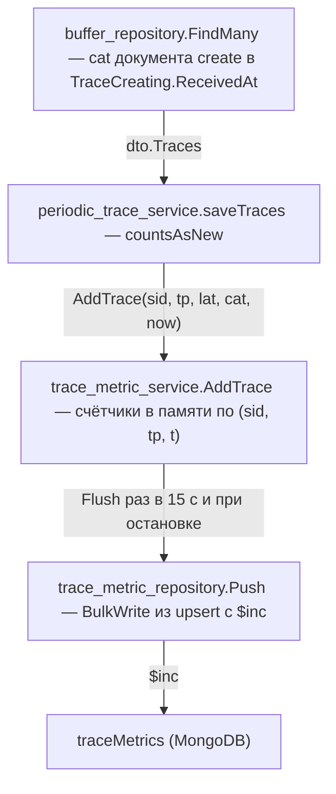

# План: метрики трейсов на Dashboard

## Цель

График за последние сутки: сколько трейсов каждого сервиса и типа пришло в каждую
15-минутку, по трём часам сразу — когда трейс залогирован в источнике, когда принят в буфер
и когда записан в шард. Расхождение трёх серий и есть то, что хочется видеть: затор
буфера, отстающие часы клиента, пачка трейсов, отправленная разом.

Шарды при этом не читаются. Суточный график по 24 часовым коллекциям на каждое открытие
Dashboard — тот же запрос, от которого ушли вотчеры.

## Что считается

Только новые трейсы, каждый один раз. Признак — `countsAsNew` в
`periodic_trace_service.saveTraces`: тот же, по которому считают вотчеры. Он срабатывает на
записи, которая первой дала трейсу тип. Повторный create того же трейса не считается;
update, пришедший раньше create, не считается, а трейс считается, когда create его догонит.
Update без create не считается никогда.

## Хранение

Коллекция `traceMetrics` в базе трейсов. Документ на сервис, тип и 15-минутку:

```text
{sid, tp, t, lc, bc, sc}
```

- `t` — начало 15-минутки, UTC;
- `lc` — трейсов, залогированных в эту 15-минутку (`lat` трейса);
- `bc` — трейсов, принятых в буфер в эту 15-минутку (`cat` документа create в буфере);
- `sc` — трейсов, записанных в шард в эту 15-минутку (момент записи).

Три времени одного трейса дают `$inc` своему счётчику в своей 15-минутке. Совпали — это
один upsert `{lc: 1, bc: 1, sc: 1}`; разошлись — два или три. Документов на пару сервис и
тип не больше, чем 15-минуток в сроке хранения, как бы времена ни расходились.

- уникальный индекс `(sid, tp, t)` — два одновременных upsert не создают два документа;
- TTL по `t` — 25 часов; график показывает последние 24, час запаса покрывает шаг
  фоновой чистки Mongo;
- `lat` старше срока хранения в `lc` не пишется: документ удалил бы TTL сразу же;
- `lat` из будущего приравнивается к моменту записи, как у вотчеров.

Коллекцию и индексы создаёт миграция на PHP, пишет в неё приёмник.

## Приёмник



- `dto.TraceCreating.ReceivedAt` — новое поле, заполняется из `cat` при чтении буфера;
- `trace_metric_service` — счётчики в памяти, `Run` с тикером 15 секунд, `Flush`;
  счётчики уходят из памяти до записи, как у вотчеров: потерять 15 секунд счёта лучше, чем
  копить карту против молчащего Mongo;
- финальный `Flush` — в `Transporter.flushCounters` рядом с вотчерами, после остановки
  цикла; `Run` сервиса ждётся в `main.go` так же, как `watcher_service`;
- коллекция — `MONGODB_COLL_TRACE_METRICS`, по умолчанию `traceMetrics`.

## Бэкенд — модуль Dashboard

- `database/migrations/…_mongodb_create_trace_metrics_collection.php` — коллекция и два
  индекса;
- `app/Models/Traces/TraceMetric.php`;
- `Repositories/TraceMetricRepository` — `find` по `{sid, t ≥ from}`;
- `Domain/Actions/FindTraceMetricsAction` — окно в 24 часа от текущей 15-минутки;
- `Entities/TraceMetricObject` — тип, момент, три счётчика;
- `GET /dashboard/trace-metrics/{serviceId}` — `[{type, timestamp, logged, buffered, stored}]`.

Сумма по типам — на фронте: фильтр типов не должен быть запросом.

## Фронт

- `Dashboard.vue` — вкладки Metrics (по умолчанию) и Databases (то, что там было);
- `DashboardMetrics.vue` — при первом открытии вкладки сервисы из
  `traceAggregatorServicesStore` (если их ещё нет), затем по очереди графики первых трёх;
  фильтр сервисов сужает список графиков; Refresh all по очереди загружает все графики
  списка, Refresh loaded — только уже загруженные из них;
- `DashboardMetricsServiceChart.vue` — график сервиса: столбцы, три серии по 96
  15-минуткам, пустые — нулями; фильтр типов без запроса; свой Refresh; фиксированная
  высота с заглушкой, пока не загружен;
- `store/dashboardMetricsStore.ts` — загруженное переживает переход между вкладками.

Автообновления нет: только кнопки и перезагрузка страницы.

## Тесты

- Go: раскладка трёх времён по 15-минуткам, совпавшие и разошедшиеся времена, `lat` из
  будущего, `lat` старше срока, сумма двух трейсов в одном ключе;
- PHP: action — окно и чтение документов, в том числе без одного из счётчиков.

## Выкатка

Миграция (`make art c=migrate`), пересборка приёмника (`make receiver-build`),
перезапуск воркеров (`make sconcur-restart`), `make frontend-npm-build`. `make deploy-prod`
делает всё это сам.
