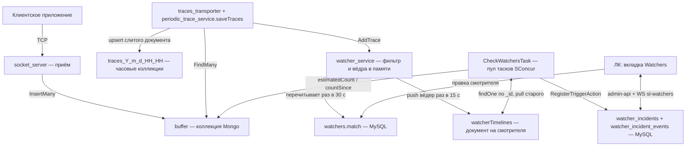

# План: смотрители (watchers)

Ветка: `feature/watchers`.

Сверено с кодом ветки: `app/Modules/**`, `app/Models/**`, `config/sconcur.php`,
`config/database.php`, `code-analyse/deptrac-layers.yaml`, `routes/admin-api.php`,
`database/migrations/**`, `frontend/src/**`, `servers/receiver/**`.

## Цель

Настраиваемые смотрители: правило проверяет состояние системы, при нарушении заводит
инцидент (факт) и складывает в него события. Инцидент закрывается руками из ЛК.

## Жёсткое ограничение

**Ни один смотритель не делает запросов в часовые коллекции трейсов** (`traces_Y_m_d_HH_HH`,
до 5 млн документов в час) и **не использует систему динамических индексов**.

## Разделение ролей

Трейсы считаются там, где они и так проходят по одному, — в приёмнике. Но приёмник только
**кладёт данные в таймлайн смотрителя**. Он не знает ни типов смотрителей, ни порогов, ни
окон, ни cooldown, ни того, что такое «спайк» или «долгое выполнение».

| Кто | Что делает |
|---|---|
| Go | по одному базовому фильтру решает, относится ли трейс к смотрителю, и складывает его в 15-секундное ведро: количество, длительности, свёртка по разрезам |
| PHP | читает таймлайн, применяет пороги, окна и проценты, решает, что сработало, ведёт инциденты и события |

Базовый фильтр одинаков по форме у всех смотрителей — сервис, тип, теги. Всё, чем
смотрители отличаются друг от друга, лежит в PHP и в Go не попадает вовсе.

Что это даёт:

- **Нет проблемы кардинальности.** У каждого смотрителя одна линия. Не нужен ни белый
  список тегов, ни отдельный канал настроек сбора.
- **Пустая инсталляция не платит ничего.** Нет смотрителей — нет матчинга и записей.
- **Новый тип смотрителя не трогает Go.** Пока он укладывается в те же три разреза, Go
  переписывать не нужно — меняются только чекеры в PHP.
- **Проверка смотрителя — арифметика** по одному документу.

## Что именно читает Go

Колонка `watchers.match` (json) — и только она, плюс `id`.

```json
{ "v": 1,
  "service_ids": [3, 7],
  "types": ["http", "db"],
  "tags": ["billing"] }
```

Пустой или отсутствующий ключ — не фильтруем. `tags` — трейс подходит, если несёт **любой**
из перечисленных. `v` — версия формата: приёмник, встретив незнакомую, пропускает такого
смотрителя и пишет об этом в лог, вместо того чтобы молча считать не то.

`match = NULL` — смотритель приёмнику не интересен (`buffer_overflow`,
`invalid_buffer_grown` считаются в PHP по буферам). Таких Go не загружает.

`match` — производная от `settings`, её пересчитывает PHP при сохранении смотрителя
(`WatcherMatchFactory`). Отдельная колонка, а не вложенный ключ: контракт с Go должно быть
видно в схеме, а не в соглашении внутри json.

### Почему статуса в фильтре нет

Статус трейса меняется по дороге: create приходит со `started`, финальный статус приезжает
апдейтом. Трейс же считается один раз — при первой записи, иначе он посчитается дважды. То
есть фильтр по статусу считал бы не то, что от него ждут: смотритель «спайк ошибок» не
увидел бы ни одного создания, потому что в этот момент ошибки ещё нет.

Поэтому статус не входит ни в `match`, ни в подпись свёртки. Смотритель по статусу — это
отдельная история со счётом по апдейтам, и она вынесена за рамки задачи, а не сделана
наполовину.

С тегами тот же эффект, но слабее: теги обычно приходят полными уже в create, а если
апдейт их дополнит, трейс останется посчитанным по тем, что были на момент создания.

## Точка съёма

`periodic_trace_service.saveTraces()`
(`servers/receiver/internal/services/periodic_trace_service/service.go:83`) — там, где
транспортёр пишет трейс в часовую коллекцию.

Место выбрано не случайно: метод **уже** делает `FindOne` по `{sid, tid}` и **уже**
собирает слитый документ — `traceType`, `tags`, `duration`, `loggedAt` лежат в локальных
переменных. Дополнительных чтений матчинг не требует вовсе.

Это же снимает две проблемы, неизбежные при съёме на приёме сокета:

- **Тип и теги у апдейта.** `dto.TraceUpdating` не несёт `tp`, а `dur` приходит как раз в
  апдейте (README, «Trace timeline»). В `saveTraces` тип уже восстановлен из create или из
  сохранённого документа — матчинг видит трейс целиком, а не половину.
- **Двойной счёт.** Один трейс проходит транспортёр дважды. Счётчик `c` растёт только
  когда `FindOne` вернул `ErrNoDocuments`, то есть при первой записи трейса. Апдейт тоже
  матчится, но приносит длительность: `dc`, `dSum`, `dMax`.

Ведро берётся по тому же `loggedAt`, которым `saveTraces` выбирает часовую коллекцию, —
поэтому создание и завершение одного трейса гарантированно попадают в одно ведро. Это та
же ось времени, что у `lat` в агрегаторе, и опоздавшая пачка ложится в своё ведро, а не в
текущее.

Если транспортёр встал, линии перестают заполняться и `no_new_traces` сработает. Это
верное поведение: трейсы действительно не появляются в хранилище, а `buffer_overflow` тут
же скажет, почему.

## Таймлайн смотрителя

Коллекция `watcherTimelines`, БД `traces` (соединение `mongodb.traces` — там же `buffer` и
`invalidBuffer`, приёмник в неё уже ходит из `buffer_repository`).

**Один документ на смотрителя**, `_id` — его `id`. Индексов не нужно вовсе: и чтение, и
запись адресуют документ по `_id`.

```
{ _id: 7,               // watcher_id
  tl: [                 // линия, отсортирована по t
    { t: UTCDateTime,   // начало 15-секундного ведра
      c: int,           // сколько подходящих трейсов начато
      dc: int,          // у скольких из них уже известна длительность
      dSum: float,      // сумма длительностей
      dMax: float,      // максимальная длительность
      g: [              // свёртка по разрезам
        { sid, tp, tgs: [string], c, dc, dSum, dMax, tid }
      ] }
  ],
  uat: UTCDateTime }    // когда линию дописывали в последний раз
```

`dc` отдельно от `c` потому, что это разные вещи: `c` — начатые трейсы, `dc` — завершённые.
Среднее считается как `dSum / dc`, и без `dc` оно было бы занижено ровно на долю трейсов,
которые ещё не закончились.

`g` — свёртка: трейсы ведра группируются по подписи `(sid, tp, отсортированные теги)`, в
группе остаётся счётчик, длительности и `tid` **самого долгого** трейса группы. Отсюда
берутся доказательства для события: не «сработало», а «вот 43 трейса такого вида, самый
долгий 14.2 с, вот он». Групп в ведре не больше 20 (`$slice`); `c` верхнего уровня при
переполнении остаётся точным.

Свёртка пишется всегда и одинаково для всех смотрителей — Go не решает, кому она нужна.

Запись — один `updateOne` с апсертом на смотрителя за сброс:

```
$push: { tl: { $each: [ ...закрытые вёдра... ], $sort: { t: 1 }, $slice: -720 } }
$set:  { uat: now }
```

`$sort` ставит опоздавшее ведро на его место в линии, `$slice: -720` держит потолок в 3
часа (720 вёдер по 15 секунд) **независимо от PHP**. Потолок здесь не роскошь: без него
остановленная PHP-таска означает массив, растущий до 16 МБ, после чего `$push` начинает
отказывать и метрики тихо теряются. TTL не поможет — он удаляет документы, а не элементы
массива.

Точную уборку делает PHP: `TrimWatcherTimelinesAction` раз в минуту считает по настройкам
смотрителя, какая глубина ему вообще видна (окно, база, запас), и вырезает лишнее —
`$pull: { tl: { t: { $lt: cutoff } } }`. То есть `$slice` — предохранитель, `$pull` —
уборка по конфигу.

Размер: 4 ведра в минуту, 240 в час, 720 под потолком. Чтение чекером — `findOne({_id: w})`,
один документ.

Два свойства, которые надо держать в голове при чтении:

- **Одинаковые `t` возможны.** Опоздавший трейс дописывает ведро, уже отправленное в
  линию, — вторым элементом с тем же `t`. Приёмник придерживает ведро 15 секунд после
  закрытия, поэтому это редкость, но PHP при чтении складывает элементы с одинаковым `t`,
  а не берёт первый.
- **Смотрителя удалили — документ удаляется** вместе с ним (`DeleteWatcherAction`).

## Изменения в приёмнике (Go)

```text
servers/receiver/internal/
├── repositories/watcher_repository/repository.go          — SELECT id, match FROM watchers WHERE enabled = 1
├── repositories/watcher_timeline_repository/repository.go — запись вёдер в Mongo
└── services/watcher_service/service.go                    — компиляция фильтров, матчинг, вёдра в памяти, сброс
```

- `watcher_repository` ходит в MySQL **по уже существующему пути**: приёмник и так читает
  оттуда `services` (`internal/repositories/service_repository`, имя таблицы из
  `MYSQL_TABLE_SERVICES`). Добавляется `MYSQL_TABLE_WATCHERS` в его `.env` и `.env.example`.
- Список перечитывается раз в 30 с и компилируется в матчеры: `service_ids` и `types` — в
  `map[...]struct{}`, теги — в множество. Смотрители с одинаковым `match` схлопываются в
  один матчер со списком `watcher_id`, чтобы одинаковые фильтры не считались дважды.
- Матчеры разложены по `sid`: трейс проверяется только против смотрителей своего сервиса
  плюс тех, у кого сервисы не заданы. При десятках смотрителей это ещё не нужно, но стоит
  один `map` и снимает вопрос роста.
- Вёдра держатся в памяти (`map[{w, bucket}]*bucket`) и сбрасываются раз в 15 секунд —
  только закрытые, с запасом ещё в 15 секунд на опоздавшие. Горутина рядом с `saveStats`
  в `cmd/receiver/main.go`.
- Сбой матчинга или записи линии логируется и **не** влияет на сохранение трейса.
- Нет включённых смотрителей с `match` — ни матчинга, ни записей, ни соединения с Mongo
  под это.

Весь объём Go-части — фильтр по трём множествам, счётчики и запись. Ни одного знания о
том, зачем эти числа нужны.

### Финальный сброс при остановке

Ведро надо отдавать в graceful shutdown, иначе на каждом деплое теряется до 30 секунд
линии (текущее ведро плюс придержанные). Одной горутины с `<-ctx.Done()` тут мало — в
`cmd/receiver/main.go` есть две тонкости.

**Первая: контекст уже отменён.** Остановка начинается с `cancel()`, а значит любая запись
в Mongo по этому контексту немедленно вернёт ошибку. Финальный сброс должен идти по
своему: `context.WithTimeout(context.Background(), 5*time.Second)`.

**Вторая: порядок и кто кого ждёт.** Сброс обязан случиться после того, как транспортёр
перестал считать. Поэтому сбрасывает не отдельная горутина, а сам транспортёр — в конце
`Transporter.Run`, когда его цикл уже вышел по `closing`, и синхронно, до `return`. Тогда
«транспортёр закончил» означает «линии дописаны».

Этого мало без правки в `main`. Сейчас на сигнале там:

```go
cancel()

select {
case err := <-done:            // ждёт ПЕРВЫЙ из двух
case <-time.After(10 * time.Second):
```

`done` общий на сокет-сервер и транспортёр, и `main` выходит по первому пришедшему. Если
первым вернётся сокет-сервер, процесс завершится посреди финального сброса. Нужно дождаться
обоих — цикл на два чтения из `done` под тем же общим дедлайном. Правка на три строки,
своей ценностью за пределами этой задачи: сейчас по SIGTERM транспортёр может быть оборван
на середине пачки (там же рядом живёт `TODO: graceful shutdown` в `socket_server`).

`SIGKILL` и падение процесса финального сброса, разумеется, не дают.

## Схема потока



## Типы триггеров

| Тип | Что читает PHP | Настройки |
|---|---|---|
| `buffer_overflow` | `buffer.estimatedDocumentCount()` — O(1) по метаданным | `threshold` (1000) |
| `invalid_buffer_grown` | `invalidBuffer.count({iat: {$gt: last_checked_at}})` — по существующему индексу `iat` | `threshold` (1) |
| `no_new_traces` | сумма `c` за окно == 0 | `period_minutes` (10) + `match` |
| `traces_spike` | сумма `c` за окно против средней за базу | `window_minutes` (5), `baseline_minutes` (60), `growth_percent` (90) + `match` |
| `slow_traces` | группы окна с `dMax >= duration` | `duration` (10) + `match` |

Все числа — поля конкретного смотрителя, в скобках только значения по умолчанию в форме.
Cooldown («не чаще, чем раз в») тоже настраивается: `cooldown_seconds`.

`slow_traces` знает, что долгие трейсы были, какого они вида и какой самый долгий (с его
`tid`), но не знает, сколько именно трейсов перешагнуло порог: свёртка хранит максимум по
группе, а не распределение. Для «duration превысил N секунд» этого достаточно, и это
осознанный размен на то, что Go не знает про пороги. Точный счёт потребовал бы гистограммы
длительностей с фиксированными границами — если понадобится, добавляется в ведро, не меняя
остального.

Самый тяжёлый запрос смотрителя — `findOne` своей линии.

### Прогрев

Только что созданный смотритель не имеет прошлого: его линия начинается сейчас. Без этого
`no_new_traces` с окном 10 минут сработает сразу после создания — окно пустое просто
потому, что его никто не считал.

Поэтому у смотрителя есть `collect_since` (ставится при создании, включении и при любом
изменении `match`), и проверка, которой нужно полное окно, пропускается, пока
`now - collect_since` меньше окна. Смотритель тихо ждёт, пока накопится история.

## Инциденты и события (MySQL)

Объём мал по построению: cooldown ограничивает поток событий (при 5 минутах — максимум 288
событий на смотрителя в сутки).

`watchers`:

| Колонка | Тип | Смысл |
|---|---|---|
| `id` | bigint | |
| `name` | string(255) | человеческое имя |
| `type` | string(64) | `WatcherTypeEnum` |
| `enabled` | bool, index | выключенный не проверяется и не загружается приёмником |
| `match` | json null | **единственное, что читает Go**; `NULL` у буферных типов |
| `settings` | json | пороги, окна, проценты — только для PHP |
| `cooldown_seconds` | int | «не чаще, чем раз в» |
| `collect_since` | timestamp null | с какого момента линия достоверна |
| `last_checked_at` | timestamp null | граница окна для `invalid_buffer_grown` |
| `last_triggered_at` | timestamp null | для cooldown |
| `created_at` / `updated_at` | timestamp | |

`watcher_incidents` — таблица1:

| Колонка | Тип | Смысл |
|---|---|---|
| `id` | bigint | |
| `watcher_id` | FK → watchers, cascadeOnDelete | |
| `status` | string(16) | `open` / `closed` — статус1/статус2 |
| `first_event_at`, `last_event_at` | timestamp | |
| `events_count` | int | чтобы список не считал |
| `closed_at` | timestamp null | |
| `closed_by_user_id` | FK → users null | кто закрыл |

Уникальности «один открытый инцидент на смотрителя» нет: индекс `{watcher_id, status}`
нужен только для поиска. Открытый инцидент ищется запросом
`where watcher_id = ? and status = 'open' order by id desc limit 1` — есть, событие уходит
в него; нет, заводится новый. Ограничение в базе тут и не требуется: пишет всегда один
процесс — пул тасков SConcur.

`watcher_incident_events` — таблица2:

| Колонка | Тип | Смысл |
|---|---|---|
| `id` | bigint | |
| `incident_id` | FK → watcher_incidents, cascadeOnDelete | |
| `occurred_at` | timestamp, index | время происшествия |
| `payload` | json | что увидел смотритель: значение, порог, свёртка `g` с `tid` |

Порядок при срабатывании (`RegisterTriggerAction`):

1. `now - last_triggered_at < cooldown_seconds` → выходим, ничего не пишем.
2. Ищем последний открытый инцидент смотрителя. Нет — создаём.
3. Пишем событие с `occurred_at` и `payload`.
4. `events_count++`, `last_event_at`, `watchers.last_triggered_at = now`.
5. Диспатчим `WatcherIncidentChangedEvent`; листенер вещает в `sl-watchers`.

Закрытие из ЛК (`CloseIncidentAction`): `status = closed`, `closed_at`,
`closed_by_user_id`. Следующее срабатывание заведёт новый инцидент.

## Структура модуля

```text
app/Modules/Watcher/
├── Enums/
│   ├── WatcherTypeEnum.php
│   └── WatcherIncidentStatusEnum.php
├── Entities/
│   ├── WatcherObject.php
│   ├── WatcherIncidentObject.php
│   ├── WatcherIncidentEventObject.php
│   ├── WatcherTriggerObject.php             — результат проверки: сработало + payload
│   ├── WatcherMatchObject.php               — то, что уезжает в колонку match
│   ├── WatcherTimelineObject.php            — линия целиком
│   ├── WatcherTimelineBucketObject.php      — ведро
│   ├── WatcherTimelineGroupObject.php       — группа свёртки
│   └── Settings/
│       ├── BufferOverflowSettingsObject.php
│       ├── InvalidBufferGrownSettingsObject.php
│       ├── NoNewTracesSettingsObject.php
│       ├── TracesSpikeSettingsObject.php
│       └── SlowTracesSettingsObject.php
├── Parameters/
│   ├── CreateWatcherParameters.php
│   ├── UpdateWatcherParameters.php
│   └── FindIncidentsParameters.php
├── Repositories/
│   ├── WatcherRepository.php
│   ├── WatcherIncidentRepository.php
│   ├── WatcherIncidentEventRepository.php
│   ├── WatcherTimelineRepository.php        — findOne по _id, pull старого
│   └── Services/
│       ├── WatcherSettingsMapper.php        — json ↔ объект настроек
│       ├── WatcherMatchFactory.php          — settings → match
│       └── WatcherTimelineReader.php        — склейка вёдер с одинаковым t, окна
├── Domain/
│   ├── Actions/Mutations/
│   │   ├── CreateWatcherAction.php
│   │   ├── UpdateWatcherAction.php
│   │   ├── DeleteWatcherAction.php
│   │   ├── RegisterTriggerAction.php
│   │   ├── CloseIncidentAction.php
│   │   ├── CheckWatchersAction.php          — один проход по включённым смотрителям
│   │   └── TrimWatcherTimelinesAction.php   — вырезать то, что ушло за видимость
│   ├── Actions/Queries/
│   │   ├── FindWatchersAction.php
│   │   ├── FindIncidentsAction.php
│   │   └── FindIncidentEventsAction.php
│   ├── Services/Checkers/
│   │   ├── WatcherCheckerInterface.php      — check(WatcherObject): ?WatcherTriggerObject
│   │   ├── BufferOverflowChecker.php
│   │   ├── InvalidBufferGrownChecker.php
│   │   ├── NoNewTracesChecker.php
│   │   ├── TracesSpikeChecker.php
│   │   ├── SlowTracesChecker.php
│   │   └── WatcherCheckerRegistry.php       — тип → чекер
│   ├── Events/WatcherIncidentChangedEvent.php
│   └── Exceptions/WatcherNotFoundException.php
└── Infrastructure/
    ├── Tasks/CheckWatchersTask.php
    ├── Listeners/BroadcastWatcherIncidentListener.php
    ├── Broadcasting/WatcherIncidentBroadcast.php
    ├── Http/Controllers/WatcherController.php
    ├── Http/Controllers/WatcherIncidentController.php
    ├── Http/Requests/{Create,Update}WatcherRequest.php, IndexIncidentsRequest.php
    ├── Http/Resources/WatcherResource.php, WatcherIncidentResource.php, WatcherIncidentEventResource.php
    └── WatcherServiceProvider.php
```

Модели: `app/Models/Watchers/Watcher.php`, `WatcherIncident.php`,
`WatcherIncidentEvent.php` (MySQL, `AbstractModel`) и `WatcherTimeline.php` (Mongo,
`AbstractTraceModel` — соединение `mongodb.traces`).

Каждый чекер — класс с одним публичным методом; `CheckWatchersAction` только раскладывает
смотрителей по чекерам и передаёт срабатывания в `RegisterTriggerAction`.

### Что добавляется в модуль Trace

Только доступ к счётчикам буферов, которые PHP сейчас не читает:

- `app/Models/Traces/TraceBuffer.php`, `TraceInvalidBuffer.php` — коллекции `buffer`,
  `invalidBuffer`.
- `Repositories/TraceBufferRepository.php` — `estimatedCount()`, `countInvalidSince()`.
- `Domain/Actions/Queries/FindTraceBufferStatAction.php`.

Линия смотрителя — не метрика трейсов, а его собственные данные, поэтому
`WatcherTimelineRepository` живёт в `Watcher`.

### Задача пула

В `config/sconcur.php`, `tasks.list`:

```php
[ 'name' => CheckWatchersTask::NAME, 'idle' => 5, 'busy' => 5, 'backoff' => 30 ],
```

Такт проверяет всех включённых смотрителей раз в ~30 секунд — при cooldown в минутах этого
достаточно, а стоимость такта это выборка из MySQL и по одному `findOne` на смотрителя.
Уборка линий (`TrimWatcherTimelinesAction`) идёт из того же такта, но не чаще раза в
минуту. Пул тасков — один процесс, конкуренции за инциденты нет by design.

## HTTP API

В `routes/admin-api.php`:

```php
Route::prefix('/watchers')->as('watchers.')->group(function () {
    Route::get('', [WatcherController::class, 'index'])->name('index');
    Route::post('', [WatcherController::class, 'create'])->name('create');
    Route::patch('/{id}', [WatcherController::class, 'update'])->name('update');
    Route::delete('/{id}', [WatcherController::class, 'delete'])->name('delete');
    Route::get('/types', [WatcherController::class, 'types'])->name('types');

    Route::get('/incidents', [WatcherIncidentController::class, 'index'])->name('incidents.index');
    Route::get('/incidents/{id}/events', [WatcherIncidentController::class, 'events'])->name('incidents.events');
    Route::patch('/incidents/{id}/close', [WatcherIncidentController::class, 'close'])->name('incidents.close');
});
```

Два контроллера: смотритель и инцидент — разные сущности. `types` отдаёт описание типов и
их полей, чтобы форма строилась по контракту, а не по дублирующему списку в TS.

После изменений — `make oa-generate`, затем `make frontend-npm-build`.

## Фронт

Вкладка `Watchers` в `frontend/src/components/Header.vue` перед `Logs`, маршрут
`/watchers` в `frontend/src/utils/router.ts`.

- `frontend/src/components/pages/watchers/Watchers.vue` — два таба:
  - **Incidents**: таблица, открытые сверху, раскрытие строки показывает события со
    свёрткой (сколько трейсов, какого вида, ссылка на `tid` в агрегатор).
  - **Settings**: таблица смотрителей, диалог создания/редактирования, набор полей формы
    зависит от типа и берётся из `/watchers/types`.
- Сторы `store/watchersStore.ts` и `store/incidentsStore.ts` по образцу
  `trace-cleaner/store/traceCleanerStore.ts`.
- Бейдж с числом открытых инцидентов в шапке по WS-каналу `sl-watchers` (WS уже включён:
  `BROADCAST_DRIVER=sconcur`, `SCONCUR_WS_WORKER_COUNT=1`).

## Тесты

Go (`servers/receiver`, образец — `buffer_repository/repository_test.go`):

- матчер: каждый разрез по отдельности и в связке, пустой фильтр, незнакомая версия `v`,
  теги как «любой из»;
- вёдра: раскладка по `loggedAt`, `c` растёт ровно один раз на трейс, апдейт не трогает
  `c`, но приносит `dc`/`dSum`/`dMax`, свёртка по подписи, ограничение в 20 групп;
- схлопывание одинаковых `match` в один матчер;
- финальный сброс: после выхода из цикла транспортёра в памяти не остаётся вёдер, и сброс
  идёт по своему контексту, а не по отменённому.

PHP:

- `tests/Modules/Watcher/Domain/Services/Checkers/TracesSpikeCheckerTest.php` — расчёт
  процента роста, пустая база, база из одного ведра, деление на ноль;
- `.../NoNewTracesCheckerTest.php` — границы окна, прогрев (`collect_since`);
- `.../SlowTracesCheckerTest.php` — порог по `dMax` группы, доказательства (`tid`);
- `tests/Modules/Watcher/Repositories/Services/WatcherTimelineReaderTest.php` — склейка
  вёдер с одинаковым `t`, границы окна;
- `tests/Modules/Watcher/Repositories/Services/WatcherMatchFactoryTest.php` — settings →
  match, `NULL` у буферных типов;
- `tests/Modules/Watcher/Domain/Actions/RegisterTriggerActionTest.php` — cooldown,
  переиспользование открытого инцидента, новый инцидент после закрытия;
- `tests/Modules/Watcher/Domain/Actions/TrimWatcherTimelinesActionTest.php` — глубина
  отреза по настройкам;
- `tests/Modules/Watcher/Infrastructure/CheckWatchersTaskTest.php` — по образцу
  `tests/Services/Tasks/CronTaskTest.php`.

## Этапы

1. **MySQL и скелет модуля.** Миграции `watchers` (с `match` и `collect_since`),
   `watcher_incidents`, `watcher_incident_events`; модели, репозитории, енумы, объекты
   настроек, `WatcherMatchFactory`. Проверяется тестами.
2. **Go.** `watcher_repository`, матчер, `watcher_timeline_repository`, вёдра и сброс, хук
   в `saveTraces`, финальный сброс при остановке, `MYSQL_TABLE_WATCHERS` в `.env.example`.
   Проверяется тестами Go и глазами по `watcherTimelines`.
3. **Проверки.** Чекеры, `WatcherTimelineReader`, инциденты и события, `CheckWatchersTask`,
   `TrimWatcherTimelinesAction`.
4. **HTTP.** Контроллеры, реквесты, ресурсы, роуты, `make oa-generate`.
5. **Фронт.** Вкладка, сторы, формы, `make frontend-npm-build`.
6. **WS-бейдж** открытых инцидентов.

Этапы 1–3 самостоятельны и проверяются без фронта.

## Принятые решения

1. Go только собирает: фильтр по сервису/типу/тегу, счётчики, длительности, свёртка.
   Пороги, окна, проценты, cooldown — PHP.
2. Ведро — 15 секунд, по `loggedAt`.
3. Таймлайн — один документ на смотрителя, `_id` = `watcher_id`.
4. Уникальности открытого инцидента нет.
5. Приёмник читает `watchers` сам, отдельного канала настроек сбора нет.

## Вне рамок

- **Смотритель по статусу** («спайк ошибок»): требует счёта по апдейтам, а не по созданиям
  — см. «Почему статуса в фильтре нет».
- **Точный счёт трейсов выше порога длительности**: нужна гистограмма в ведре.
- Внешние уведомления (telegram, email, вебхуки). Точка расширения —
  `WatcherIncidentChangedEvent`.
- Автозакрытие инцидента при исчезновении причины: по постановке закрывает человек.
- Фильтры по полям `dt` в `match`.
- Смотрители за логами (`app/Modules/Logs`) — та же схема, отдельный тип, позже.

## Требуют решения

1. **Правка `main.go`, чтобы дождаться обоих серверов** при остановке — три строки, но это
   изменение общего поведения приёмника при SIGTERM, а не только нашей фичи. Нужно явное
   «да».
2. **Потолок линии — 720 элементов (3 часа).** `$slice` на стороне приёмника, страховка от
   неработающей PHP-уборки. Он должен быть больше самого длинного окна, которое настройки
   позволяют задать: если разрешим базу спайка длиннее 3 часов, потолок надо поднимать
   вместе с ней.
3. **Групп в свёртке — 20** на ведро; `c` точный при любом переполнении.
