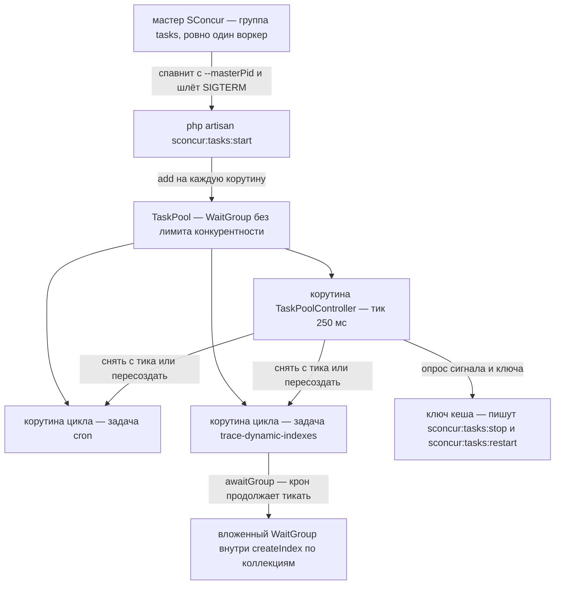

# План: пул периодических задач на `SConcur\WaitGroup` в пакете `sconcur-laravel`

Всё ниже сверено с кодом этой ветки: `docker/supervisor/conf/supervisor.conf`,
`app/Console/Commands/Cron/*`, `app/Modules/Trace/**`, `packages/sconcur/sconcur-laravel/**`,
`vendor/sconcur/sconcur` (0.11).

## 1. Цель

Дать пакету третью форму рантайма — рядом с HTTP-сервером (`src/Http`) и пулом
консьюмеров очередей (`src/Queue/Rabbitmq`) появляется пул периодических задач: один
процесс, `WaitGroup`, по корутине на задачу, общий цикл и общая остановка.

Приложение первым же потребителем схлопывает две supervisor-программы в одну:

| Программа сейчас | Команда | Процессов |
| --- | --- | --- |
| `sl-cron` | `cron:start` | 1 |
| `sl-queue-trace-dynamic-indexes-monitor` | `trace-dynamic-indexes:monitor:start` | 1 |

Очереди в эту работу не входят. Параллельная работа по AMQP уже убрала очередные
программы из supervisor — они стали группой `rabbitmq` мастера. Пул идёт туда же, третьей
группой `tasks`, поэтому в `supervisor.conf` остаётся одна программа — сам мастер.

**Про телеметрию — сразу, чтобы не ждали.** Панель наполняют снапшоты, которые раз в
секунду шлёт Go-сторона серверного и консьюмерского рантаймов
(`vendor/sconcur/sconcur/docs/admin-stats.ru.md`); пул не запускает ни того, ни другого и
не шлёт ничего. В `sconcur:servers:master:status` и в state-файле группа видна, в
`/api/stats` — нет. Дашборд дорисовывает такие группы нулями (§ 5.11), чтобы пул не
выглядел несуществующим. Что даёт мастер взамен: общий журнал с ротацией вместо вечно
растущих логов supervisor, единое дерево процессов, один graceful на всё и
`master:reload --group=tasks`.

## 2. Почему пул именно на корутинах

Обе задачи — либо сон, либо ожидание Mongo, и ни одна не занимает PHP-поток надолго:

- **cron** (`app/Console/Commands/Cron/CronStartCommand.php`): `sleep(5)`, сверка
  минуты и раз в минуту `Artisan::call('schedule:run')`. Расписание здесь только
  диспатчит две джобы (`app/Console/Kernel.php:17-18`).
- **монитор индексов** (`StartMonitorTraceDynamicIndexesAction`): `find()`,
  `createIndex()`, `deleteIndexByName()` и `sleep(1)` на пустом проходе. Весь
  ввод-вывод идёт через асинхронный Mongo SConcur (`TraceDynamicIndex::sconcur()`,
  `PeriodicTraceService` поверх `SConcur\Features\Mongodb`), а `createIndex`
  (`app/Modules/Trace/Repositories/TraceRepository.php:293`) внутри себя разворачивает
  собственный `WaitGroup` по коллекциям.

Второе важно вдвойне: вложенный `WaitGroup` внутри корутины — штатный режим.
`WaitGroup::iterate()` при `Fiber::getCurrent() !== null` уходит в
`Scheduler::awaitGroup()`, поэтому построение индексов не блокирует крон.

Единственное место, где сейчас процесс замирает целиком, — родные `sleep(5)` и
`sleep(1)`. Их и заменяем (§ 5.5).

## 3. Схема



Диаграмма записана в консервативном подмножестве синтаксиса: без скобок, двоеточий и
`()` внутри подписей — они ломают рендер в старых сборках mermaid, которые бандлит
PhpStorm. Разделитель внутри подписи — только тире.

## 4. Именование: задачи, а не воркеры

В пакете и в библиотеке «воркер» уже занят — это **процесс**, который спавнит и
стережёт мастер (`src/Worker/`, `workerScript`, `workerCount`, журнал
`worker: <pid> <группа> #<индекс>`). Назвать `WorkerInterface` корутину с `tick()` в
том же пакете — гарантированная путаница в двух шагах от `WorkerGroupConfig`.

Поэтому в пакете это **задачи**: `TaskInterface`, `TaskPool`, `sconcur:tasks:start`.
Если хочется оставить «воркеров» — скажи, переименование механическое.

## 5. Состав изменений

### 5.1. Пакет — новый рантайм (ничего не знает о приложении)

| Файл | Назначение |
| --- | --- |
| `src/Tasks/TaskInterface.php` | `name()`, `tick()` (§ 5.4) |
| `src/Tasks/TickResultEnum.php` | `Worked`, `Idle`, `Failed` — от него зависит пауза |
| `src/Tasks/TaskRegistry.php` | читает `sconcur.tasks.list`, резолвит задачи из контейнера, пересоздаёт по `restart` |
| `src/Tasks/TaskPool.php` | `WaitGroup`, общий цикл, паузы, обработка исключений |
| `src/Tasks/TaskPoolState.php` | кто активен, что запрошено, время старта процесса |
| `src/Tasks/TaskPoolController.php` | корутина-контролёр: сигналы, канал, дренаж, дедлайн |
| `src/Tasks/CooperativeSleeper.php` | прерываемый сон; зовёт только пул |
| `src/Tasks/Control/ControlChannel.php` | чтение и запись ключа кеша |
| `src/Tasks/Control/ControlCommandDto.php` | `action`, `target`, `at` |
| `src/Tasks/Control/ControlActionEnum.php` | `Stop`, `Restart` |
| `src/Console/TasksStartCommand.php` | `sconcur:tasks:start [--only=]` |
| `src/Console/TasksStopCommand.php` | `sconcur:tasks:stop [--task=]` |
| `src/Console/TasksRestartCommand.php` | `sconcur:tasks:restart [--task=]` |
| `docs/task-pool.ru.md` | описание рантайма, как у двух существующих доков пакета |

Правки в существующих файлах пакета (обе аддитивные, обе — общий файл с параллельной
работой, § 9):

- `src/SConcurServiceProvider.php` — три команды в массив `commands([...])` и
  `TaskRegistry` синглтоном;
- `config/sconcur.php` — секция `tasks`: настройки пула и список задач (§ 6);
- `README.md` пакета — строка про `src/Tasks/` в блоке «Структура».

`isCoroutineWorker()` не трогаем: корутинные адаптеры (`config`, `events`, `router`,
`translator`, `view`) задачам не нужны — они не касаются `Request`, `Auth`, `Session`
и не мутируют конфиг. Это фиксируется правилом в PHPDoc `TaskInterface`, а не
проводкой. Если однажды задаче понадобится — одна строка.

### 5.2. Приложение — конкретные задачи

| Файл | Назначение |
| --- | --- |
| `app/Services/Tasks/CronTask.php` | `tick()` крона (§ 5.6) |
| `app/Modules/Trace/Infrastructure/Tasks/BuildTraceDynamicIndexesTask.php` | `tick()` монитора (§ 5.7) |
| `app/Modules/Trace/Domain/Actions/Mutations/BuildPendingTraceDynamicIndexesAction.php` | один проход по индексам в работе |
| `app/Modules/Trace/Domain/Actions/Mutations/DeleteExpiredTraceDynamicIndexesAction.php` | один проход по просроченным |

Задача монитора живёт в `Infrastructure/Tasks/` модуля — это адаптер к внешнему
рантайму, ровно то, для чего в правилах проекта отведён `Infrastructure`. Deptrac
проходит: слой `Infrastructure` собирается из вложенных каталогов
(`/app/Modules/\w+/Infrastructure/\w+/`) и ему разрешено зависеть от `Domain`.
Задача крона модулю не принадлежит и лежит в `app/Services`.

Список задач и их интервалы лежат там же, где все прочие настройки пакета, — в
`config/sconcur.php`, секция `tasks.list` (§ 6). Отдельного `config/tasks.php` и
провайдера-регистратора нет: `TaskRegistry` просто читает этот список и резолвит классы
из контейнера.

Оговорка на будущее: конфиг пакета при этом ссылается на классы приложения. Для
локального path-пакета это нормально и уже так и есть — в том же файле стоят
`base_path('artisan')` и `storage_path(...)`. Если пакет когда-нибудь поедет в
отдельный репозиторий, `tasks.list` придётся вынести на сторону приложения; всё
остальное в секции переносить не надо.

### 5.3. Изменяемое и удаляемое в приложении

| Файл | Изменение |
| --- | --- |
| `docker/supervisor/conf/supervisor.conf` | две программы → одна `sl-sconcur-tasks` (§ 7) |
| `app/Console/Commands/Cron/CronStartCommand.php` | алиас `sconcur:tasks:start --only=cron` |
| `StartMonitorTraceDynamicIndexesCommand` | алиас `sconcur:tasks:start --only=trace-dynamic-indexes` |
| `app/Modules/Trace/Infrastructure/TraceServiceProvider.php` | регистрация двух новых action'ов, снятие удалённых |
| `.env.example`, `DEPLOY.md`, `README.md`, `README.ru.md` | новые переменные и команды |

| Удаляется | Почему |
| --- | --- |
| `app/Console/Commands/Cron/CronStopCommand.php` | заменяется `sconcur:tasks:stop --task=cron` |
| `app/Console/Commands/Cron/BaseCronCommand.php` | session-key больше не механизм остановки (§ 5.6) |
| `.../Commands/StopMonitorTraceDynamicIndexesCommand.php` | заменяется `sconcur:tasks:restart --task=...` |
| `.../Actions/Mutations/StopMonitorTraceDynamicIndexesAction.php` | единственный писатель флага |
| `.../Domain/Services/MonitorTraceDynamicIndexesService.php` | весь смысл сервиса — этот флаг |
| `.../Actions/Mutations/StartMonitorTraceDynamicIndexesAction.php` | распадается на два action'а и `tick()` (§ 5.7) |

Проверено: флаг читает только `StartMonitorTraceDynamicIndexesAction:28`, пишет только
`StopMonitorTraceDynamicIndexesAction`, фронтенд и HTTP-слой к нему не обращаются.

### 5.4. `tick()` вместо вечного цикла внутри задачи

```php
interface TaskInterface
{
    public function name(): string;

    /**
     * Одна порция работы. Обязана возвращаться сама — пул не умеет её прервать.
     * Пауза, обработка исключений и остановка — не забота задачи.
     */
    public function tick(): TickResultEnum;
}
```

Цикл — общий, живёт в пуле, по корутине на задачу:

```php
$waitGroup->add(function () use ($name): void {
    while ($this->state->isActive($name)) {
        try {
            $result = $this->registry->task($name)->tick();
        } catch (FlowStoppedException | CoroutineTimeoutException $exception) {
            throw $exception;                       // намеренная размотка — не глушим
        } catch (Throwable $exception) {
            report($exception);

            $result = TickResultEnum::Failed;
        }

        CooperativeSleeper::sleep(
            $this->intervalFor($name, $result),
            $this->state->interruptFor($name),
        );
    }
});
```

Что это даёт:

- **Нет `stop()` у задачи.** Он мог бы только поднять флаг, который цикл задачи должен
  не забыть проверить, — обещание, которое интерфейс не выполняет. Пул просто перестаёт
  звать `tick()`, и проверка остановки — ровно между тиками.
- **Одна реализация цикла на всех.** Пауза, backoff, `report()`, проверка остановки,
  пересоздание — в одном месте.
- **Задачи вообще не спят.** Единственный вызов `CooperativeSleeper` — в пуле, поэтому
  заморозить процесс родным `sleep()` больше негде.
- **Тесты сводятся к вызову `tick()`** нужное число раз, без корутин и без расширения.

`TickResultEnum` управляет паузой: `Worked` — спим `busy` (по умолчанию 0, чтобы
дренировать работу); `Idle` — спим `idle`; `Failed` — спим `backoff`.

**Чего `tick()` не решает:** он не ограничивает длительность работы. Один тик монитора
может уйти на минуты внутри `createIndex()`, и прервать его пул не может. Жёсткий
дедлайн остановки (§ 5.9) остаётся обязательным.

**Известное ограничение:** задача, чья природа — блокирующий цикл внутри библиотеки, в
`tick()` не укладывается. Обе сегодняшние укладываются; вторую форму, если понадобится,
добавить нетрудно.

### 5.5. Кооперативный и прерываемый сон

```php
public static function sleep(float $seconds, ?Closure $interrupt = null): void
{
    $deadline = microtime(true) + $seconds;
    $chunk    = self::chunkMicroseconds();          // sleep_chunk_ms, дефолт 250

    while (true) {
        if ($interrupt !== null && $interrupt()) {
            return;
        }

        $left = (int) round(($deadline - microtime(true)) * 1_000_000);

        if ($left <= 0) {
            return;
        }

        self::pause(min($left, $chunk));
    }
}

private static function pause(int $microseconds): void
{
    if (Fiber::getCurrent() !== null && extension_loaded('sconcur')) {
        Sleeper::usleep($microseconds);

        return;
    }

    usleep($microseconds);
}
```

`Sleeper::usleep()` усыпляет только свою корутину; родной `sleep()` заморозил бы
процесс целиком. Проверка на фибер и расширение нужна, чтобы пул работал и вне
корутины — в тестах.

Квант 250 мс взят не с потолка: с таким же интервалом поллят серверы самой библиотеки,
и по той же причине — «цикл `serve()` поллит `waitAnyTimeoutBatch` с этим интервалом и
замечает сигнал без трафика» (`vendor/sconcur/sconcur/docs/http-server.ru.md:542`).

Тик контролёра решает вторую половину задачи. Обработчик `pcntl` при
`pcntl_async_signals(true)` выполняется на границе опкодов, то есть только когда
исполняется PHP-код; пока все корутины припаркованы в ожидании Go, `SIGTERM` лежит
недоставленным. Контролёр, просыпающийся раз в квант сна, даёт PHP-коду исполняться
регулярно, и сигнал доставляется, чем бы ни были заняты задачи в ожидании.

Одного этого мало: контролёр должен ещё и получить поток. Вычислительный участок внутри
чужого тика поток не уступает, и просыпаться контролёру будет некогда — эту половину
закрывает автопереключение корутин (§ 5.10). Два механизма дополняют друг друга:
дробление пауз даёт точку исполнения PHP-кода, преемпция — гарантию, что она наступит
вовремя.

Обработчики ставим и снимаем ровно как
`SConcur\Features\Server\ServerRuntimeSupportTrait::installSignalHandlers()`: сохранить
прежние и режим `pcntl_async_signals`, поставить свои, восстановить в `finally`.

### 5.6. `tick()` крона

```php
public function tick(): TickResultEnum
{
    $minute = (int) date('i');

    if ($minute === $this->previousMinute) {
        return TickResultEnum::Idle;
    }

    $this->previousMinute = $minute;

    Artisan::call('schedule:run');

    return TickResultEnum::Worked;
}
```

`idle` = 5 секунд — та же гранулярность, что у нынешнего `sleep(5)`.

Побочный эффект удаления session-key крона: эта метка заодно была защитой от двух
одновременно запущенных кронов (второй старт ставил новую метку, первый цикл выходил).
Поэтому пул берёт на старте `Cache::lock` на весь процесс — две копии
`sconcur:tasks:start` рядом не станут дважды тикать `schedule:run`. Имя лока — из
конфига пакета, чтобы два разных пула в одном приложении не мешали друг другу.

### 5.7. `tick()` монитора и разбор его action'а

Главная цена решения. `StartMonitorTraceDynamicIndexesAction` — демон, который выдаёт
себя за action: внутри бесконечный `while`, свой `sleep(1)` и свой cache-флаг. В
`Domain` такому места нет и в `tick()` он не лезет. Разбираем на то, чем он является:

| Было (внутри `while`) | Стало |
| --- | --- |
| `find(inProcess: true)` → `createIndex` → `updateByName` | `BuildPendingTraceDynamicIndexesAction::handle(int $limit = 10): int` |
| раз в 30 с: `find(inProcess: false, toActualUntilAt: now)` → `deleteIndexByName` → `deleteById` | `DeleteExpiredTraceDynamicIndexesAction::handle(int $limit = 10): int` |
| `$deletingTimeout = time() + 30` | таймер внутри `tick()` задачи |
| `sleep(1)` на пустом проходе | `TickResultEnum::Idle` + `idle` = 1 с |
| `while (!hasRestartFlag())` | пул перестаёт звать `tick()` |

Разбор не выдуманный: `DeleteExpiredTraceDynamicIndexesAction` — это существующий
`FlushDynamicIndexesAction` с фильтром по сроку, а поштучное удаление индекса уже живёт
в `DeleteTraceDynamicIndexAction`.

```php
public function tick(): TickResultEnum
{
    $handled = 0;

    if ($this->deleteExpiredAt <= time()) {
        $handled += $this->deleteExpired->handle();

        $this->deleteExpiredAt = time() + self::DELETE_EXPIRED_INTERVAL;
    }

    $handled += $this->buildPending->handle();

    return $handled > 0 ? TickResultEnum::Worked : TickResultEnum::Idle;
}
```

Выигрыш помимо `tick()`: у модуля появляются два нормальных action'а с одним `handle()`
и без вечного цикла, которые можно покрыть тестом. Сейчас «один проход монитора» не
выразим отдельно от демона и не тестируется вообще.

Проверка остановки остаётся **после** полного прохода: внутри идёт `createIndex()` и
следом `updateByName(inProcess: false, created: ...)`, и рвать между ними нельзя —
индекс остался бы навсегда в `inProcess: true`. Граница тика это и обеспечивает.

Если разбирать `Domain` не хочется — скажи; тогда монитор остаётся демоном второй
формой задачи, и выигрыш от `tick()` достаётся только крону.

### 5.8. Контролёр и канал управления

`TaskPoolController` — обычный член той же группы: раз в квант сна просыпается и смотрит

1. **флаг сигнала** — его поднимает обработчик `SIGTERM`/`SIGINT`/`SIGQUIT`;
2. **ключ кеша** — его пишут `sconcur:tasks:stop` и `sconcur:tasks:restart`.

| Команда | Что делает контролёр |
| --- | --- |
| `sconcur:tasks:stop` | снимает с тика все задачи, дренаж, выход процесса |
| `sconcur:tasks:stop --task=cron` | снимает с тика крона; остальные работают |
| `sconcur:tasks:restart --task=trace-dynamic-indexes` | просит реестр пересоздать инстанс — задача тикает дальше с чистым состоянием |

Обе удаляемые команды покрыты, причём каждая своим по смыслу действием, а не одним
«стопом», который сегодня для крона значит «остановись», а для монитора —
«перезапустись». `restart` при `tick()` получает точный смысл: сбросить внутреннее
состояние задачи (счётчик минуты, таймер чистки).

Канал через кэш, а не только сигналы, нужен по той же причине, по которой он есть
сейчас: управлять надо уметь **из другого процесса** — из контейнера `php-fpm`, из
`make art`. Сигнал так не отправишь, не зная pid.

**Защита от устаревшей команды** обязательна, иначе цикл остановок: `stop` оставит ключ,
supervisor поднимет процесс, тот прочитает старую команду и снова выйдет. Поэтому пул
запоминает время своего старта, контролёр реагирует только на команду с `at` позже
старта и позже последней обработанной, и удаляет ключ после обработки. Проверка по
времени — основная, удаление — уборка.

Это ровно сегодняшняя семантика `cron:stop`: остановка одноразовая и перезапуск
процесса не переживает. «Выключить задачу насовсем» — это конфиг, а не рантайм-команда.

### 5.9. Graceful shutdown

Инвариант: **любая причина остановки идёт одним путём** — контролёр снимает задачи с
тика → дренаж → выход `0`. Причины: сигнал, `sconcur:tasks:stop`, превышение лимита
памяти.

1. Контролёр видит сигнал или команду и переводит задачи в неактивные: ~250 мс, когда
   задачи спят или ждут ввод-вывод, и до ~1.25 с под вычислительным участком чужого
   тика (квант преемпции плюс квант сна, § 5.10).
2. Цикл каждой задачи доходит до конца текущего тика и возвращается.
3. Контролёр дожидается, пока живых циклов не останется, и выходит сам. Группа пустеет,
   `iterate()` возвращается, обработчики сигналов восстанавливаются, команда отдаёт `0`.
4. Если за `shutdown_timeout_seconds` кто-то не вышел — контролёр логирует имена
   застрявших и зовёт `$waitGroup->stop()`.
5. Если и это не помогло — `SIGKILL` от supervisor по `stopwaitsecs`.

**Про принудительную остановку — ограничение, которое надо знать заранее.** Отдельную
корутину принудительно размотать нечем: публичного API планировщика для этого нет.
`WaitGroup` держит `$members` (fiber id) в защищённом свойстве, `Scheduler::detach()`
снимает корутину с планирования, но не разматывает её — `finally` не отработают, фибер
повиснет. Единственный принудительный инструмент — `WaitGroup::stop()`, и он
разматывает **всю группу целиком** (`FlowStoppedException` каждому приостановленному,
так что их `finally` выполняются). Вызов `stop()` изнутри корутины поддерживается — в
докблоке `WaitGroup::stop()` этот случай разобран отдельно, с оговоркой, что отмена на
стороне Go доедет на такт планировщика позже.

Отсюда честное поведение шага 4: истёк дедлайн **общей** остановки — `WaitGroup::stop()`
и размотка всех, на выходе из процесса это и нужно; истёк дедлайн **выборочной**
остановки — остальные работают, разматывать группу нельзя, контролёр пишет
предупреждение с именем застрявшего и оставляет его доживать тик.

Если выборочное принудительное убийство когда-нибудь понадобится, оно выразимо: дать
каждой задаче собственный вложенный `WaitGroup` из одного участника. Сейчас не делаем.

**Соотношение таймаутов — инвариант, который легко сломать молча:**

```
shutdown_timeout_seconds (20)  <  stopwaitsecs программы sl-sconcur-tasks (30)
```

Дефолт `stopwaitsecs` у supervisor — 10 секунд, и в текущем `supervisor.conf` он не
задан ни у одной программы. То есть без явной строки жёсткий дедлайн в 20 с не успеет
отработать никогда и остановка всегда будет идти через `SIGKILL` — весь мягкий путь
окажется декоративным.

> Попутно, не наша территория: у `sl-sconcur-http-master` та же проблема уже сейчас —
> мастер по своему `shutdownTimeoutMs` (дефолт 10000 мс) ждёт воркеров ровно столько,
> сколько supervisor даёт ему целиком по дефолтному `stopwaitsecs=10`, без запаса на
> собственную работу. Стоит сказать тому, кто ведёт AMQP-ветку; сам не трогаю.

### 5.10. Автоматическое переключение корутин — включено

Пул включает преемпцию на всё время работы, опция `preemption_quantum_ms`, `0`
выключает.

**Квант — 1000 мс, а не 5 мс дефолта библиотеки.** Дефолт рассчитан на серверы, где
десятки одновременных обработчиков делят один поток и латентность соседнего запроса
считается в миллисекундах. Здесь три корутины, две из которых почти всё время спят, и ни
одного клиента, который ждёт ответа. Единственный, кому нужен поток вовремя, — контролёр,
а его бюджет измеряется не миллисекундами: при `shutdown_timeout_seconds` = 20 и
`stopwaitsecs` = 30 задержка в секунду не значит ничего.

Что теряем: под вычислительным участком чужого тика контролёр просыпается с задержкой до
кванта. Худший случай реакции на `SIGTERM` — примерно квант преемпции плюс квант сна,
около 1.25 с вместо ~250 мс. На фоне 20-секундного дедлайна это несущественно.

**Чего преемпция не даёт.** Вытесняется только userland-код PHP. Нативный блокирующий
вызов (синхронный PDO, `curl`, родной `sleep`) прервать нечем — отдельно оговорено в
`vendor/sconcur/sconcur/docs/worker-master.ru.md`, раздел «Зависший воркер». Поэтому
жёсткий дедлайн остановки (§ 5.9) остаётся обязательным.

**Как включаем.** Парой с выключением: таймер продолжает срабатывать до
`disablePreemption()` или конца процесса — требование докблока
`Scheduler::enablePreemption()`. И под проверкой расширения: `Extension::get()` в
конструкторе зовёт `checkExtension()` и без `sconcur.so` бросает исключение, а пул должен
подниматься и в тестах.

**Цена.** По `packages/sconcur/sconcur-laravel/docs/fiber-safe-laravel-bridge.ru.md`
§ 6.4 физической изоляции PDO-соединения по корутинам нет. Без преемпции гонка возможна
только на связке «MySQL-транзакция + async-await внутри неё»; с преемпцией корутину могут
припарковать на любой границе опкодов, в том числе между двумя запросами одной
транзакции. Ни одна из двух задач к MySQL не обращается — крон диспатчит джобы в очередь,
монитор целиком на Mongo, — поэтому правило зафиксировано в PHPDoc `TaskInterface`: тик не
держит транзакцию MySQL на общем соединении.

> **Ловушка при проверке, стоившая мне неверного вывода.** Сначала я заключил по логам,
> что с преемпцией крон встаёт, и выключил её. Вывод был неверным. `schedule:run` замолкает
> после первого же сработавшего события: `ScheduleRunCommand::$eventsRan` — свойство,
> которое команда не сбрасывает, а консольное приложение держит один её экземпляр, поэтому
> в долгоживущем процессе строка «No scheduled commands are ready to run.» больше не
> печатается. Все «зависшие» прогоны начинались на минуте, кратной пяти, то есть с
> сработавшим событием, а все «рабочие» — нет. Крон при этом тикал: проверяется по джобе,
> которая действительно запускается на кратной минуте.

### 5.11. Молчащая группа в дашборде — нули, а не пропажа

Панель отдаёт только те группы, чьи воркеры ей отчитываются, поэтому `tasks` в её ответе
нет вообще. Если оставить как есть, дашборд покажет две группы из трёх, и пул будет
выглядеть несуществующим — хуже, чем выглядеть незамеренным.

`SconcurStatClient::withSilentGroups()` дописывает к разобранному ответу те группы из
`config('sconcur.master.groups')`, которых панель не назвала, с нулями в числовых полях и
`null` в необязательных секциях `requests` / `consumers`. Фронтенд к этому готов и без
правок: строка группы уже берёт `row.consumers?.in_flight ?? row.requests?.in_flight ??
DASH`, то есть числовые поля покажет нулями, а обе секции — прочерком.

Осознанный компромисс: `workersTotal` у такой группы — 0, хотя в конфиге стоит 1.
Показывать конфигурационное число значило бы выдавать намерение за измерение; ноль
честно говорит «не замерено», а сам факт существования группы виден по её строке.

## 6. Единственный конфиг — секция `tasks` в `config/sconcur.php`

Всё, что относится к пулу, живёт в одном месте рядом с `master` и `queue`:

```php
'tasks' => [
    'control_key'              => env('SCONCUR_TASKS_CONTROL_KEY', 'sconcur:tasks:control'),
    'lock_key'                 => env('SCONCUR_TASKS_LOCK_KEY', 'sconcur:tasks:lock'),
    'memory_mb'                => (int) env('SCONCUR_TASKS_MEMORY_MB', 256),
    'sleep_chunk_ms'           => (int) env('SCONCUR_TASKS_SLEEP_CHUNK_MS', 250),
    // Автопереключение корутин: контролёр продолжает тикать даже под
    // вычислительной задачей. Квант грубый намеренно — здесь не HTTP с сотнями
    // одновременных обработчиков, делить поток тонко не за чем (§ 5.10).
    // 0 выключает — там же про транзакции MySQL.
    'preemption_quantum_ms'    => (int) env('SCONCUR_TASKS_PREEMPTION_QUANTUM_MS', 1000),
    // Обязан быть меньше stopwaitsecs программы sl-sconcur-tasks в supervisor.conf,
    // иначе контролёр не успевает и остановка всегда идёт через SIGKILL.
    'shutdown_timeout_seconds' => (int) env('SCONCUR_TASKS_SHUTDOWN_TIMEOUT_SECONDS', 20),

    /*
    | Задачи пула: имя для команд управления и логов, класс и три интервала
    | по исходам тика — idle (работы не было), busy (была) и backoff (исключение).
    | Пустой список — пул поднимается ни с чем и сразу выходит.
    */
    'list' => [
        [
            'name'    => 'cron',
            'task'    => CronTask::class,
            'idle'    => 5,
            'busy'    => 5,      // крону дренировать нечего
            'backoff' => 5,
        ],
        [
            'name'    => 'trace-dynamic-indexes',
            'task'    => BuildTraceDynamicIndexesTask::class,
            'idle'    => 1,
            'busy'    => 0,      // есть работа — берём следующую пачку сразу
            'backoff' => 3,
        ],
    ],
],
```

`TaskRegistry` читает этот список и резолвит задачи из контейнера по классу, поэтому
конфиг кэшируется без проблем (замыканий нет). У `sconcur:tasks:start` есть `--only=`
(повторяемый) — поднять подмножество; на нём же построены алиасы `cron:start` и
`trace-dynamic-indexes:monitor:start`, так что реализация цикла в проекте остаётся ровно
одна.

## 7. Группа мастера вместо программы supervisor

Пул поднимается третьей группой того же мастера, что держит HTTP-пул и консьюмеров:

```php
[
    'name'              => 'tasks',
    'workerScript'      => base_path('artisan'),
    'workerCount'       => 1,
    'workerArgs'        => ['sconcur:tasks:start'],
    'shutdownTimeoutMs' => 30000,
],
```

`workerCount` — ровно 1, и это мина, а не формальность: для мастера `0` означает не «ни
одного», а `Cpu::count()`, то есть на восьмиядерной машине восемь кронов, тикающих одну и
ту же минуту. Выключить группу можно только убрав её из списка — отдельной env-ручки на
это нет намеренно: пул не опция, а часть рантайма приложения.

`server`-блока у группы нет — пулу нечего читать из argv. Но `--masterPid` мастер
дописывает всегда, поэтому команда обязана объявить этот флаг, иначе Symfony Console
отвергнет запуск. Пул им пользуется так же, как серверы библиотеки: контролёр сверяет
`posix_getppid()` с этим pid и штатно останавливается, когда мастер умер и ядро
переприсвоило родителя. Сравнение по родителю, а не по «жив ли такой pid», устойчиво к
переиспользованию pid.

В `supervisor.conf` остаётся одна программа — мастер, и ей нужен явный `stopwaitsecs`:

```
shutdown_timeout_seconds пула (20 с)
  < shutdownTimeoutMs группы tasks (30 000 мс)
    < stopwaitsecs программы sl-sconcur-master (40 с)
```

Дефолт `stopwaitsecs` у supervisor — 10 секунд, и до этой работы он не был задан ни у
одной программы. С ним мастер получил бы `SIGKILL` посреди дренажа своих групп, и весь
мягкий путь ниже оказался бы декоративным.

Логи: вывод пула перехватывает мастер и пишет в свой журнал с меткой
`worker: <pid> tasks #0`, там же ротация по `rotateDays`. Строки пула при этом остаются
префиксованными именем источника (`[cron]`, `[trace-dynamic-indexes]`, `[controller]`).

## 8. Риски

| Риск | Решение |
| --- | --- |
| Долгий тик нельзя прервать | это свойство, а не баг: § 5.4 говорит прямо, § 5.9 даёт жёсткий дедлайн |
| Разбор монитора на два action'а заденет поведение | оба прохода переносятся дословно; на новые action'ы пишутся тесты, которых сейчас нет вообще |
| Устаревшая команда в кэше зацикливает остановки | реакция только на команду новее старта процесса, плюс удаление ключа (§ 5.8) |
| `SIGTERM` не доставляется, пока все корутины спят | тик контролёра 250 мс + дробление пауз (§ 5.5) |
| Разрыв между `createIndex` и `updateByName` оставляет индекс в `inProcess: true` | граница остановки — конец тика, а тик содержит оба шага (§ 5.7) |
| Цепочка таймаутов сломана | инвариант в трёх местах сразу: конфиге пула, `shutdownTimeoutMs` группы и `stopwaitsecs` мастера (§ 7) |
| `workerCount: 0` у группы — это не «ноль», а число ядер | в конфиге жёстко `1`, выключение — отсутствием группы (§ 7) |
| Пул не виден в панели телеметрии | так и есть, и не лечится: панель наполняет Go-сторона серверного рантайма. Дашборд дорисовывает группу нулями (§ 5.11) |
| Осиротевший пул продолжает работать после смерти мастера | сверка `posix_getppid()` с `--masterPid` на тике контролёра (§ 7) |
| Потеря защиты от двух кронов вместе с session-key | `Cache::lock` на весь процесс (§ 5.6) |
| Исключение в тике гасит всю группу | ловится в цикле пула, наружу выходят только `FlowStoppedException`/`CoroutineTimeoutException` (§ 5.4) |
| Долгое построение индекса подвешивает крон | не подвешивает: `createIndex` идёт через асинхронный Mongo и вложенный `WaitGroup` |
| Утечка памяти в одной задаче гасит обе | проверка лимита → общий дренаж → перезапуск supervisor'ом |
| Удаление сервиса-флага заденет что-то ещё | проверено: читателей и писателей, кроме удаляемых файлов, нет |
| Будущая задача не уложится в `tick()` | известное ограничение § 5.4; вторая форма добавляется отдельно |
| Преемпция расширяет гонку на общем PDO-соединении | ни одна текущая задача не ходит в MySQL; правило «тик не держит транзакцию на общем соединении» — в PHPDoc `TaskInterface` и в доке пакета (§ 5.10) |
| Забыли `disablePreemption()` — таймер живёт до конца процесса | включение и выключение парой в `try/finally` вокруг дренажа (§ 5.10) |
| `enablePreemption()` падает без расширения (тесты) | включаем под `extension_loaded('sconcur')`, как и кооперативный сон (§ 5.10) |
| Конфиг пакета ссылается на классы приложения | осознанно: пакет локальный и уже app-aware; при выносе в отдельный репозиторий переезжает только `tasks.list` (§ 5.2) |

## 9. Разграничение с параллельной работой

Раньше пересечений не было; с переносом фичи в пакет они появляются, и это надо
учитывать при мерже:

| Файл | Кто ещё правит | Характер |
| --- | --- | --- |
| `packages/.../src/SConcurServiceProvider.php` | AMQP-ветка | аддитивно: три команды в массив + синглтон реестра |
| `packages/.../config/sconcur.php` | AMQP-ветка | аддитивно: новая секция `tasks` (настройки пула + `list`) рядом с `queue` |
| `packages/.../README.md` | AMQP-ветка | аддитивно: строка в блоке «Структура» |
| `docker/supervisor/conf/supervisor.conf` | AMQP-ветка | непересекающееся: та работа убрала очередные программы, эта убирает две свои |

Всё новое в пакете лежит в отдельном каталоге `src/Tasks/` и трёх новых файлах
`src/Console/` — там конфликтовать нечему. Правки в общих файлах делаем последним шагом
(§ 11).

## 10. Проверка

1. `make check` — обязательна. Пакет входит в пути PHPStan (`code-analyse/phpstan.neon`,
   `../packages/sconcur`, level 8), так что новый код анализируется наравне с `app`.
2. Тесты без корутин и без расширения: `tick()` каждой задачи отдельно; цикл пула на
   фейковой задаче (паузы по `TickResultEnum`, исключение не гасит соседей, снятие с
   тика останавливает, зависший тик разматывается по дедлайну); разбор команд канала и
   игнор команды старше старта процесса; новые action'ы модуля `Trace`.
3. Ручная проверка в контейнере `workers`:
   - `supervisorctl status` → `sl-sconcur-tasks` вместо двух программ;
   - `schedule:run` отрабатывает раз в минуту (по логу);
   - создание динамического индекса из UI → монитор его строит;
   - просроченные индексы удаляются примерно раз в 30 секунд;
   - `sconcur:tasks:restart --task=trace-dynamic-indexes` → пересоздана только она;
   - `sconcur:tasks:stop --task=cron` → крон снят с тика, монитор работает;
   - `sconcur:tasks:stop` → процесс вышел с кодом 0, в логе шаги остановки;
   - после перезапуска supervisor'ом старая команда из кэша не срабатывает повторно;
   - `supervisorctl stop sl-sconcur-tasks` во время построения тяжёлого индекса → выход по
     жёсткому дедлайну, до `SIGKILL` не доходит;
   - индексы после остановки не остаются в `inProcess: true`.
4. Запущенные вручную процессы после проверки гасим.

`make oa-generate` и `make frontend-npm-build` не нужны: HTTP-слой, роуты и фронтенд не
затрагиваются.

## 11. Порядок внедрения

1. Пакет, новый каталог: `TaskInterface`, `TickResultEnum`, `CooperativeSleeper`,
   `Control/*`, `TaskRegistry`, `TaskPoolState`.
2. Пакет: `TaskPool`, `TaskPoolController`, три команды, `docs/task-pool.ru.md`.
3. Приложение: `CronTask`; `CronStartCommand` становится алиасом, `CronStopCommand` и
   `BaseCronCommand` удаляются.
4. Разбор монитора: два action'а с тестами, `BuildTraceDynamicIndexesTask`, удаление
   демона-action, стоп-action, сервиса и стоп-команды, правка `TraceServiceProvider`.
5. Тесты пакета и приложения, `make check`.
6. Аддитивные правки общих файлов пакета: `SConcurServiceProvider`, секция `tasks` в
   `config/sconcur.php` (включая `list` с двумя задачами), `README.md` пакета.
7. `supervisor.conf`, `.env.example`, `DEPLOY.md`, оба README приложения.

Шаги 6 и 7 — последними, чтобы минимизировать конфликт с AMQP-веткой.
