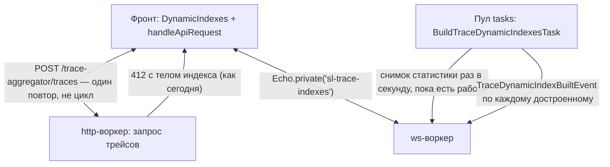

# План: динамические индексы — снять фоновый опрос и ретрай-шторм на 412

Второй из двух прикладных ws-планов. Требует сделанного `ws-foundation.md`.

Сверено с кодом ветки: `frontend/src/utils/handleApiRequest.ts`,
`frontend/src/store/pendingRequestStore.ts`, `frontend/src/components/PendingRequestDialog.vue`,
`frontend/src/components/pages/trace-aggregator/components/dynamic-indexes/*`,
`app/Exceptions/Handler.php`, `app/Modules/Trace/Domain/Services/TraceDynamicIndexInitializer.php`,
`app/Modules/Trace/Domain/Actions/Mutations/BuildPendingTraceDynamicIndexesAction.php`,
`app/Modules/Trace/Domain/Actions/Queries/FindTraceDynamicIndexStatsAction.php`,
`app/Modules/Trace/Infrastructure/Tasks/BuildTraceDynamicIndexesTask.php`,
`app/Modules/Trace/Infrastructure/Http/Resources/TraceDynamicIndex*.php`.

## Проблема

Здесь два независимых опроса, и второй дороже первого на порядок.

### Фоновый опрос статистики

```
DynamicIndexes.vue:126
    updateStats() {
      this.traceDynamicIndexesStore.findTraceDynamicIndexStats()
          .finally(() => setTimeout(() => this.updateStats(), 2000))
    }
```

Условия остановки у рекурсии нет. Запускается один раз из `mounted()` под флагом
`traceDynamicIndexesStore.started` и живёт до перезагрузки вкладки — компонент
размонтирован, страница сменилась, индексов в работе нет уже час, а `GET
/trace-aggregator/dynamic-indexes/stats` продолжает уходить каждые две секунды. За
каждым запросом — `getIndexProgressesInfo()` в Mongo и выборка статистики.

### Ретрай на 412

`TraceDynamicIndexInitializer.php:146` бросает `TraceDynamicIndexInProcessException`,
когда нужный индекс ещё строится. `app/Exceptions/Handler.php` превращает его в `412` с
телом индекса, а фронт в `handleApiRequest.ts` открывает модалку и уходит в цикл:

```
handleApiRequest.ts:38
    while (true) {
        await waitBeforeRetry(1000, pendingRequestStore)
        try { return await request() } catch (...) { continue }
    }
```

Повторяется не запрос статуса, а исходный запрос — то есть та самая тяжёлая выборка
трейсов, которая только что упёрлась в отсутствующий индекс. Раз в секунду, у каждого
ждущего пользователя, всё время построения индекса. Построение индекса и без того самая
нагруженная операция в системе, и мы её сопровождаем очередью повторов той агрегации,
ради которой индекс и строится.

## Решение

Два кадра на два разных вопроса.

- Прогресс — снимок статистики, который вещает один процесс: пул `tasks`, тот самый,
  что индексы и строит. Это не доменный факт, а телеметрия, и опрашивать её из
  браузеров смысла нет — `getIndexProgressesInfo()` одинаков для всех, кто смотрит.
- Готовность индекса — дискретное доменное событие. По нему закрывается модалка и
  ровно один раз повторяется исходный запрос.



## Изменения на бэке

### 1. Снимок статистики из пула задач

`BuildTraceDynamicIndexesTask::tick()` уже зовёт `BuildPendingTraceDynamicIndexesAction`
и знает, была ли работа. Добавить туда же: взять `FindTraceDynamicIndexStatsAction` и
вещать снимок.

Дроссель обязателен. У задачи в `config/sconcur.php` стоит `busy: 0` — «была работа,
бери следующую пачку сразу», то есть во время построения тики идут вплотную. Вещать не
чаще раза в секунду, по таймеру внутри задачи — рядом с уже живущим там
`deleteExpiredAt`, это ровно тот же приём.

Когда работа кончилась — один финальный снимок с нулём в `in_process_count`, и дальше
молчание. Без него у последнего наблюдателя навсегда останется на экране прогресс
последнего индекса.

Класс события вещания — `app/Modules/Trace/Infrastructure/Broadcasting/`,
`ShouldBroadcastNow`, канал `private-sl-trace-indexes`, нагрузка повторяет ключи
`TraceDynamicIndexStatsResource`: `in_process_count`, `errors_count`, `total_count`,
`indexes_in_process[]` с `collectionName`, `name`, `progress`. Совпадение формы даёт
фронту переиспользовать сгенерированный тип `TraceDynamicIndexStats` без ручного
описания.

Доменного события здесь не нужно и не должно быть: задача лежит в
`Infrastructure/Tasks`, ей разрешено звать `Domain` и вещать самой. Правило про
«сначала доменное событие» — про доменные факты, а снимок телеметрии им не является.

Вещание — через инъецированный `Illuminate\Contracts\Events\Dispatcher`, а не через
хелпер `broadcast()`: диспетчер сам отправляет событие с `ShouldBroadcast`, а зависимость
в конструкторе — единственное, что позволяет проверить дроссель юнит-тестом без
контейнера. То же самое в листенерах и в доменных действиях.

### 2. Событие «индекс достроен»

`BuildPendingTraceDynamicIndexesAction::handle()` в конце каждой итерации всегда пишет
`updateByName(name, inProcess: false, created, exception)` — вот единственная точка, где
индекс перестаёт быть «в процессе», каким бы ни был исход. Рядом с ней поднимать
доменное событие `TraceDynamicIndexBuiltEvent` (id индекса, признак успеха, ошибка).

Важно, чего событие не должно ловить: ветку `FlowStoppedException |
CoroutineTimeoutException`. Там индекс осознанно остаётся `inProcess` и будет подобран
следующим проходом — «достроен» о нём говорить нельзя.

Дальше по правилам проекта — листенер в `Infrastructure/Listeners`, он и вещает.
Канал приватный, по индексу: `private-sl-trace-index.{indexId}`. По индексу, а не общий,
потому что ждущих может быть несколько и каждый ждёт свой.

Нагрузка — `{id, created, error}`, и не больше. Ждущему нужен сам факт «ожидание
окончено», после которого он повторяет запрос; всё, что показывает модалка, у него уже
есть из тела `412`. Полный объект индекса потребовал бы чтения из Mongo в листенере ради
данных, которые никто не читает.

### 3. `routes/channels.php`

```php
Broadcast::channel('sl-trace-indexes', fn(User $user) => true);
Broadcast::channel('sl-trace-index.{indexId}', fn(User $user) => true);
```

## Изменения на фронте

### `DynamicIndexes.vue` + `traceDynamicIndexesStore.ts`

- Убрать `updateStats()` с рекурсивным `setTimeout` из компонента. Флаг `started`
  остаётся, но теперь он означает «слежение уже запущено» и живёт в сторе.
- Подписка на `sl-trace-indexes` поднимается один раз за сессию. Живёт она в сторе, а
  не в компоненте (компонент размонтируется при уходе со страницы, а стор — нет), хотя
  запускается по-прежнему из `mounted()`; флаг `started` переживает размонтирование и не
  даёт поднять её второй раз. Снимается она в `authStore.logout()` — вместе с запасным
  опросом, который иначе пережил бы сессию.
- Опрос остаётся запасным путём при выключенном ws-пуле, ровно тот же самый.
- Кадр кладётся в `traceDynamicIndexStats` как есть.
- Один стартовый `findTraceDynamicIndexStats()` при входе в ЛК остаётся: пока построения
  нет, никто ничего не вещает, и без него первый экран будет пустым.

### `handleApiRequest.ts` — цикл повторов

Сейчас: `waitBeforeRetry(1000)` в бесконечном `while`, повтор всего запроса каждую
секунду. Становится: ждём кадр по `sl-trace-index.{indexId}` (id есть в теле `412`) и
повторяем запрос один раз.

Три вещи, которые обязаны остаться:

- Отмена. `pendingRequestStore.requestCancel()` — это кнопка «Close» в
  `PendingRequestDialog.vue`, и она должна прерывать ожидание кадра так же, как сейчас
  прерывает паузу.
- Повторный `412`. Индекс мог достроиться, а следом запроситься другой — тогда
  ждём уже его, по новому id из нового тела ответа. Цикл остаётся циклом, меняется
  только то, чем в нём заполняется пауза.
- Тайм-аут ожидания. Истории событий в шине нет, кадр может разойтись с подпиской.
  Поэтому у ожидания должен быть потолок — порядка 30 секунд, после которого запрос
  повторяется без всякого кадра. Это возвращает нас к нынешнему поведению в худшем
  случае, а не ломает его.

Оценка эффекта: вместо ~30 повторов тяжёлой агрегации на полуминутное построение —
один, и он приходится на момент, когда индекс уже есть.

## Тесты

`tests/Modules/Trace/`: `BuildPendingTraceDynamicIndexesAction` поднимает событие при
успешной сборке, поднимает при `Throwable` (с ошибкой в нагрузке) и не поднимает при
`FlowStoppedException`. Проверять `Event::fake()` на доменном событии.

Дроссель снимка в задаче — отдельным тестом на `BuildTraceDynamicIndexesTask`, если
существующая обвязка `tests/Modules/Trace` это позволяет; если задача сегодня не покрыта
вовсе, заводить под неё стенд ради дросселя не стоит — вынести таймер так, чтобы он
проверялся без пула.

## Порядок выкатки

1. Событие «индекс достроен» и ветка ожидания в `handleApiRequest` — это самая дорогая
   половина проблемы и она самостоятельна.
2. Снимок статистики из пула задач и снятие фонового опроса.

## После изменений

`make check`, `make frontend-npm-build`. `make oa-generate` не нужен: ни роуты, ни
ресурсы, ни enum-ы не меняются — вещание идёт мимо OpenAPI.
