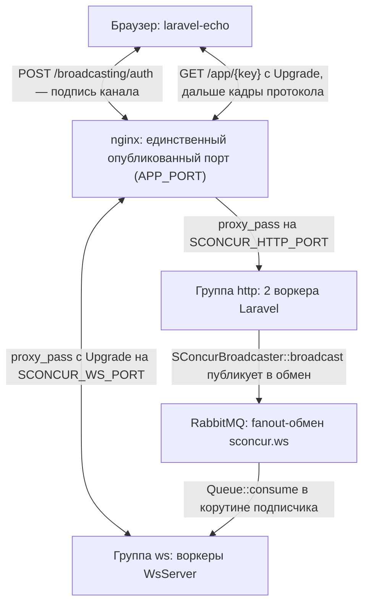

# План: включить WS-пул SConcur и завести вещание в ЛК

Фундамент для остальных ws-планов — `ws-trace-tree.md` и `ws-dynamic-indexes.md`. Ни
один из них не заработает, пока не сделано это.

Всё ниже сверено с кодом ветки: `config/sconcur.php`, `config/broadcasting.php`,
`config/cors.php`, `config/app.php`, `app/Providers/BroadcastServiceProvider.php`,
`routes/channels.php`, `docker/nginx/templates/default.conf.template`,
`docker-compose.yml`, `frontend/src/utils/apiContainer.ts`, а также с пакетом
`sconcur/laravel` (`vendor/sconcur/laravel/src/Ws/**` и `docs/websocket.ru.md`).

## Цель

Сделать так, чтобы `broadcast(...)` из любого процесса приложения доезжал до браузера, и
чтобы ЛК умел на это подписываться. Прикладных событий этот план не добавляет — только
транспорт.

## Что уже есть

Пакет `sconcur/laravel` несёт весь ws-пул целиком:

| Задача | Где |
|---|---|
| Драйвер вещания `sconcur` | `vendor/sconcur/laravel/src/Ws/Broadcasting/SConcurBroadcaster.php` |
| Регистрация драйвера | `vendor/sconcur/laravel/src/SConcurServiceProvider.php:285` |
| Проверка подписи канала | `vendor/sconcur/laravel/src/Ws/Auth/SignatureVerifier.php` |
| Шина между процессами | `vendor/sconcur/laravel/src/Ws/Bus/` |
| Запуск воркера | `artisan sconcur:servers:ws:start` |
| Проверка без браузера | `artisan ws:check` |

Группа `ws` уже описана в `config/sconcur.php` (секции `master.groups` и `ws`) со всеми
параметрами и подробными комментариями. Она выключена условием
`(int) env('SCONCUR_WS_WORKER_COUNT', 0) < 1 ? null : [...]`, и это осознанный выбор: в
комментарии там же сказано, что приложение пока ничего не вещает.

Протокол — совместимое подмножество Pusher v7, поэтому со стороны браузера подходит
обычный `laravel-echo` + `pusher-js`, а авторизация канала идёт штатным маршрутом
`/broadcasting/auth`.

## Чего нет

- `BROADCAST_DRIVER=null` (`config/broadcasting.php:19`), соединения `sconcur` в списке
  `connections` нет.
- `App\Providers\BroadcastServiceProvider::class` закомментирован в `config/app.php:168`
  — значит маршрута `/broadcasting/auth` в приложении нет вообще.
- В `docker/nginx/templates/default.conf.template` единственный `location /`, без
  `Upgrade`-заголовков: рукопожатие через него не пройдёт.
- `laravel-echo` и `pusher-js` не стоят (`frontend/package.json`).
- `config/cors.php:18` покрывает только `*-api/*`. `/broadcasting/auth` под этот шаблон
  не попадает, а фронт живёт на своём порту (`docker-compose.yml`, сервис `frontend`) —
  то есть запрос кросс-доменный.

## Топология



Шина обязана быть `amqp`, а не `local`. Это не вопрос вкуса: события, ради которых всё
затевается, рождаются в чужих процессах — `BuildTraceTreeCacheJob` и `ClearTracesJob` в
пуле `rabbitmq`, `BuildTraceDynamicIndexesTask` в пуле `tasks`, а http-воркеров и без
того два. С драйвером `local` до браузера не дойдёт ничего.

## Изменения

### 1. `config/broadcasting.php`

Добавить в `connections` соединение драйвера:

```php
'sconcur' => [
    'driver' => 'sconcur',
],
```

`'default'` оставить как есть — он читает `BROADCAST_DRIVER`. Это расхождение с
документацией пакета, где названа переменная `BROADCAST_CONNECTION` (ключ Laravel 12 по
умолчанию): в этом репозитории конфиг переписан на `BROADCAST_DRIVER`, и менять надо ту
переменную, которую читает конфиг, а не ту, что в примере.

### 2. `config/app.php:168`

Раскомментировать `App\Providers\BroadcastServiceProvider::class`. Без него нет
`/broadcasting/auth`, и приватные каналы не подписываются вообще.

### 3. `app/Providers/BroadcastServiceProvider.php`

Сейчас там голый `Broadcast::routes()`, а он по умолчанию вешает на маршрут группу
`web` — сессия, куки, CSRF (`app/Http/Kernel.php`, группа `web`). ЛК так не ходит: он
шлёт `Authorization: Bearer` (`frontend/src/utils/apiContainer.ts:38`).

```php
Broadcast::routes([
    'middleware' => [AuthMiddleware::class],
]);
```

Связка сходится: `AuthMiddleware` читает `$request->bearerToken()` и ставит
`setUserResolver(...)`, а `SConcurBroadcaster::auth()` берёт пользователя через
`retrieveUser($request, $channel)`, который без явных guard-ов сводится к
`$request->user()`.

### 4. `config/cors.php`

Добавить `broadcasting/auth` в `paths`. Иначе браузер не отпустит кросс-доменный POST, а
в консоли это выглядит как «Echo не подписывается» без внятной причины.

### 5. `routes/channels.php`

Все каналы ЛК — приватные, и колбэк у всех один:

```php
Broadcast::channel('sl-trace-tree.{rootTraceId}', fn(User $user) => true);
```

Проверять больше нечего: в `app/Models/Users/User.php` нет ни ролей, ни признака
администратора, а трейсы в ЛК не разделены по пользователям — любой вошедший видит всё.
Смысл приватности здесь другой: публичный канал подписывается без обращения к
приложению, достаточно знать `app_key`, а он публичный и лежит в бандле фронта. Приватный
канал требует подписи, которую выдаёт только http-воркер и только после `AuthMiddleware`.

Общий префикс `sl-` у всех каналов — чтобы шина, которая физически общая, не свела наши
имена с чужими, если в этот RabbitMQ когда-нибудь приедет второе приложение.

### 6. `docker-compose.yml`, сервис `nginx`

Рядом с `SCONCUR_HTTP_PORT` добавить `SCONCUR_WS_PORT: ${SCONCUR_WS_PORT:-28090}` —
шаблон подставляется на старте контейнера и без переменной не отрендерится.

### 7. `docker/nginx/templates/default.conf.template`

Отдельный `location` под апгрейд. Таймауты обычного блока (300 s) рвали бы соединение
несколько раз в час, поэтому здесь свои:

```nginx
map $http_upgrade $connection_upgrade {
    default upgrade;
    ''      close;
}

server {
    # ...

    location /app/ {
        set $sconcur_ws workers:${SCONCUR_WS_PORT};

        proxy_pass http://$sconcur_ws;

        proxy_http_version 1.1;

        proxy_set_header Upgrade    $http_upgrade;
        proxy_set_header Connection $connection_upgrade;

        proxy_set_header Host              $host;
        proxy_set_header X-Real-IP         $remote_addr;
        proxy_set_header X-Forwarded-For   $proxy_add_x_forwarded_for;
        proxy_set_header X-Forwarded-Proto $scheme;

        proxy_read_timeout 3600s;
        proxy_send_timeout 3600s;
    }
}
```

Хост апстрима через переменную — по той же причине, что и в `location /`: имя в
`proxy_pass` без переменной резолвится один раз при загрузке конфига, и пересоздание
контейнера `workers` оставляет nginx звонить по старому IP.

`map` объявляется на уровне `http`, вне `server`. В шаблоне nginx-образа это значит —
до блока `server`.

Путь `/app/` обязан совпадать с `SCONCUR_WS_PATH_PREFIX`; ключ приложения идёт в пути
следом за ним, и сравнение в расширении игнорирует query-строку — `?protocol=7` от Echo
проходит, чужой ключ отваливается на рукопожатии с 404, до PHP.

### 8. `.env.example` и `.env`

```dotenv
BROADCAST_DRIVER=sconcur

SCONCUR_WS_WORKER_COUNT=1
SCONCUR_WS_PORT=28090
SCONCUR_WS_ADDRESS=0.0.0.0:28090
SCONCUR_WS_APP_KEY=
SCONCUR_WS_APP_SECRET=
SCONCUR_WS_BUS_DRIVER=amqp
SCONCUR_WS_BUS_DSN=amqp://${RABBITMQ_USER}:${RABBITMQ_PASSWORD}@${RABBITMQ_HOST}:${RABBITMQ_PORT}/%2F
```

DSN приходится собирать руками: `config/sconcur.php` откатывается к
`SCONCUR_RABBITMQ_DSN`, которого в этом проекте нет — `config/queue.php` собирает свой
DSN из `RABBITMQ_*` сам, а у ws-шины такого запасного пути нет. Без этой строки шина
получает `null` и ни одно событие не уезжает.

Один воркер, а не два. При одном воркере `presence.store: auto` выбирает `memory`, и
общего хранилища участников не нужно; presence-каналы нам всё равно не понадобятся ни в
одном из планов. Больше одного воркера имеет смысл заводить, когда соединений станет
столько, что один процесс перестанет справляться, — для админки на десяток вкладок это
не тот случай.

Значения `SCONCUR_WS_APP_KEY` и `SCONCUR_WS_APP_SECRET` в `.env.example` оставить
пустыми, в `.env` — заполнить. Секрет видят только http-воркеры (подписывают) и
ws-воркеры (проверяют); ключ публичный и уезжает в браузер.

Заполняет их `make ws-keys-generate` (`app/Console/Commands/WsKeysGenerateCommand.php`),
и `make setup` его вызывает — иначе свежая установка поднимает пул с пустым ключом,
`WsStartCommand` отказывается стартовать, и группа `ws` уходит в цикл перезапусков. Та же
команда кладёт ключ в `frontend/.env` → `SCONCUR_WS_KEY`.

### 9. Фронт: `frontend/package.json` и клиент Echo

Поставить `laravel-echo` и `pusher-js`. Клиент — один на приложение, рядом с
`apiContainer.ts`:

```ts
// frontend/src/utils/echoContainer.ts
export const echo = new Echo<'pusher'>({
    broadcaster: 'pusher',
    Pusher,
    key: import.meta.env.VITE_SCONCUR_WS_KEY,
    wsHost: /* хост из VITE_BACKEND_URL */,
    wsPort: /* порт оттуда же — APP_PORT, не 80 */,
    forceTLS: false,
    disableStats: true,
    enabledTransports: ['ws', 'wss'],
    cluster: '',
    // Не authEndpoint: см. ниже — авторизацию канала приходится делать самим.
    authorizer: /* ... */,
})
```

Авторизация канала пишется руками, а не отдаётся `authEndpoint`. Причина найдена
проверкой, а не вычитана: `pusher-js` шлёт этот POST как
`application/x-www-form-urlencoded`, а HTTP-сервер SConcur отдаёт PHP пустой ввод для
такого тела — `$request->all()` пуст, `channel_name` до брокастера не доезжает, и
`SConcurBroadcaster::auth()` отказывает каждому приватному каналу. Тот же запрос с
`Content-type: application/json` проходит. Поэтому в `authorizer` — обычный `fetch` с
JSON и `Bearer`-токеном, тем же, что у остальных запросов панели.

Проверяется это так:

```
curl -X POST http://localhost:8097/broadcasting/auth -H 'Authorization: Bearer <token>' \
     -d 'channel_name=private-sl-trace-indexes&socket_id=1.1'      # 403
curl -X POST http://localhost:8097/broadcasting/auth -H 'Authorization: Bearer <token>' \
     -H 'Content-type: application/json' \
     -d '{"channel_name":"private-sl-trace-indexes","socket_id":"1.1"}'   # {"auth":"key:hmac"}
```

Три места, где легко ошибиться:

- `wsHost` и `wsPort` — это хост и порт API, а не фронта. Сокет идёт туда же, куда
  остальные запросы, то есть на `VITE_BACKEND_URL` (`frontend/.env.example`:
  `http://localhost:8097`), и порт там не 80.
- Токен читается один раз при создании клиента. Значит соединение надо поднимать после
  логина и рвать в `authStore.logout()` — там же, где уже гасится опрос страницы SConcur
  (`frontend/src/store/authStore.ts`, вызов `useSconcurStore().reset()`). Иначе
  переподключение после смены пользователя пойдёт со старым токеном.
- Новые переменные окружения фронта надо добавить в `frontend/.env.example` и
  `frontend/.env` (`VITE_SCONCUR_WS_KEY`), они подставляются на сборке.

## Проверка

1. `make up`, затем `artisan ws:check` — команда пакета проходит весь путь: рукопожатие,
   ping, подписку и доставку, и показывает пид воркера, который взял соединение.
2. `artisan ws:check --host=<хост nginx>` — то же самое, но через прокси. Разница между
   этими двумя запусками и есть ответ на вопрос «пул или nginx».
3. В браузере: подписка на приватный канал должна сходить на `/broadcasting/auth` и
   получить `{"auth": "key:hmac"}`.

## Что этот план не делает

- Не добавляет ни одного прикладного события — это следующие планы.
- Не трогает опросы на фронте: они остаются работать как есть, пока соответствующий
  план их не снимет. Так каждый следующий шаг можно катить отдельно и откатывать
  отдельно.
- Не занимается presence-каналами и клиентскими событиями (`client-*`) — ни то, ни
  другое в ЛК не нужно.

## Гонка «опубликовали раньше, чем подписались»

Единственное место, где эта конструкция может молча потерять данные, и потому — с
проверкой, а не с рассуждением.

Шина ничего не хранит: `autoDelete` у очереди ws-воркера выключен, но сообщение,
пришедшее в fanout до того, как клиент подписался на канал, до него не доедет никогда.
Проверяется так — соединение поднято, событие опубликовано, подписка сделана после:

```
connected, socket_id=355.2
publishing before subscribe...
subscribed after the fact
frames after subscribing: ['pusher_internal:subscription_succeeded']
VERDICT: LOST
```

Важно, что окно шире, чем кажется. `Echo.private(...).listen(...)` — это не «подписан»,
а «попросил подписаться»: дальше идёт установка соединения, `POST /broadcasting/auth` и
кадр `pusher:subscribe`, и только `pusher_internal:subscription_succeeded` означает, что
канал слушает. Всё, что опубликовано до этого момента, потеряно — включая то, что
опубликовано уже после вызова `listen()`.

Отсюда правило для каждого потока: **добор состояния делается не после `listen()`, а
после `subscribed`.**

| Поток | Чем закрыт |
|---|---|
| Дерево трейса | `onSubscribed` → одно чтение состояния. Всё, что раньше, видно в этом чтении; всё, что позже, приезжает кадром. Окна не остаётся |
| Ожидание индекса (412) | `onSubscribed` → один повтор запроса, только на первой попытке |
| Прогресс индексов | Само чинится: снимок повторяется раз в секунду, пока идёт работа, и закрывается кадром с нулём |

Плюс общий страховочный слой на случай, когда `subscribed` не наступает вовсе (пул
принял сокет и молчит): у дерева — сторож на 10 секунд, после которого включается
опрос; у ожидания индекса — потолок на ожидании; `pusher:subscription_error` и
недоступность соединения переводят всех слушателей на опрос сразу.

## Ограничения, которые придётся принять

Из документации пакета, все — по делу для ЛК:

- Истории событий нет: переподключившийся клиент не получит пропущенное. Поэтому
  каждый следующий план обязан оставлять способ добрать состояние запросом — и в них
  это отдельным пунктом.
- `sconcur:servers:master:reload` рвёт ws-соединения (для http-пула reload незаметен).
  Echo переподключается сам.
- Событие, отправленное в первые десятки миллисекунд после первого подключения к
  простаивавшему воркеру, может не дойти: подписчик шины поднимается вместе с этим
  соединением, а fanout выбрасывает сообщение, пока очередь не привязана.
