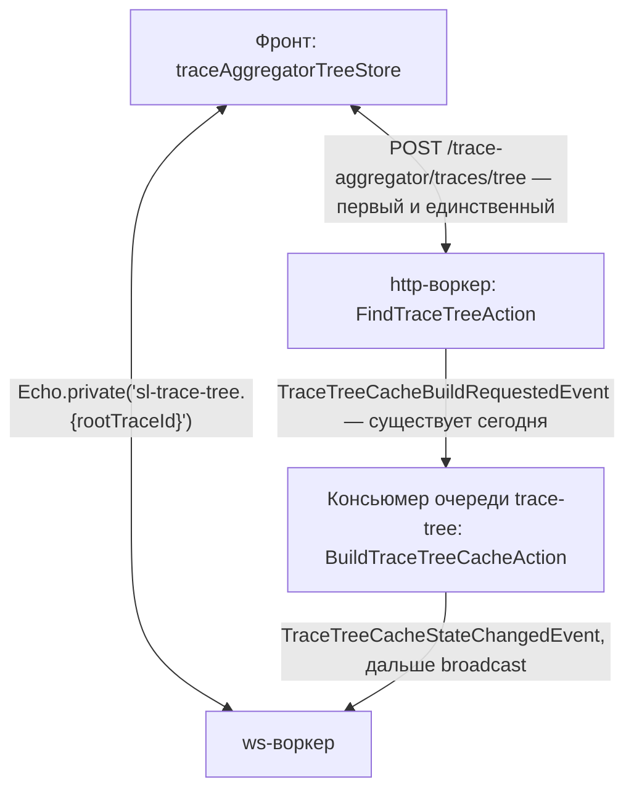

# План: живой статус построения дерева трейса вместо опроса раз в секунду

Первый из двух прикладных ws-планов. Требует сделанного `ws-foundation.md`.

Сверено с кодом ветки:
`frontend/src/components/pages/trace-aggregator/components/tree/store/traceAggregatorTreeStore.ts`,
`app/Modules/Trace/Domain/Actions/Mutations/BuildTraceTreeCacheAction.php`,
`app/Modules/Trace/Domain/Actions/Mutations/CancelTraceTreeCacheStateAction.php`,
`app/Modules/Trace/Domain/Services/TraceTreeCacheBuilderService.php`,
`app/Modules/Trace/Repositories/TraceTreeCacheStateRepository.php`,
`app/Modules/Trace/Infrastructure/Http/Resources/Tree/TraceTreeStateResource.php`,
`app/Modules/Trace/Enums/TraceTreeCacheStateStatusEnum.php`, `routes/admin-api.php`.

## Проблема

Пользователь открыл дерево трейса, кэша ещё нет — запускается построение, и фронт
начинает ждать опросом:

```
traceAggregatorTreeStore.ts:270
    pollingTimeoutId = window.setTimeout(async () => { ... findTreeNodes(...) }, 1000)
```

Пока `state.status === 'inProcess'`, раз в секунду уходит `POST
/trace-aggregator/traces/tree`. Это не пустой ping. За каждым таким запросом стоит
`FindTraceTreeAction`, чтение состояния и узлов из Mongo и чанковый ответ — под него в
`docker/nginx/templates/default.conf.template` специально прописаны
`proxy_http_version 1.1` и `proxy_read_timeout 300s`. Построение большого дерева идёт
десятки секунд и дольше, то есть на одно построение приходятся десятки холостых тяжёлых
запросов, и каждый конкурирует за Mongo с тем самым построением, которого ждёт.

Второе, менее заметное: прогресс есть в базе, но его никто не показывает.
`TraceTreeCacheBuilderService` зовёт `incrementCount(...)` (строки 73 и 159), поле
`count` уходит наружу в `TraceTreeStateResource`, а пользователь всё это время видит
только «идёт построение».

## Решение

Состояние построения пушится в приватный канал по `rootTraceId`. Опрос снимается,
запрос остаётся ровно один — стартовый.



## Изменения на бэке

### 1. Доменное событие

`app/Modules/Trace/Domain/Events/TraceTreeCacheStateChangedEvent.php` — рядом с уже
существующим `TraceTreeCacheBuildRequestedEvent`. Несёт `TraceTreeCacheStateObject`
целиком: он уже собран там, где меняется статус, и в нём есть всё, что показывает фронт.

Правило `.ai/README.md` здесь работает буквально: доменное событие — это доменная
логика, а вещание — инфраструктурный побочный эффект, значит в `Domain` не должно
появиться ни одного `use Illuminate\Broadcasting\...`.

### 2. Где событие поднимается

| Переход | Место |
|---|---|
| `finished` | `BuildTraceTreeCacheAction::handle()`, после `markFinished(...)` |
| `failed` | `BuildTraceTreeCacheAction::handle()`, после `markFailed(...)` |
| `canceled` | `CancelTraceTreeCacheStateAction::handle()`, после `updateStatus(...)` |
| прогресс | `TraceTreeCacheBuilderService`, у вызовов `incrementCount(...)` |

Репозиторий не трогаем: по правилам проекта он остаётся набором примитивов
(`markFinished`, `updateStatus`, `incrementCount`), и события из него не летят.

Прогресс дросселировать по времени — не чаще раза в 500 мс на одно построение. Инкремент
на строке 159 идёт по чанкам в 1000 потомков, и на широком дереве чанки ложатся плотно;
вещать каждый — менять опрос раз в секунду на поток кадров чаще секунды, что хуже
исходной задачи. Таймер держать в сервисе, он и так живёт ровно одно построение.

### 3. Событие вещания

`app/Modules/Trace/Infrastructure/Broadcasting/TraceTreeStateBroadcast.php`, реализует
`ShouldBroadcastNow`.

Именно `Now`, а не `ShouldBroadcast`: обычный `ShouldBroadcast` кладёт задание в очередь
`default`, то есть добавляет лишний круг через тот же пул консьюмеров, из которого мы и
вещаем. Публикация в fanout дешёвая, отдельное задание ради неё не нужно.

```php
public function broadcastOn(): array
{
    return [new PrivateChannel('sl-trace-tree.' . $this->state->rootTraceId)];
}

public function broadcastAs(): string
{
    return 'state.changed';
}
```

Полезная нагрузка — те же ключи, что у `TraceTreeStateResource`: `root_trace_id`,
`version`, `status`, `count`, `error`, `started_at`, `finished_at`, `created_at`,
`updated_at`. Не «похожие», а ровно те же, и вот зачем: фронт типизирует состояние как
`AdminApi.TraceAggregatorTracesTreeProcessesCancelPartialUpdate.ResponseBody['data']`
(`traceAggregatorTreeStore.ts`, тип `TraceAggregatorTreeState`). Совпадающая форма
означает, что кадр ложится в существующий сгенерированный тип и руками писать тип не
надо. WS-нагрузка в OpenAPI не попадает, и это единственный способ не заводить рядом
второй, ничем не связанный источник истины о форме.

Сам HTTP-ресурс при этом переиспользовать не нужно — он про HTTP-ответ; собрать массив
в классе вещания.

### 4. Листенер и регистрация

`app/Modules/Trace/Infrastructure/Listeners/BroadcastTraceTreeStateListener.php` —
по образцу существующего `DispatchTraceTreeCacheBuildListener`. Регистрация в
`$listen` у `app/Providers/EventServiceProvider.php` (автообнаружение там выключено —
`shouldDiscoverEvents(): false`).

### 5. `routes/channels.php`

```php
Broadcast::channel('sl-trace-tree.{rootTraceId}', fn(User $user) => true);
```

Почему колбэк тривиальный — в `ws-foundation.md`.

## Изменения на фронте

`traceAggregatorTreeStore.ts`:

- Убрать `schedulePolling()`, `clearPollingTimeout()`, `pollingTimeoutId`. Флаг
  `polling` оставить — он про «идёт построение», и на нём висит UI; менять его теперь
  будет подписка.
- Там, где сейчас `data.state.status === 'inProcess'` заводит опрос, — подписываться на
  `sl-trace-tree.{trace_id}`.
- В обработчике кадра: `setTreeState(payload)`; на `finished` — один раз позвать
  `findTreeContent(...)` и `findTreeNodes(...)` за готовым деревом, затем отписаться; на
  `failed` и `canceled` — просто отписаться.
- Отписка обязана происходить и в `stopPolling()`, и в `cancelPolling()`, и в `$reset()`
  — сейчас через них проходят все выходы, включая уход со страницы и отмену
  пользователем. Иначе подписки накопятся по одной на каждый открытый трейс.

Один запрос-подстраховка остаётся, и он обязателен: истории событий в шине нет, а
подписка поднимается уже после того, как построение началось. Значит `finished` могло
проскочить в зазоре. Поэтому после успешной подписки — один `findTreeNodes({fresh:
false})`, и если состояние уже конечное, подписка сразу закрывается. Это одна лишняя
выборка на построение против нынешних десятков.

## Тесты

`tests/Modules/Trace/` — по правилу «сначала ищем существующее поддерево модуля».
Покрыть: `BuildTraceTreeCacheAction` поднимает событие с `finished` при успехе и с
`failed` при исключении; `CancelTraceTreeCacheStateAction` — с `canceled`, и не
поднимает ничего, когда `updateStatus` вернул `false` (сегодня в этом случае действие
отдаёт `null`); дроссель прогресса не пропускает два кадра подряд внутри окна.
Проверять через `Event::fake()` — на доменном событии, а не на вещании: так тест не
зависит от того, поднят ли ws-пул.

## Порядок выкатки

1. Бэк целиком, фронт не трогаем — опрос продолжает работать, кадры летят в пустоту.
   На этом шаге проверяется, что событие вообще доезжает (`artisan ws:check` и
   подписка руками).
2. Фронт переключается на подписку, опрос снимается.

## После изменений

`make check`; `make oa-generate` не нужен — HTTP-контракты не меняются (ни роутов, ни
ресурсов, ни enum-ов, влияющих на схему); `make frontend-npm-build` — нужен.
