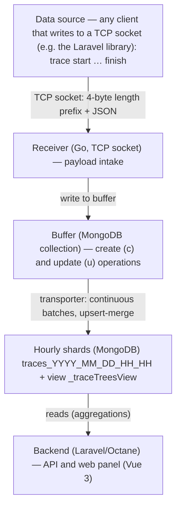

**English** | [Русский](README.ru.md)

# SLogger

SLogger is an observability platform for ingesting, storing, and analyzing traces and logs from your applications and microservices.

It collects data about code execution (HTTP requests, queues, events, commands, and any custom operations), stores it in time-distributed storage, and provides a web panel for search, call-tree building, flexible filtering, and metric charts.

---

## Features

- Trace and log collection from any application over a simple socket protocol (the source language/stack does not matter).
- Call tree — a `parent → children` hierarchy with arbitrary nesting depth.
- Joining requests across services/microservices into a single end-to-end tree (distributed tracing).
- Flexible filtering by any field of the trace payload (`data`): numbers, strings, booleans, field-presence checks.
- Timeline charts for trace metrics — count, duration, memory, CPU — with aggregations and the same filtering as in search.
- Storage dashboard — collection sizes, memory and index usage.
- Automatic cleanup of stale data.

---

## Architecture

### Data flow



### Components

- Backend — Laravel 12 / PHP 8.4 on [RoadRunner](https://roadrunner.dev/) via [Laravel Octane](https://laravel.com/docs/octane). The application stays in memory between requests, removing framework-bootstrap overhead and giving high throughput when ingesting and reading large volumes of traces. Heavy parallel shard queries are parallelized through `SConcur\WaitGroup`.
- Receiver — a standalone Go service (`servers/receiver/`) that accepts trace payloads over a TCP socket and writes them into the buffer.
- Storage — MongoDB (traces/logs), MySQL (users/services/auth), Redis/RabbitMQ (queues).
- Frontend — Vue 3 + Vite + TypeScript (`frontend/`).

Business logic is split into modules under `app/Modules/<ModuleName>/` with strict layer separation (Deptrac).

---

## Technical implementation

### Hourly database sharding

Traces are stored not in a single collection, but in periodic shard collections split by hour:

```
traces_YYYY_MM_DD_HH_HH      example: traces_2026_06_21_14_15  (hour 14:00–15:00)
```

On the first access to a given hour, the shard is created on demand and a set of base indexes is set up on it: `sid` (service), `tid` (trace), `ptid` (parent), `tp` (type), `st` (status), tags, `lat` (logged-at time), plus composite indexes. Active shard names are cached in memory.

Hourly slicing gives three advantages:

1. Period queries read only the relevant shards. A search over the last hour does not scan week-old data — it touches one or two collections instead of a single large one.
2. Deleting old data means dropping whole collections. Cleanup does not run an expensive `delete` over millions of documents — it drops the shards that fell out of the retention window (see "Automatic cleanup"). This is fast and does not load the database.
3. Dynamic indexes live together with their shards and are removed along with them, so they do not accumulate indefinitely (see "Per-query auto-indexing").

On top of all shards, MongoDB exposes a unifying view `_traceTreesView` — it combines all periodic collections into a single logical set and adds the collection name to every document. The call tree is built through this view even when a parent and its children landed in different hourly shards.

### Buffer → write to shard

Intake and write are decoupled to absorb load spikes:

1. Intake. The receiver accepts the payload over TCP and puts it into a buffer collection in MongoDB as a set of two kinds of operations: create (`c`) and update (`u`).
2. Transport. A background transporter continuously pulls batches from the buffer (up to ~1000 records in FIFO order) and writes them into the corresponding hourly shards. It pauses for one second only when the buffer is empty (or after a read error), then checks again.
3. Merge (upsert-merge). Writing to a shard is an `upsert` keyed by service + trace: the create and update operations of the same trace are merged into one resulting document.
4. Reliability. After a successful write the record is removed from the buffer; on error it is marked for retry (with a limited number of attempts).

The buffer smooths out peaks: the client hands off data quickly and does not wait for the write into the main storage.

### Trace timeline: start separately → finish separately

A trace may be written in two stages, when the operation's outcome is not yet known at start time (the typical case for a parent trace):

1. Start — a trace-creation object is sent:
   - a `traceId` is assigned and the `parentTraceId` is captured (the current parent from context);
   - `status = started`, `duration = null` (the duration is not yet known);
   - type, tags, data, logged-at time, and snapshot memory/CPU values are recorded;
   - the started trace becomes the current parent — every trace that starts before its finish automatically becomes its child.

2. Finish — an update object for the same trace is sent:
   - the final `status` is set (`success` / `failed` / custom);
   - `duration` (actual elapsed time) is filled in;
   - memory and CPU are updated, and tags/data are supplemented if needed;
   - the previous parent is restored from the stack.

On the storage side, the creation and the finish are merged into one document (upsert by `tid`). This two-stage mechanism forms a timeline of nested operations: from the `parent → child` links and the start time / duration you can reconstruct what ran inside a request and in what order, which operations were nested into one another, and how long each took. Unfinished traces (a start with no finish) are visible with status `started`, which lets you catch operations that hung or crashed without a finish.

Update is not mandatory. Two stages are just one scenario, not a requirement. A trace can be written with a single creation message — for example, when it is not a parent but a single operation whose outcome is known immediately (a database query, an outbound HTTP call, sending an email, etc.). In that case the final `status`, `duration`, `memory`, `cpu` are set right in the creation, and no update is sent at all. Likewise, `ptid` is optional: a trace with no parent is a root trace (the top of the tree). So the minimum is a single creation object with its fields filled in; a parent and/or a subsequent update are added only when they are actually needed.

### Joining requests across services/microservices

The `parent → child` link is built on the `parentTraceId` / `traceId` identifiers and is not tied to a specific service. If service A passes its `traceId` to service B as the parent when starting an operation, then service B's traces will appear in the tree as children of service A's trace.

This forms an end-to-end call tree across microservice boundaries: a single inbound HTTP request can fan out into a chain of calls to several services, and all of it is assembled into one tree through `_traceTreesView`. Search, tree, and charts can be filtered by several services at once (`serviceIds`) — or built with no service binding at all.

### Per-query auto-indexing (dynamic indexes)

Traces are filtered by arbitrary `data` fields, and it is impossible to index all possible field combinations in advance. Therefore indexes are created automatically for a specific query:

- before a search, the system analyzes the set of filters (services, types, tags, statuses, duration/memory/CPU ranges, arbitrary `data` fields) and determines the required set of index fields;
- if a suitable index does not exist yet, it is created (asynchronously, marked in-progress), and the query waits for it to become ready;
- subsequent identical queries use the ready index and run fast.

Why dynamic indexes rather than permanent ones: indexes take up disk space and slow down writes, so keeping an index for every conceivable `data` field is expensive and wasteful. Dynamic indexes are therefore short-term (TTL on the order of a few days — currently 5) and are deleted automatically once they stop being used. Hourly sharding works in tandem here: an index is bound to its shards and is removed with them during cleanup, so it never accumulates indefinitely. The result is fast search over arbitrary fields combined with space savings — the system pays for an index only while it is actually needed.

### Flexible filtering by trace data

You can filter by any payload field, including nested ones (`user.id`, `request.path`, etc.):

- numbers — `=`, `≠`, `>`, `≥`, `<`, `≤`;
- strings — equals, contains, starts with, ends with;
- booleans — `true` / `false`;
- field presence — has a value / is absent.

These filters are assembled into a MongoDB aggregation pipeline and work together with the base filters (service, type, tags, status, duration/memory/CPU ranges, time period). A dynamic index is automatically raised for the selected set of fields.

### Trace metric charts

Besides paginated search, timeline charts are built over traces. You pick a period (from 5 minutes to a year) and a step (bucket granularity); the data is laid out across time intervals, and within each interval the metrics are computed:

- count of traces (`count`, aggregation — sum);
- duration (`duration`);
- memory (`memory`);
- CPU (`cpu`).

For duration/memory/CPU the average, minimum, and maximum are computed. Charts can additionally be built over numeric fields from `data`. The same set of filters as in search applies to charts, so you can watch metric dynamics for a specific service, operation type, tag, or an arbitrary condition on the data. Interval collection is parallelized, which makes charts fast to build even over large periods.

### Automatic cleanup

Stale traces are removed automatically. The retention period is set by the `TRACES_LIFETIME_DAYS` variable (default 3 days). Cleanup is a queued job (`ClearTracesJob`) and, thanks to hourly sharding, drops whole shard collections that fell out of the retention window instead of deleting individual documents. This is fast, does not fragment storage, and also removes the dynamic indexes associated with those shards.

---

## Tech stack

- PHP 8.4, Laravel 12, PSR-12 style (PHP CS Fixer)
- Laravel Octane + RoadRunner — long-running application
- MongoDB (`mongodb/laravel-mongodb`) — traces and logs
- MySQL — users, services, auth
- Redis / RabbitMQ — queues
- Go — trace receiver service (`servers/receiver/`)
- Vue 3 + Vite + TypeScript — web panel
- Static analysis: PHPStan; layer boundaries: Deptrac

---

## Data source and format

SLogger is not tied to a specific client. The data source can be any application in any language capable of writing to the receiver's TCP socket. The dataset is universal — the only requirement is that the payload conforms to the expected format.

For Laravel applications there is a ready-made library that handles trace start/finish, parent-context propagation (including across services), buffering, and sending data:

slogger/laravel → https://github.com/sprust/slogger-laravel

This is just one of the possible sources — your own client implementing the protocol below can send data just as well.

### Socket protocol

Communication is over TCP. Every message, in both directions, is sent with a 4-byte length prefix (big-endian `uint32`) followed by the body (UTF-8 JSON). The maximum body size is 10 MB.

1. Authentication. Right after connecting, the client sends a message with the service API token:

   ```json
   { "t": "<api_token>" }
   ```

   The token determines which service the traces belong to (created via `make art c=service:create`). The server replies with `ok` or an error text.

2. Sending traces. Then, within the same connection, the client sends trace messages in a loop; the server replies `received` to each one.

### Trace message format

A message contains two optional fields — a batch of traces to create (`c`) and a batch of updates (`u`). The values of `c` and `u` are JSON strings (serialized arrays of objects), not nested arrays:

```json
{
  "c": "[ <traces to create> ]",
  "u": "[ <trace updates> ]"
}
```

Trace to create (the start stage):

```json
{
  "tid":  "9f1c…",          // trace ID (required)
  "ptid": "0b8a…",          // parent trace ID (optional; links into the tree, incl. across services)
  "tp":   "request",        // operation type (request, job, command, event, …)
  "st":   "started",        // status
  "tgs":  ["api", "v2"],    // tags (array)
  "dt":   { "path": "/x" }, // arbitrary data (JSON only, any structure)
  "dur":  null,             // duration (usually not yet known at start)
  "mem":  41.5,             // memory, % (optional)
  "cpu":  12.3,             // CPU, % (optional)
  "lat":  "2026-06-21 14:00:00.000000"  // logged-at time
}
```

Trace update (the finish stage):

```json
{
  "tid":  "9f1c…",          // the same trace ID
  "st":   "success",        // final status (success / failed / custom)
  "tgs":  ["api", "v2"],    // tags — overwrite existing ones if present (do not append)
  "dt":   { "code": 200 },  // data (JSON) — overwrites existing if present (does not append)
  "dur":  0.137,            // actual duration
  "mem":  43.1,             // memory, %
  "cpu":  15.0,             // CPU, %
  "plat": "2026-06-21 14:00:00.000000"  // parent's logged-at time
}
```

The field names are intentionally short (`tid`, `ptid`, `tp`, …) — this reduces the volume of transmitted and stored data.

Merging create and update. On the receiver side, a create and an update with the same `tid` are merged into one document (see "Buffer → write to shard" and "Trace timeline"). The update overwrites fields (`st`, `tgs`, `dt`, `dur`, `mem`, `cpu`) rather than appending to them — but only those that are actually present in the update; missing fields keep their values from the create. The order in which each field's value is taken: update → already-stored document → create. Therefore, if an update is persisted before the create, the update's data takes priority: a create that arrives later does not overwrite it, only backfills the missing fields (for example, the type `tp`).

---

## Installation

### Copy env files

```bash
make env-copy
```

### Configure environment variables

`.env`:

```dotenv
APP_ENV=production        # or local
APP_DEBUG=false           # true for local

# the root user is set by default
# to find user id and group id on linux: `id -u` and `id -g`
DOCKER_USER_ID=1000
DOCKER_GROUP_ID=1000

FRONTEND_DOCKER_COMMAND=${FRONTEND_DOCKER_SERVER_COMMAND}  # or ${FRONTEND_DOCKER_LOCAL_COMMAND}
FRONTEND_DOCKER_PORT=3075                                  # external port of the web panel

TRACES_LIFETIME_DAYS=3    # trace retention period in days
```

`frontend/.env`:

```dotenv
BACKEND_URL=http://localhost:10021  # see the port in .env → OCTANE_RR_DOCKER_PORT
```

### Setup

```bash
make setup
```

### Create a user

```bash
make art c=user:create
```

### Create a service

```bash
make art c=service:create
```

### OpenAPI schema

```text
storage/api/json-schemes/traces-api-openapi-scheme.json
```
