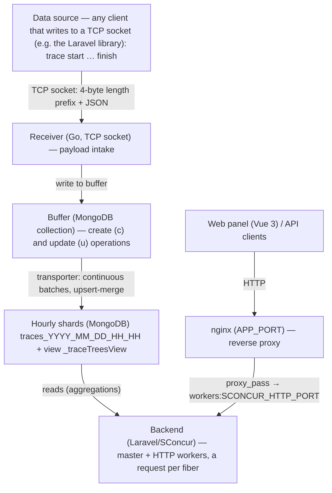

**English** | [Русский](README.ru.md)

# SLogger

SLogger is an observability platform for ingesting, storing, and analyzing traces and logs from your applications and microservices.

It collects data about code execution (HTTP requests, queues, events, commands, and any custom operations), stores it in time-distributed storage, and provides a web panel for search, call-tree building, flexible filtering, and metric charts.

---

## Features

- Trace collection from any application over a simple socket protocol (the source language/stack does not matter); SLogger's own application log is stored and browsable too.
- Call tree — a `parent → children` hierarchy with arbitrary nesting depth.
- Joining requests across services/microservices into a single end-to-end tree (distributed tracing).
- Flexible filtering by any field of the trace payload (`data`): numbers, strings, booleans, null and presence checks.
- Timeline charts for trace metrics — count, duration, memory, CPU — as an average, a minimum and a maximum, with the p50, p95 and p99 percentiles a legend click away, and the same filtering as in search.
- Presets — saved aggregator filters and an automatic history of searches.
- Trace metrics — how many new traces each service sent in every fifteen minutes of the last day, by when they were logged, taken into the buffer and written to storage.
- Storage dashboard — collection sizes, memory and index usage.
- Runtime dashboard — live stats of the SConcur HTTP server: worker pool, RPS, CPU, memory, in-flight requests.
- Watchers — configurable rules that open an incident when the system misbehaves: a buffer growing, traces stopping, too many of them, traces running too long, errors in the application log; trace watchers can be narrowed by service, type, tag and status.
- Notification channels — a watcher's incidents are sent on to Telegram, to Slack, or to an address of your own as JSON, with a delivery log per channel.
- Automatic cleanup of stale data.

---

## Architecture

### Data flow


```mermaid
flowchart TB
    src["Data source — any client that writes to a TCP socket (e.g. the Laravel library): trace start … finish"]
    receiver["Receiver (Go, TCP socket) — payload intake"]
    buffer["Buffer (MongoDB collection) — create (c) and update (u) operations"]
    shards["Hourly shards (MongoDB) traces_YYYY_MM_DD_HH_HH + view _traceTreesView"]
    backend["Backend (Laravel/SConcur) — master + HTTP workers, a request per fiber"]
    nginx["nginx (APP_PORT) — reverse proxy"]
    ui["Web panel (Vue 3) / API clients"]
    src -->|"TCP socket: 4-byte length prefix + JSON"| receiver
    receiver -->|"write to buffer"| buffer
    buffer -->|"transporter: continuous batches, upsert-merge"| shards
    shards -->|"reads (aggregations)"| backend
    ui -->|"HTTP"| nginx
    nginx -->|"proxy_pass → workers:SCONCUR_HTTP_PORT"| backend
```

### Components

- Backend — Laravel 12 / PHP 8.4 on [SConcur](https://github.com/sprust/sconcur), a concurrent coroutine HTTP runtime that executes each request in its own PHP Fiber inside a single long-lived process. The application stays in memory between requests, removing framework-bootstrap overhead and giving high throughput when ingesting and reading large volumes of traces. Heavy parallel shard queries are parallelized through `SConcur\WaitGroup`. See "SConcur runtime" below.
- [sconcur/laravel](https://github.com/sprust/sconcur-laravel) — a composer package that binds Laravel to SConcur: the coroutine-scoped application, the HTTP worker, and the `sconcur:*` artisan commands.
- nginx — a reverse proxy in front of the HTTP workers and the only HTTP entry point to the backend (`APP_PORT`, 8097 by default); the workers container publishes no ports. The upstream host is resolved per request, so recreating the workers container does not require an nginx restart.
- Receiver — a standalone Go service (`servers/receiver/`) that accepts trace payloads over a TCP socket and writes them into the buffer.
- Storage — MongoDB (traces/logs), MySQL (users/services/auth), RabbitMQ (queues), Redis (cache). Reads and writes from the HTTP workers go through SConcur's non-blocking Mongo, MySQL and Redis drivers.
- Frontend — Vue 3 + Vite + TypeScript (`frontend/`).
- Tool links — the panel header links to the RabbitMQ management UI, taken from `RABBITMQ_ADMIN_URL`.

Business logic is split into modules under `app/Modules/<ModuleName>/` with strict layer separation (Deptrac).

---

## Technical implementation

### SConcur runtime: a request per fiber

The backend does not run under php-fpm or Octane. HTTP requests are served by SConcur — a coroutine runtime in which every request gets its own PHP Fiber inside one long-lived process:

- Master and workers. `sconcur:servers:master:start` (started by supervisor in the `workers` container) is a supervisor over the worker pools: it spawns `SCONCUR_HTTP_WORKER_COUNT` processes as `php artisan sconcur:servers:http:start --masterPid=N`, restarts crashed and hung ones, and exposes a telemetry panel. A pool is a `groups` entry of the master config, and one master can supervise several unlike pools under one lock and one journal; here up to four: `http`, `rabbitmq` (when `SCONCUR_RABBITMQ_WORKER_COUNT` is at least 1), `ws` (when `SCONCUR_WS_WORKER_COUNT` is at least 1) and `tasks`. All workers of it listen on the same port via `SO_REUSEPORT`; nginx proxies to them without knowing about the pool. A single worker can also be run standalone by the same `sconcur:servers:http:start` command. `sconcur:servers:master:status` and `:reload` take an optional `--group=NAME` to act on one pool instead of all of them.
- Coroutine-scoped application. Under concurrent fibers, the Octane model (clone the app + swap the global container) is unsafe: neighbouring requests would see each other's state. Instead, `bootstrap/app.php` builds `SConcur\Laravel\Foundation\AsyncApplication` — a drop-in subclass of `Illuminate\Foundation\Application` that moves per-request state into the coroutine context: `request`, `auth`, `session`, `cookie`, the config overlay (`config()->set`), the current route, the locale, `View::share`, and `defer`. There is nothing to enable and no mode to detect: the adapters are installed in every process, and outside a coroutine each of them has a single caller, which is what the stock implementations are.
- Non-blocking I/O. MongoDB goes through the SConcur driver and nothing else: `Model::sconcur()` hands back a collection of it, and the model is a facade over that collection rather than an active record — it declares where the documents live and what they hold, and no read or write passes through Eloquent. There is no Mongo ORM package and no `ext-mongodb` in the image. MySQL goes through the `sconcur_mysql` Laravel connection — an ordinary connection whose statements run in the sconcur extension instead of on PDO, so Eloquent and the query builder work as usual while a fiber waiting on the database yields the process to other requests instead of blocking it. It is simply what `DB_CONNECTION` names: the same calls are synchronous outside a coroutine, so nothing picks a connection at runtime, and migrations run over it too. The PDO `mysql` connection stays configured for the few things that need a PDO object (`schema:dump` shells out to `mysqldump`, and the `database` queue driver asks PDO for its name and version). Redis goes through the `sconcur` client (`REDIS_CLIENT`) and the cache through the `sconcur_redis` store (`CACHE_DRIVER`): commands run in the extension, and the image carries no `ext-redis`. The framework's `redis` cache store is gone, because its `putMany()` opens a transaction with `multi()`, which that client refuses. Where a single request needs several shard queries at once, they are run in parallel through `SConcur\WaitGroup` (search, charts, tree building).
- Transaction caveat, for the PDO connection only. On the plain `mysql` connection, nothing may switch coroutines while a transaction is open — not only an await, but a `WaitGroup`, automatic preemption, or a `Fiber::suspend()` inside some package you called: the blocking PDO connection is shared by the process, so the coroutine that runs next can end up inside your transaction. On `sconcur_mysql` this does not apply, because the extension pins a transaction to a physical connection of its own; its nesting level lives in the coroutine context, so concurrent transactions cannot see one another and one spawned inside another joins it.
- Row-count caveat, for `sconcur_mysql` only. An `UPDATE` answers with the rows it **matched**, not the rows it changed: the driver negotiates `CLIENT_FOUND_ROWS` in the handshake and PDO does not, so `DB::update()` on a row that already holds the new value returns 1 here and 0 on the `mysql` connection. There is no switch for it. Code that reads that count as "did anything actually change" has to ask the question in the statement instead — exclude the rows that would not change with `whereRaw('NOT (col <=> ?)', [$value])`, and matched is changed.
- Queues on the same runtime. `QUEUE_CONNECTION` is `sconcur_rabbitmq`: a Laravel queue driver over the SConcur AMQP feature, read by a consumer pool that is another group of the same master. One process holds all four queues at once (`default`, `trace-tree`, `traces-clearing`, `slogger`) with a coroutine per delivery, and how many coroutines each gets is set by `SCONCUR_RABBITMQ_DEFAULT_CONSUMERS`, `QUEUE_TRACE_TREE_WORKERS_COUNT`, `SCONCUR_RABBITMQ_CLEANER_CONSUMERS` and `SLOGGER_DISPATCHER_QUEUE_WORKERS_COUNT`. A slow job costs one message rather than a worker. It is the only way to RabbitMQ here, the slogger dispatcher included: `SLOGGER_DISPATCHER_QUEUE_CONNECTION` names it too, so a trace batch is published from the coroutine that produced it rather than down a blocking socket in the middle of a request. The wire format is still the one `vladimir-yuldashev/laravel-queue-rabbitmq` wrote — the same body, the same message properties, the same `laravel.attempts` header — so a message that package left in a queue is read and run without ceremony. `SendTracesJob` carries its own `$tries` and `$backoff`, and a job's own values win over the pool's. Details: `vendor/sconcur/laravel/README.md`.

- Periodic tasks on the same runtime. The cron, the dynamic index builder, the watcher check and the publisher of dynamic index stats are four tasks of one coroutine pool, the `tasks` group of the same master (`sconcur:tasks:start`, exactly one worker: a second would tick the same minute twice). A task implements `tick()` and nothing else — one pass of work — while the loop, the pauses, the error handling and the stop belong to the pool. A native `sleep()` would freeze the whole process, so the pause goes through `Sleeper` and suspends only its own coroutine: while the monitor builds an index in Mongo, the cron keeps ticking. Control is `sconcur:tasks:stop [--task=]` and `sconcur:tasks:restart [--task=]`: the command goes through the cache, so the pool is manageable from another container without knowing its pid. `cron:start` and `trace-dynamic-indexes:monitor:start` run a single task on its own. The pool reports its own telemetry — it runs no extension-side runtime to do that for it — so the `tasks` group has CPU, RSS and the In process / Finished / Refused columns counted over its ticks. Details: `vendor/sconcur/laravel/docs/task-pool.md`.

Details on the bridge and the coroutine context: `vendor/sconcur/laravel/README.md` and its `docs/`.

### Runtime dashboard (SConcur stats)

The master's telemetry panel (`SCONCUR_HTTP_PANEL_PORT`, protected by `SCONCUR_HTTP_ADMIN_TOKEN`) is polled by the backend and rendered on the "Sconcur" tab: the master totals, a per-group breakdown, a per-worker breakdown carrying the group each worker belongs to, and a chart over a rolling 15-minute window.

The panel keeps two workload sections that never appear together on one pool — an HTTP pool reports `requests`, a queue-consumer pool reports `consumers`, and the task pool reports its ticks in the consumer section. The backend folds them into one, because the two count the same thing, and the summary and both tables carry a single set of columns for every row: **In process** (handed to PHP and not finished yet), **Finished** (ended, however it ended: completed requests plus deliveries acked or refused), **Refused** (how many of those failed) and **Avg, ms** — cumulative since the worker started, beside the average over the chart's window. Every column name explains itself on hover.

Groups come out in the order `config/sconcur.php` declares them, not the order the panel happens to answer in, and workers follow the same order and then their pid; the panel builds its answer from a map, whose iteration order is not stable between calls. The chart can be pointed at the master, one group or one worker — every source is sampled on each poll, so switching keeps the history already collected — and offers In process, Finished/sec, Avg duration, CPU, RSS and Ext tasks (live tasks in the extension runtime), with Finished/sec and CPU on by default. Finished/sec is derived on the client from the delta of the counter between polls. If the panel host or the token is not configured, or the master is down, the tab shows the runtime as unavailable instead of erroring.

### Trace metrics

The Metrics tab of the Dashboard shows, for each service, how many new traces arrived in every fifteen-minute slot of the last 24 hours, by three clocks: when the source logged the trace (`logged`), when the receiver took it into the buffer (`buffered`) and when the transporter wrote it to its hourly shard (`stored`). The three series drift apart exactly when something is wrong: a buffer that backs up leaves `stored` behind `buffered` and then catches up in one spike, and a source with a clock off, or one that holds traces back and sends them in a batch, moves `logged` away from the other two.

Nothing here reads the shards. The receiver counts every trace once, on the write that first gives it a type — the same point the watchers count at — keeps the counters in memory per service, type and slot, and every 15 seconds adds them to the `traceMetrics` collection, one `$inc` per document. A trace whose three moments fall into different slots adds to each of them. The collection keeps 25 hours, retired by a TTL index on the slot.

Each service has a chart of its own, with a type filter that is applied without a request. The first three services of the list are loaded one after another when the tab is opened; the rest wait for their Refresh button. A service filter above the charts narrows the list, and the two buttons beside it reload either every chart of the list or only those of it already loaded. Nothing refreshes by itself.

A click on a bar opens the aggregator filtered by the chart's service, the types selected above it and the fifteen minutes of the bar. The aggregator searches by logging time, so for a `logged` bar that is exactly the traces behind it; for `buffered` and `stored` it is the traces logged in the same slot, which are the same ones unless the buffer backed up.

### Hourly database sharding

Traces are stored not in a single collection, but in periodic shard collections split by hour:

```
traces_YYYY_MM_DD_HH_HH      example: traces_2026_06_21_14_15  (hour 14:00–15:00)
```

On the first access to a given hour, the shard is created on demand and a set of base indexes is set up on it: `sid` (service), `tid` (trace), `ptid` (parent), `tp` (type), `st` (status), tags, `lat` (logged-at time), plus composite indexes. Active shard names are cached in memory.

Hourly slicing gives three advantages:

1. Period queries read only the relevant shards. A search over the last hour does not scan week-old data — it touches one or two collections instead of a single large one.
2. Deleting old data means dropping whole collections. Cleanup does not run an expensive `delete` over millions of documents — it drops the shards that fell out of the retention window (see "Automatic cleanup"). This is fast and does not load the database.
3. Dynamic indexes live together with their shards and are removed along with them, so they do not accumulate indefinitely (see "Per-query auto-indexing").

On top of all shards, MongoDB exposes a unifying view `_traceTreesView` — it combines the `tid` and `ptid` of every periodic collection into a single logical set and tags each document with the name of its collection (`__cn`). The call tree is built through this view even when a parent and its children landed in different hourly shards.

### Buffer → write to shard

Intake and write are decoupled to absorb load spikes:

1. Intake. The receiver accepts the payload over TCP and puts it into a buffer collection in MongoDB as a set of two kinds of operations: create (`c`) and update (`u`). The creates and the updates of a message are each written with one unordered `InsertMany` rather than a call per trace.
2. Transport. A background transporter continuously pulls batches from the buffer (up to ~1000 records in FIFO order) and writes them into the corresponding hourly shards. It pauses for one second only when the buffer is empty (or after a read error), then checks again.
3. Merge (upsert-merge). Writing to a shard is an `upsert` keyed by service + trace: the create and update operations of the same trace are merged into one resulting document.
4. Reliability. After a successful write the record is removed from the buffer; on error it is marked for retry. After 5 failed attempts — or at once, if the record cannot be read — it is moved to the invalid-trace buffer, which keeps records for 3 days. A record that stays in the buffer for 6 hours without being written or rejected is dropped by a TTL index.

The buffer smooths out peaks: the client hands off data quickly and does not wait for the write into the main storage.

Concurrency in the receiver is bounded rather than unlimited: at most 512 messages are handled at once, and at most 64 shard writes run in parallel in the transporter. When the limits are reached, the next socket read is simply delayed — backpressure reaches the sender instead of the process piling up a multi-gigabyte backlog, and the transporter does not starve the intake path of Mongo connections.

### Trace timeline: start separately → finish separately

A trace may be written in two stages, when the operation's outcome is not yet known at start time (the typical case for a parent trace):

1. Start — a trace-creation object is sent:
   - a `traceId` is assigned and the `parentTraceId` is captured (the current parent from context);
   - `status = started`, `duration = null` (the duration is not yet known);
   - type, tags, data, logged-at time, and snapshot memory/CPU values are recorded;
   - the started trace becomes the current parent — every trace that starts before its finish automatically becomes its child.

2. Finish — an update object for the same trace is sent:
   - the final `status` is set (`success` / `failed` / custom);
   - `duration` (actual elapsed time) is filled in;
   - memory and CPU are updated, and tags/data are supplemented if needed;
   - the previous parent is restored from the stack.

On the storage side, the creation and the finish are merged into one document (upsert by `tid`). This two-stage mechanism forms a timeline of nested operations: from the `parent → child` links and the start time / duration you can reconstruct what ran inside a request and in what order, which operations were nested into one another, and how long each took. Unfinished traces (a start with no finish) are visible with status `started`, which lets you catch operations that hung or crashed without a finish.

Update is not mandatory. Two stages are just one scenario, not a requirement. A trace can be written with a single creation message — for example, when it is not a parent but a single operation whose outcome is known immediately (a database query, an outbound HTTP call, sending an email, etc.). In that case the final `status`, `duration`, `memory`, `cpu` are set right in the creation, and no update is sent at all. Likewise, `ptid` is optional: a trace with no parent is a root trace (the top of the tree). So the minimum is a single creation object with its fields filled in; a parent and/or a subsequent update are added only when they are actually needed.

### Joining requests across services/microservices

The `parent → child` link is built on the `parentTraceId` / `traceId` identifiers and is not tied to a specific service. If service A passes its `traceId` to service B as the parent when starting an operation, then service B's traces will appear in the tree as children of service A's trace.

This forms an end-to-end call tree across microservice boundaries: a single inbound HTTP request can fan out into a chain of calls to several services, and all of it is assembled into one tree through `_traceTreesView`. Search, tree, and charts can be filtered by several services at once (`serviceIds`) — or built with no service binding at all.

### Building the call tree

A tree is built in the background rather than inside the request. Opening one records a build state and queues the build on the `trace-tree` queue; the panel shows the state and loads the tree once it is finished, and the refresh button builds it again. A built tree is cached for an hour. The list of builds that have not finished is shown beside the tree, where a build can be canceled or deleted.

### Per-query auto-indexing (dynamic indexes)

Traces are filtered by arbitrary `data` fields, and it is impossible to index all possible field combinations in advance. Therefore indexes are created automatically for a specific query:

- before a search, the system analyzes the set of filters (services, types, tags, statuses, duration/memory/CPU ranges, arbitrary `data` fields) and determines the required set of index fields;
- if a suitable index does not exist yet, it is created asynchronously and marked in-progress; the request answers that the index is being built, and the panel repeats it once the index is ready (notified over WebSocket, or by polling when the ws pool is off);
- subsequent identical queries use the ready index and run fast.

Why dynamic indexes rather than permanent ones: indexes take up disk space and slow down writes, so keeping an index for every conceivable `data` field is expensive and wasteful. Dynamic indexes are therefore short-term (12 hours since the last query that used them) and are deleted automatically once they stop being used. Hourly sharding works in tandem here: an index is bound to its shards and is removed with them during cleanup, so it never accumulates indefinitely. The result is fast search over arbitrary fields combined with space savings — the system pays for an index only while it is actually needed.

The Dynamic indexes dialog of the aggregator lists the indexes with their state and deletes one on request; `make art c=trace-dynamic-indexes:flush` deletes every index that is not being built.

### Flexible filtering by trace data

You can filter by any payload field, including nested ones (`user.id`, `request.path`, etc.):

- numbers — `=`, `≠`, `>`, `≥`, `<`, `≤`;
- strings — equals, contains, starts with, ends with;
- booleans — `true` / `false`;
- field checks — is null / is not null, exists / does not exist.

These filters are assembled into a MongoDB aggregation pipeline and work together with the base filters (service, type, tags, status, duration/memory/CPU ranges, time period). A dynamic index is automatically raised for the selected set of fields.

A field is added to the filter from a trace's data tree (the custom button beside a value), or by hand with the Data field button beside Other filters. A hand-added row takes a key and a value type (string, int, float, bool), and changing the type resets the value. Each row can also add its field as a column of the results table, and a numeric one as a series of the chart. A row with an empty key is left out of all three.

### Trace metric charts

Besides paginated search, timeline charts are built over traces. You pick a period (from 5 minutes to a year) and a step (bucket granularity); the data is laid out across time intervals, and within each interval the metrics are computed:

- count of traces (`count`, aggregation — sum);
- duration (`duration`);
- memory (`memory`);
- CPU (`cpu`).

For duration/memory/CPU the average, minimum and maximum are drawn, and the p50, p95 and p99 percentiles come with them, hidden — the legend, which is where a series is switched off, is where they are switched on, one chart at a time. A percentile answers what the slowest few per cent actually saw, which an average cannot: over an hour of real traces the average duration was 19ms, the p95 58ms and the slowest request 4.4s. Charts can additionally be built over numeric fields from `data`, with the same six. The same set of filters as in search applies to charts, so you can watch metric dynamics for a specific service, operation type, tag, or an arbitrary condition on the data. Interval collection is parallelized, which makes charts fast to build even over large periods.

### Presets

The Presets dialog of the aggregator keeps filters for later. The Saved tab holds presets saved under a name — typed, or built from the current filters — and the History tab holds the filters of every search, written each time Search is pressed. Applying a preset restores the whole filter, the data fields and the chart settings included. Presets are shared by all users and live in the `traceAdminStores` collection with no expiry. Only presets of the current version of the saved state are listed: a change to its shape raises the version, and older saves stop being shown.

### Watchers

Configurable rules that watch the system and open an incident when one of them is broken. Six types: the buffer growing (`bufferOverflow`), invalid traces arriving (`invalidBufferGrown`), traces stopping (`noNewTraces`), more of them than a limit (`manyTraces`), traces running longer than they should (`slowTraces`), and errors written to the application log (`logErrors`). The three trace types among them take a filter — services, trace types, tags, statuses — so a watcher can be about one part of the system rather than all of it. The status is matched against each write of a trace as it stands then: a trace is counted with the status it started with, and its duration is taken with its final one.

`logErrors` looks at SLogger's own log rather than at traces: it counts the records of level `ERROR` and above in the `logs` collection — the one the Logs page shows — since the watcher last spoke, and puts the text of the latest one into the event.

No watcher queries the hourly trace collections, and none uses the dynamic indexes. Traces are counted where they already pass one by one — in the receiver, which matches each of them against the watchers' filters and adds it to a 15-second bucket in the watcher's own timeline (`watcherTimelines`, one document per watcher). The receiver knows nothing about thresholds, windows or cooldowns: a task in the pool reads the timelines once a minute, applies the numbers each watcher was configured with, and decides what has gone wrong. The heaviest query a trace watcher makes is a `findOne` of its own line; the buffer watchers and `logErrors` run a count.

The filter the receiver reads is the `trace_match` column, which the panel writes from the watcher's settings on every save. It carries a version: this receiver reads version 2 only and skips a watcher of any other version with a line in its log. After a release that raises the version, the receiver is deployed before the panel and every trace watcher is saved again.

A trigger opens an incident, or adds an event to the one already open — a watcher speaks at most once per its cooldown, so a problem lasting an hour does not fill the incident with sixty identical events. An event carries what the watcher saw: the value, the threshold, and, for `manyTraces` and `slowTraces`, up to five shapes of trace behind it (service, type, tags, how many; for `slowTraces` also the slowest one by id and the moment it started). The filter button beside a shape opens the aggregator on that shape and the watcher's statuses, around the start of the slowest trace when the shape names one rather than around the event: traces are searched by when they started, and a trace that ran for an hour started an hour before the watcher said anything. Incidents are closed by a person, from the panel: a watcher going quiet means the symptom stopped, not that the cause was found. The badge in the header counts the open ones, and is read when a page is opened or the list beside it is refreshed — nothing follows the incidents in the background.

Only a watcher's settings live in MySQL. Everything it produces — the incidents, the events under them, the lines behind those — accumulates while the system runs, so it lives in MongoDB and is retired by a TTL index: a month after closing for incidents (an open one is kept), a month for events, three days for a line nothing has been written to. Removing a watcher therefore leaves all of it alone, and the removal is soft, so the incidents it found still have a name to show against.

### Notification channels

An incident is worth nothing to somebody who is not looking at the panel, so a channel carries it out. Three types: Telegram, where a bot posts into a chat, a group or a channel; Slack, where an incoming webhook posts into the channel it was made for; and a webhook, which POSTs `{channel, text, sent_at}` as JSON to an address of your own, optionally signed with a token in the `X-Slogger-Token` header. A channel is only where a message goes and how. The message is written in the markup of the type that carries it — Telegram's HTML, Slack's mrkdwn, and none at all for a webhook, whose reader is a program.

Each watcher names the one channel it speaks through, chosen in its own form, and naming none is a real answer: that watcher opens incidents in the panel and tells nobody. Beside the channel the watcher also says which of the three moments it speaks about — the incident being opened, another event under one already open, and the incident being closed — so a noisy watcher can send the openings alone while a critical one sends everything into the same chat. A new watcher sends the openings alone. So two teams can each be sent their own part of the system instead of everybody hearing everything. A channel switched off, or removed after a watcher was pointed at it, silences that watcher rather than piling up deliveries that cannot go anywhere.

Sending is a queued job (`SendNotificationJob`), never the watcher's pass: a receiver that is slow or down must not hold up the checks. Every message is written to `notifications` before it is sent and updated with what came back, which is what the delivery list under each channel shows — sent, queued, or the error the other side gave. The delivery log is kept for 30 days. A 429 is released for exactly as long as the answer asked for, a 4xx is final, everything else is retried with a growing backoff.

A secret — the bot token, the Slack webhook url, the webhook's token — is stored encrypted (`encrypted:array` over a single column) and never sent back to the panel: the edit form is shown a mask of the last few characters, and left blank it keeps what is already stored. There is a Test button beside each channel, which sends one message through the real credentials and reports what happened.

### Automatic cleanup

Stale traces are removed automatically. The retention period is set by the `TRACES_LIFETIME_DAYS` variable (default 3 days). Cleanup is a queued job (`ClearTracesJob`) scheduled every hour and, thanks to hourly sharding, drops whole shard collections that fell out of the retention window instead of deleting individual documents. This is fast, does not fragment storage, and also removes the dynamic indexes associated with those shards. Each run is recorded, and the Trace cleaner page lists the runs with how many collections and traces were cleared and the error, if any. `make art c=traces-clearing:clear` runs a cleanup by hand.

---

## Tech stack

- PHP 8.4, Laravel 12, PSR-12 style (PHP CS Fixer)
- SConcur — concurrent coroutine HTTP runtime (long-running application), plus the `sconcur/laravel` bridge
- nginx — reverse proxy in front of the HTTP workers
- MongoDB (non-blocking SConcur driver, no ORM package and no `ext-mongodb`) — traces and logs
- MySQL — users, services, auth
- RabbitMQ — queues; Redis — cache (the `sconcur` client and the `sconcur_redis` store, no `ext-redis` in the image)
- Go — trace receiver service (`servers/receiver/`)
- Vue 3 + Vite + TypeScript — web panel
- Static analysis: PHPStan; layer boundaries: Deptrac

---

## Data source and format

SLogger is not tied to a specific client. The data source can be any application in any language capable of writing to the receiver's TCP socket. The dataset is universal — the only requirement is that the payload conforms to the expected format.

For Laravel applications there is a ready-made library that handles trace start/finish, parent-context propagation (including across services), buffering, and sending data:

slogger/laravel → https://github.com/sprust/slogger-laravel

This is just one of the possible sources — your own client implementing the protocol below can send data just as well.

### Socket protocol

Communication is over TCP. Every message, in both directions, is sent with a 4-byte length prefix (big-endian `uint32`) followed by the body (UTF-8 JSON). The maximum body size is 10 MB.

1. Authentication. Right after connecting, the client sends a message with the service API token:

   ```json
   { "t": "<api_token>" }
   ```

   The token determines which service the traces belong to (created via `make art c=service:create`). The server replies with `ok`, or with an error text and closes the connection.

2. Sending traces. Then, within the same connection, the client sends trace messages in a loop; the server replies `received` to each one as soon as it is read, before it is parsed or buffered, so a message that does not parse is only logged. While the server is shutting down it replies `server_is_closing` instead.

The connection is long-lived: the server does not close it while it is idle, so a client may hold an authenticated socket open between bursts of traces without reconnecting. A read timeout (30 s) applies only from the moment the first byte of a message arrives and covers the rest of the length prefix and the body — a sender stalling in the middle of a message still cannot hold the connection forever. Peers that vanish without closing the socket are reaped by TCP keep-alive (30 s).

### Trace message format

A message contains two optional fields — a batch of traces to create (`c`) and a batch of updates (`u`). The values of `c` and `u` are JSON strings (serialized arrays of objects), not nested arrays:

```json
{
  "c": "[ <traces to create> ]",
  "u": "[ <trace updates> ]"
}
```

Trace to create (the start stage):

```json
{
  "tid":  "9f1c…",          // trace ID (required)
  "ptid": "0b8a…",          // parent trace ID (optional; links into the tree, incl. across services)
  "tp":   "request",        // operation type (request, job, command, event, …)
  "st":   "started",        // status
  "tgs":  ["api", "v2"],    // tags (array)
  "dt":   { "path": "/x" }, // arbitrary data (JSON only, any structure)
  "dur":  null,             // duration (usually not yet known at start)
  "mem":  41.5,             // memory, % (optional)
  "cpu":  12.3,             // CPU, % (optional)
  "lat":  "2026-06-21 14:00:00.000000"  // logged-at time
}
```

Trace update (the finish stage):

```json
{
  "tid":  "9f1c…",          // the same trace ID
  "st":   "success",        // final status (success / failed / custom)
  "tgs":  ["api", "v2"],    // tags — overwrite existing ones if present (do not append)
  "dt":   { "code": 200 },  // data (JSON) — overwrites existing if present (does not append)
  "dur":  0.137,            // actual duration
  "mem":  43.1,             // memory, %
  "cpu":  15.0,             // CPU, %
  "plat": "2026-06-21 14:00:00.000000"  // the trace's own logged-at time (lat of its create); picks the hourly shard when the update is stored first
}
```

The field names are intentionally short (`tid`, `ptid`, `tp`, …) — this reduces the volume of transmitted and stored data.

Merging create and update. On the receiver side, a create and an update with the same `tid` are merged into one document (see "Buffer → write to shard" and "Trace timeline"). The update overwrites a field rather than appending to it, but only a field it actually carries. The order in which each field's value is taken:

| Field | Order |
|---|---|
| `st` | update → stored document → create |
| `tgs`, `dt` | update → stored document, if not empty → create |
| `dur`, `mem`, `cpu` | update → stored document, if not null → create |
| `tp` | create → stored document (an update carries no type) |
| `ptid` | stored document → create (an update carries no parent) |

Therefore, if an update is persisted before the create, the update's data takes priority: a create that arrives later does not overwrite it, only backfills the missing fields (for example, the type `tp`).

---

## Installation

### Copy env files

```bash
make env-copy
```

### Configure environment variables

`.env`:

```dotenv
APP_ENV=production        # or local
APP_DEBUG=false           # true for local

# the root user is set by default
# to find user id and group id on linux: `id -u` and `id -g`
DOCKER_USER_ID=1000
DOCKER_GROUP_ID=1000

APP_PORT=8097             # external port of nginx in front of the SConcur HTTP workers

FRONTEND_DOCKER_COMMAND=${FRONTEND_DOCKER_SERVER_COMMAND}  # or ${FRONTEND_DOCKER_LOCAL_COMMAND}
FRONTEND_DOCKER_PORT=3075                                  # external port of the web panel

TRACES_LIFETIME_DAYS=3    # trace retention period in days

# SConcur HTTP runtime (the full set of knobs is in .env.example)
SCONCUR_HTTP_WORKER_COUNT=2    # number of HTTP workers, at least 2 for a rolling reload (0 = one per logical CPU)
SCONCUR_HTTP_PORT=28080        # internal port the workers listen on (nginx upstream)
SCONCUR_HTTP_PANEL_PORT=28081  # master telemetry panel (0 = off)
SCONCUR_HTTP_ADMIN_TOKEN=      # panel bearer token; empty = panel off and no runtime dashboard
SCONCUR_PANEL_HOST=http://workers:28081/api/stats  # panel stats URL as seen from the app

# sconcur WebSocket pool: the panel subscribes to it instead of polling for a trace tree
# or a dynamic index being built
SCONCUR_WS_WORKER_COUNT=1   # 0 = pool off; the panel falls back to polling
SCONCUR_WS_PORT=28090       # internal port the ws workers listen on (nginx upstream for /app/)
SCONCUR_WS_APP_KEY=         # generated by `make setup`; the browser carries it
SCONCUR_WS_APP_SECRET=      # generated by `make setup`; signs channel subscriptions
```

`frontend/.env`:

```dotenv
BACKEND_URL=http://localhost:8097  # nginx in front of the SConcur HTTP server; see the port in .env → APP_PORT
SCONCUR_WS_KEY=                    # the same key as .env → SCONCUR_WS_APP_KEY; generated by `make setup`
```

The ws credentials are not shipped in the example files — a secret published in a
repository signs nothing — and the pool refuses to start without them. `make setup`
generates the pair into both files. On an installation that already exists:

```bash
make ws-keys-generate            # keeps credentials that are already set
make ws-keys-generate c=--force  # replaces them
```

Changing the key means rebuilding the panel (`make frontend-npm-build`), because it is
baked into the bundle.

The panel shows the connection as a dot beside the theme switch: green connected, amber
connecting, red unreachable, grey not configured. Red is not a broken panel — every view
that subscribes falls back to polling, and the connection is retried once a second until
it comes back.

### Setup

```bash
make setup
```

### Create a user

```bash
make art c=user:create
```

### Create a service

```bash
make art c=service:create
```

### Runtime commands

```bash
make sconcur-status   # status of the sconcur PHP extension
make sconcur-restart  # stop the master; supervisor starts it back up with the fresh code
make sconcur-update   # update sconcur/laravel (and the sconcur/sconcur it pins): update → rebuild the image → dump-autoload → recreate containers
make deploy-prod      # pull, build the image, install dependencies, declare queues, migrate, reload the workers, rebuild the receiver and the frontend
make receiver-monitor # live receiver stats from servers/receiver/storage/stats.json
```

The `sconcur.so` extension is baked into the image from `composer.lock`, so `vendor/` and the extension must be brought into step before any long-lived process starts on them. That is why the deploy builds the image first, installs dependencies from it, and only then recreates the containers and reloads the workers one at a time. `sconcur-update` first updates `composer.lock` in the running container, without scripts, because that is what the image build reads, and builds after it. The old workers keep serving until the moment they are replaced.

### OpenAPI schema

```text
storage/api/json-schemes/admin-api-openapi-scheme.json    # web-panel API (search, tree, charts, dashboards)
```

Traces are received over the socket only, so the traces API schema (`traces-api-openapi-scheme.json`) has no paths.
