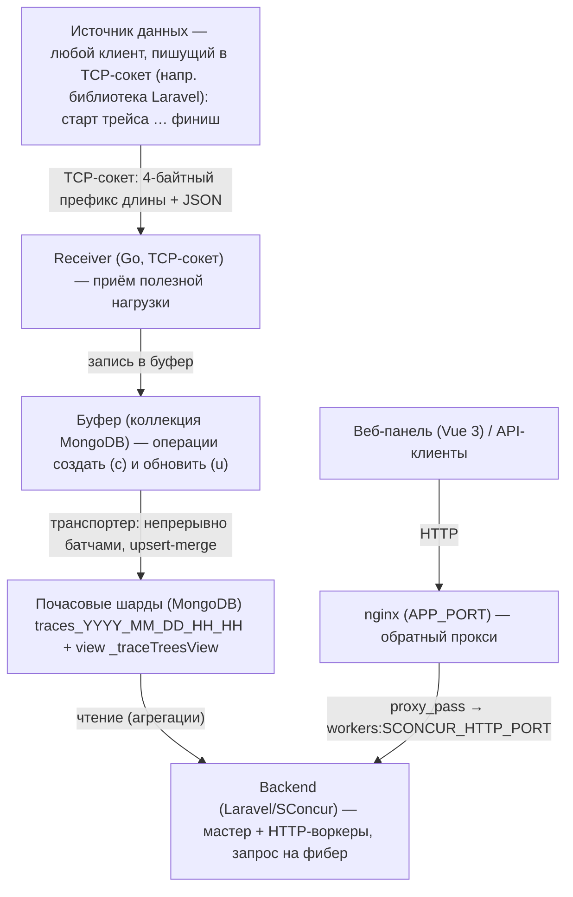

[English](README.md) | **Русский**

# SLogger

SLogger — платформа observability для приёма, хранения и анализа трейсов и логов из ваших приложений и микросервисов.

Сервис собирает данные о выполнении кода (запросы, очереди, события, команды и любые пользовательские операции), складывает их в распределённое по времени хранилище и предоставляет веб-панель для поиска, построения дерева вызовов, гибкой фильтрации и графиков по показателям.

---

## Возможности

- Сбор трейсов и логов из любых приложений по простому сокет-протоколу (язык/стек источника не важен).
- Дерево вызовов — иерархия родитель → потомки с произвольной глубиной вложенности.
- Объединение запросов разных сервисов/микросервисов в одно сквозное дерево (distributed tracing).
- Гибкая фильтрация по любым полям полезной нагрузки трейса (`data`): числа, строки, булевы значения, проверка на наличие поля.
- Графики-таймлайны по показателям трейсов — количество, длительность, память, CPU — с агрегациями и той же фильтрацией, что и в поиске.
- Дашборд состояния хранилища — размеры коллекций, использование памяти и индексов.
- Дашборд рантайма — живые показатели HTTP-сервера SConcur: пул воркеров, RPS, CPU, память, запросы в обработке.
- Автоматическая очистка устаревших данных.

---

## Архитектура

### Поток данных



### Компоненты

- Backend — Laravel 12 / PHP 8.4 поверх [SConcur](https://github.com/sprust/sconcur) — конкурентного корутинного HTTP-рантайма, исполняющего каждый запрос в отдельном PHP-Fiber в рамках одного постоянно живущего процесса. Приложение держится в памяти между запросами, что убирает накладные расходы на бутстрап фреймворка и даёт высокую пропускную способность при приёме и чтении большого объёма трейсов. Тяжёлые параллельные запросы к шардам распараллеливаются через `SConcur\WaitGroup`. Подробнее — в разделе «Рантайм SConcur».
- sconcur-laravel — встроенный в репозиторий пакет (`packages/sconcur/sconcur-laravel/`, подключён как path-репозиторий), связывающий Laravel и SConcur: корутинно-скоупленное приложение, HTTP-воркер и артизан-команды `sconcur:*`.
- nginx — обратный прокси перед HTTP-воркерами; наружу публикуется только его порт (`APP_PORT`, по умолчанию 8097). Апстрим резолвится на каждый запрос, поэтому пересоздание контейнера воркеров не требует рестарта nginx.
- Receiver — отдельный Go-сервис (`servers/receiver/`), принимающий полезную нагрузку трейсов по TCP-сокету и складывающий её в буфер.
- Хранилища — MongoDB (трейсы/логи), MySQL (пользователи/сервисы/авторизация), RabbitMQ (очереди), Redis (кэш). Чтение и запись из HTTP-воркеров идут через неблокирующие драйверы Mongo и MySQL из SConcur.
- Frontend — Vue 3 + Vite + TypeScript (`frontend/`).

Бизнес-логика разнесена по модулям в `app/Modules/<ModuleName>/` со строгим разделением слоёв (Deptrac).

---

## Техническое исполнение

### Рантайм SConcur: запрос на фибер

Backend работает не под php-fpm и не под Octane. HTTP-запросы обслуживает SConcur — корутинный рантайм, в котором каждый запрос выполняется в собственном PHP-Fiber внутри одного постоянно живущего процесса:

- Мастер и воркеры. `sconcur:servers:master:start` (поднимается supervisor'ом в контейнере `workers`) — супервизор пулов воркеров: спавнит `SCONCUR_HTTP_WORKER_COUNT` процессов как `php artisan sconcur:servers:http:start --masterPid=N`, перезапускает упавшие и зависшие, отдаёт телеметрию через панель. Пул — это элемент списка `groups` в конфиге мастера, и один мастер супервизит несколько непохожих пулов под одним локом и одним журналом; здесь их три: `http`, `rabbitmq` и `tasks`. Все его воркеры слушают один порт через `SO_REUSEPORT`, поэтому nginx проксирует на них, ничего не зная о пуле. Одиночный воркер можно поднять и standalone — той же командой `sconcur:servers:http:start`. У `sconcur:servers:master:status` и `:reload` есть необязательный `--group=NAME` — действовать на один пул вместо всех.
- Корутинно-скоупленное приложение. При конкурентных фиберах модель Octane (клон приложения + своп глобального контейнера) небезопасна: соседние запросы видели бы состояние друг друга. Поэтому в `bootstrap/app.php` создаётся `SConcur\Laravel\Foundation\AsyncApplication` — drop-in наследник `Illuminate\Foundation\Application`, переносящий per-request состояние в контекст корутины: `request`, `auth`, `session`, `cookie`, оверлей конфига (`config()->set`), текущий маршрут, локаль, `View::share`, `defer`. Включать нечего и определять нечего: адаптеры ставятся в любом процессе, а вне корутины у каждого один вызывающий — то же, чем являются штатные реализации.
- Неблокирующий I/O. MongoDB идёт через драйвер SConcur напрямую (`Model::sconcur()`), а MySQL — через Laravel-соединение `sconcur_mysql`: обычное соединение, запросы которого исполняются в Go-расширении вместо PDO, поэтому Eloquent и query builder работают как обычно, а фибер, ожидающий базу, отдаёт процесс другим запросам. Это просто то, что названо в `DB_CONNECTION`: вне корутины те же вызовы синхронны, поэтому никто не выбирает соединение в рантайме, и миграции идут через него же. PDO-соединение `mysql` остаётся в конфиге для того немногого, чему нужна настоящая ручка (`db:dump` зовёт `mysqldump`, а драйвер очереди `database` спрашивает у PDO имя и версию). Там, где одному запросу нужно сразу несколько обращений к шардам, они выполняются параллельно через `SConcur\WaitGroup` (поиск, графики, построение дерева).
- Про транзакции — только для PDO-соединения. На обычном `mysql` внутри открытой транзакции нельзя ничего, что переключает корутину: не только await, но и `WaitGroup`, вытесняющее переключение или `Fiber::suspend()` внутри вызванного пакета — блокирующее PDO-соединение общее на процесс, и следующая корутина окажется внутри твоей транзакции. На `sconcur_mysql` это не действует: Go-сторона закрепляет транзакцию за отдельным физическим соединением, а уровень вложенности живёт в контексте корутины, поэтому конкурентные транзакции друг друга не видят, а открытая внутри другой в неё вкладывается.
- Очереди на том же рантайме. `QUEUE_CONNECTION` — `sconcur_rabbitmq`: драйвер очереди Laravel поверх AMQP-фичи SConcur, а читает очереди пул консьюмеров — ещё одна группа того же мастера. Один процесс держит все четыре очереди сразу (`default`, `trace-tree`, `traces-clearing`, `slogger`) с корутиной на доставку, и сколько корутин достаётся каждой, задают веса `SCONCUR_RABBITMQ_DEFAULT_CONSUMERS`, `QUEUE_TRACE_TREE_WORKERS_COUNT`, `SCONCUR_RABBITMQ_CLEANER_CONSUMERS` и `SLOGGER_DISPATCHER_QUEUE_WORKERS_COUNT`. Медленная джоба стоит одного сообщения, а не воркера. Формат на проводе — тот, что пишет `vladimir-yuldashev/laravel-queue-rabbitmq`: то же тело, те же свойства сообщения, тот же заголовок `laravel.attempts`, — поэтому джоба, отправленная любым из двух драйверов, читается и выполняется другим. `SendTracesJob` несёт собственные `$tries` и `$backoff`, и значения самой джобы старше пуловых. Подробности — `packages/sconcur/sconcur-laravel/README.md`.

- Периодические задачи на том же рантайме. Крон и монитор динамических индексов — две задачи одного пула корутин, группа `tasks` того же мастера (`sconcur:tasks:start`, ровно один воркер: второй тикал бы ту же минуту второй раз). Задача реализует только `tick()` — одну порцию работы, — а цикл, паузы, обработку исключений и остановку берёт на себя пул. Родной `sleep()` заморозил бы весь процесс, поэтому пауза идёт через `Sleeper` и усыпляет только свою корутину: пока монитор строит индекс в Mongo, крон продолжает тикать. Управление — `sconcur:tasks:stop [--task=]` и `sconcur:tasks:restart [--task=]`: команда кладётся в кэш, поэтому пулом можно управлять из другого контейнера, не зная его pid. `cron:start` и `trace-dynamic-indexes:monitor:start` поднимают одну задачу отдельно. Телеметрию пул шлёт сам — Go-стороны, которая делает это у остальных воркеров, у него нет, — поэтому у группы `tasks` в панели есть CPU, RSS и колонки In-flight / Handled / Refused, посчитанные по тикам. Подробности — `packages/sconcur/sconcur-laravel/docs/task-pool.ru.md`.

Подробности про мост и контекст корутины — в `packages/sconcur/sconcur-laravel/README.md` и его `docs/`.

### Дашборд рантайма (статистика SConcur)

Телеметрия мастера (`SCONCUR_HTTP_PANEL_PORT`, доступ по `SCONCUR_HTTP_ADMIN_TOKEN`) опрашивается бэкендом и выводится на вкладке дашборда «Sconcur»: суммарные показатели мастера (воркеры, зависшие воркеры, CPU, RSS, горутины, запросы в обработке и завершённые, средняя длительность), разбивка по группам, разбивка по воркерам с указанием группы каждого и график со скользящим окном в 5 минут — по умолчанию RPS и CPU. Пул, потребляющий очередь брокера, отчитывается доставками, а не запросами: его счётчики (доставлено, подтверждено, отклонено, в обработке) занимают в строке место запросных и добавляют свои метрики на график; HTTP-пул эту секцию не отдаёт. RPS считается на клиенте по дельте завершённых запросов между опросами. Если адрес панели или токен не настроены либо мастер не поднят, вкладка показывает рантайм как недоступный, а не падает с ошибкой.

### Почасовое шардирование БД

Трейсы хранятся не в одной коллекции, а в периодических коллекциях-шардах с разбивкой по часам:

```
traces_YYYY_MM_DD_HH_HH      пример: traces_2026_06_21_14_15  (час 14:00–15:00)
```

При первом обращении к конкретному часу шард создаётся по требованию, на нём заводится набор базовых индексов: `sid` (сервис), `tid` (трейс), `ptid` (родитель), `tp` (тип), `st` (статус), теги, `lat` (время логирования), а также составные индексы. Имена активных шардов кэшируются в памяти.

Почасовая нарезка даёт три преимущества:

1. Запросы за период читают только нужные шарды. Поиск за последний час не сканирует данные недельной давности — он обращается к одной-двум коллекциям вместо одной большой.
2. Удаление старых данных — это удаление целых коллекций. Очистка не выполняет дорогой `delete` по миллионам документов, а дропает шарды, которые вышли за период хранения (см. «Автоочистка»). Это быстро и не нагружает БД.
3. Динамические индексы живут вместе со своими шардами и удаляются вместе с ними, не накапливаясь бесконечно (см. «Автоиндексирование под запрос»).

Поверх всех шардов MongoDB создаётся объединяющее представление `_traceTreesView` — оно сводит все периодические коллекции в один логический набор и добавляет к каждому документу имя его коллекции. Через это представление строится дерево вызовов, даже если родитель и потомки попали в разные часовые шарды.

### Буфер → запись в шард

Приём и запись разделены, чтобы выдерживать всплески нагрузки:

1. Приём. Receiver принимает полезную нагрузку по TCP и кладёт её в буферную коллекцию MongoDB как набор операций двух видов: создать (`c`) и обновить (`u`). Пакет из сообщения пишется одним неупорядоченным `InsertMany`, а не вызовом на каждый трейс.
2. Транспортировка. Фоновый транспортер непрерывно забирает из буфера батчи (до ~1000 записей в порядке FIFO) и записывает их в соответствующие часовые шарды. Пауза в одну секунду берётся только когда буфер пуст (или после ошибки чтения), затем проверка повторяется.
3. Слияние (upsert-merge). Запись в шард выполняется как `upsert` по ключу сервис + трейс: операции создать и обновить одного и того же трейса сливаются в один итоговый документ.
4. Надёжность. После успешной записи запись удаляется из буфера; при ошибке помечается на повтор (с ограничением числа попыток).

Буфер сглаживает пики: клиент отдаёт данные быстро и не ждёт записи в основное хранилище.

Конкурентность в receiver'е ограничена, а не безгранична: одновременно обрабатывается не больше 512 сообщений, а в транспортере параллельно идёт не больше 64 записей в шарды. При достижении лимита следующее чтение из сокета просто откладывается — backpressure доходит до отправителя, вместо того чтобы процесс накапливал многогигабайтный бэклог, а транспортер не отбирает у приёма соединения к Mongo.

### Таймлайн трейса: старт отдельно → финиш отдельно

Трейс может писаться в два этапа, когда в момент старта операции её итог ещё неизвестен (типичный случай для трейса-родителя):

1. Старт — отправляется объект создания трейса:
   - присваивается `traceId` и фиксируется `parentTraceId` (текущий родитель из контекста);
   - `status = started`, `duration = null` (длительность ещё неизвестна);
   - фиксируются тип, теги, данные, время логирования, моментальные значения памяти и CPU;
   - запущенный трейс становится текущим родителем — все трейсы, стартовавшие до его финиша, автоматически становятся его потомками.

2. Финиш — отправляется объект обновления того же трейса:
   - проставляется итоговый `status` (`success` / `failed` / пользовательский);
   - заполняется `duration` (фактическая длительность);
   - обновляются память и CPU, при необходимости дополняются теги и данные;
   - предыдущий родитель восстанавливается из стека.

На стороне хранилища создание и финиш сливаются в один документ (upsert по `tid`). Такой двухэтапный механизм формирует таймлайн вложенных операций: по связке родитель → потомок и по времени старта/длительности восстанавливается, что и в какой последовательности выполнялось внутри запроса, какие операции вложены друг в друга и сколько каждая заняла. Незавершённые трейсы (есть старт, но нет финиша) видны со статусом `started` — это позволяет ловить зависшие или упавшие без финиша операции.

Обновление не обязательно. Два этапа — это лишь один из сценариев, а не требование. Трейс можно записать одним сообщением создания — например, когда это не родитель, а единичная операция, итог которой известен сразу (запрос в БД, HTTP-вызов наружу, отправка письма и т. п.). В этом случае в создании сразу указываются финальные `status`, `duration`, `memory`, `cpu`, а обновление не отправляется вовсе. Точно так же необязателен и `ptid`: трейс без родителя — это корневой трейс (вершина дерева). То есть минимально достаточно одного объекта создания с заполненными полями; родитель и/или последующее обновление добавляются только тогда, когда они действительно нужны.

### Объединение запросов разных сервисов/микросервисов

Связь родитель → потомок строится по идентификаторам `parentTraceId` / `traceId` и не привязана к конкретному сервису. Если сервис A при запуске операции передаёт свой `traceId` сервису B как родительский, то трейсы сервиса B встанут в дерево как потомки трейса сервиса A.

Так формируется сквозное (end-to-end) дерево вызовов через границы микросервисов: один HTTP-запрос на входе может развернуться в цепочку обращений к нескольким сервисам, и всё это собирается в единое дерево через `_traceTreesView`. Поиск, дерево и графики могут фильтроваться сразу по нескольким сервисам (`serviceIds`) — или строиться без привязки к сервису вовсе.

### Автоиндексирование под запрос (динамические индексы)

Трейсы фильтруются по произвольным полям `data`, и заранее проиндексировать все возможные комбинации полей невозможно. Поэтому индексы создаются автоматически под конкретный запрос:

- перед поиском система анализирует набор фильтров (сервисы, типы, теги, статусы, диапазоны длительности/памяти/CPU, произвольные поля `data`) и определяет нужный набор полей индекса;
- если подходящего индекса ещё нет — он создаётся (асинхронно, с отметкой «в процессе»), а запрос дожидается его готовности;
- следующие такие же запросы используют уже готовый индекс и выполняются быстро.

Почему именно динамические, а не постоянные индексы: индексы занимают место на диске и замедляют запись, поэтому держать индекс под каждое мыслимое поле `data` дорого и расточительно. Динамические индексы делаются короткоживущими (TTL порядка нескольких дней — сейчас 5) и автоматически удаляются, когда перестают использоваться. Здесь снова работает почасовое шардирование: индекс привязан к своим шардам и уходит вместе с ними при очистке, не накапливаясь бесконечно. В итоге быстрый поиск по произвольным полям сочетается с экономией места — система платит за индекс только пока он реально нужен.

### Гибкая фильтрация по данным трейса

Фильтровать можно по любому полю полезной нагрузки, включая вложенные (`user.id`, `request.path` и т.п.):

- числа — `=`, `≠`, `>`, `≥`, `<`, `≤`;
- строки — равно, содержит, начинается с, заканчивается на;
- булевы — `true` / `false`;
- наличие поля — есть значение / отсутствует.

Эти фильтры собираются в aggregation pipeline MongoDB и работают вместе с базовыми фильтрами (сервис, тип, теги, статус, диапазоны длительности/памяти/CPU, период времени). Под выбранный набор полей автоматически поднимается динамический индекс.

### Графики по показателям трейсов

Помимо постраничного поиска, по трейсам строятся таймлайн-графики. Выбирается период (от 5 минут до года) и шаг (гранулярность корзины), данные раскладываются по временным интервалам, и в каждом интервале считаются показатели:

- количество трейсов (`count`, агрегация — сумма);
- длительность (`duration`);
- память (`memory`);
- CPU (`cpu`).

Для длительности/памяти/CPU считаются среднее, минимум и максимум. Дополнительно можно строить графики по числовым полям из `data`. К графикам применяется тот же набор фильтров, что и к поиску, поэтому можно смотреть динамику показателей по конкретному сервису, типу операции, тегу или произвольному условию по данным. Сбор по интервалам распараллеливается, что позволяет быстро строить графики даже на больших периодах.

### Автоочистка

Устаревшие трейсы удаляются автоматически. Период хранения задаётся переменной `TRACES_LIFETIME_DAYS` (по умолчанию 3 дня). Очистка оформлена как job в очереди (`ClearTracesJob`) и, благодаря почасовому шардированию, дропает целые коллекции-шарды, вышедшие за период хранения, вместо удаления отдельных документов. Это быстро, не фрагментирует хранилище и заодно убирает связанные с этими шардами динамические индексы.

---

## Технологический стек

- PHP 8.4, Laravel 12, стиль PSR-12 (PHP CS Fixer)
- SConcur — конкурентный корутинный HTTP-рантайм (постоянно работающее приложение) и встроенный мост `sconcur/sconcur-laravel`
- nginx — обратный прокси перед HTTP-воркерами
- MongoDB (`mongodb/laravel-mongodb`, неблокирующий драйвер SConcur) — трейсы и логи
- MySQL — пользователи, сервисы, авторизация
- RabbitMQ — очереди; Redis — кэш
- Go — сервис-приёмник трейсов (`servers/receiver/`)
- Vue 3 + Vite + TypeScript — веб-панель
- Статический анализ: PHPStan; границы слоёв: Deptrac

---

## Источник данных и формат

SLogger не привязан к конкретному клиенту. Источником данных может быть любое приложение на любом языке, умеющее писать в TCP-сокет receiver'а. Набор данных универсален — важно лишь, чтобы полезная нагрузка соответствовала ожидаемому формату.

Для приложений на Laravel есть готовая библиотека, которая берёт на себя старт/финиш трейсов, проброс родительского контекста (в том числе между сервисами), буферизацию и отправку данных:

slogger/laravel → https://github.com/sprust/slogger-laravel

Это лишь один из возможных источников — точно так же данные может слать ваш собственный клиент, реализующий протокол ниже.

### Протокол сокета

Обмен идёт по TCP. Каждое сообщение в обе стороны передаётся с 4-байтовым префиксом длины (big-endian `uint32`), за которым следует тело (UTF-8 JSON). Максимальный размер тела — 10 МБ.

1. Авторизация. Сразу после подключения клиент отправляет сообщение с API-токеном сервиса:

   ```json
   { "t": "<api_token>" }
   ```

   Токен определяет, к какому сервису относятся трейсы (создаётся через `make art c=service:create`). Сервер отвечает `ok` либо текстом ошибки.

2. Отправка трейсов. Далее в рамках того же соединения клиент в цикле шлёт сообщения с трейсами; на каждое сервер отвечает `received`.

Соединение долгоживущее: сервер не закрывает его на простое, поэтому клиент может держать авторизованный сокет открытым между всплесками трейсов и не переподключаться. Таймаут чтения (30 с) начинает действовать только с момента прихода первого байта сообщения и покрывает остаток префикса длины и тело — отправитель, зависший в середине сообщения, всё равно не удержит соединение навсегда. Пропавшие без закрытия сокета клиенты отсекаются TCP keep-alive (30 с).

### Формат сообщения с трейсами

Сообщение содержит два необязательных поля — пакет создаваемых трейсов (`c`) и пакет обновлений (`u`). Значения `c` и `u` — это JSON-строки (сериализованные массивы объектов), а не вложенные массивы:

```json
{
  "c": "[ <создаваемые трейсы> ]",
  "u": "[ <обновления трейсов> ]"
}
```

Создаваемый трейс (этап «старт»):

```json
{
  "tid":  "9f1c…",          // ID трейса (обязательно)
  "ptid": "0b8a…",          // ID родительского трейса (опционально; связывает в дерево, в т.ч. между сервисами)
  "tp":   "request",        // тип операции (request, job, command, event, …)
  "st":   "started",        // статус
  "tgs":  ["api", "v2"],    // теги (массив)
  "dt":   { "path": "/x" }, // произвольные данные (только JSON, любая структура)
  "dur":  null,             // длительность (на старте обычно ещё неизвестна)
  "mem":  41.5,             // память, % (опционально)
  "cpu":  12.3,             // CPU, % (опционально)
  "lat":  "2026-06-21 14:00:00.000000"  // время логирования
}
```

Обновление трейса (этап «финиш»):

```json
{
  "tid":  "9f1c…",          // тот же ID трейса
  "st":   "success",        // итоговый статус (success / failed / пользовательский)
  "tgs":  ["api", "v2"],    // теги — перезаписывают существующие, если присутствуют (не дополняют)
  "dt":   { "code": 200 },  // данные (JSON) — перезаписывают существующие, если присутствуют (не дополняют)
  "dur":  0.137,            // фактическая длительность
  "mem":  43.1,             // память, %
  "cpu":  15.0,             // CPU, %
  "plat": "2026-06-21 14:00:00.000000"  // время логирования родителя
}
```

Поля намеренно короткие (`tid`, `ptid`, `tp`, …) — это снижает объём передаваемых и хранимых данных.

Слияние создания и обновления. На стороне receiver'а создание и обновление с одинаковым `tid` сливаются в один документ (см. «Буфер → запись в шард» и «Таймлайн трейса»). При этом обновление перезаписывает поля (`st`, `tgs`, `dt`, `dur`, `mem`, `cpu`), а не дополняет их — но только те, что фактически присутствуют в обновлении; отсутствующие поля остаются из создания. Порядок применения значения каждого поля: обновление → уже сохранённый документ → создание. Поэтому если обновление зафиксировалось в хранилище раньше создания, приоритетными считаются данные из обновления: пришедшее позже создание не затрёт их, а лишь дозаполнит недостающие поля (например, тип `tp`).

---

## Установка

### Копирование env-файлов

```bash
make env-copy
```

### Настройка переменных окружения

`.env`:

```dotenv
APP_ENV=production        # или local
APP_DEBUG=false           # true для local

# по умолчанию выставлен root-пользователь
# узнать user id и group id в linux: `id -u` и `id -g`
DOCKER_USER_ID=1000
DOCKER_GROUP_ID=1000

APP_PORT=8097             # внешний порт nginx перед HTTP-воркерами SConcur

FRONTEND_DOCKER_COMMAND=${FRONTEND_DOCKER_SERVER_COMMAND}  # или ${FRONTEND_DOCKER_LOCAL_COMMAND}
FRONTEND_DOCKER_PORT=3075                                  # внешний порт веб-панели

TRACES_LIFETIME_DAYS=3    # срок хранения трейсов в днях

# HTTP-рантайм SConcur (полный набор параметров — в .env.example)
SCONCUR_HTTP_WORKER_COUNT=1    # число HTTP-воркеров (0 = по числу ядер)
SCONCUR_HTTP_PORT=28080        # внутренний порт, который слушают воркеры (апстрим nginx)
SCONCUR_HTTP_PANEL_PORT=28081  # панель телеметрии мастера (0 = выкл)
SCONCUR_HTTP_ADMIN_TOKEN=      # bearer-токен панели; пусто = панель выключена, дашборда рантайма нет
SCONCUR_PANEL_HOST=http://workers:28081/api/stats  # URL статистики панели со стороны приложения
```

`frontend/.env`:

```dotenv
BACKEND_URL=http://localhost:8097  # nginx перед SConcur HTTP-сервером; порт см. в .env → APP_PORT
```

### Setup

```bash
make setup
```

### Создание пользователя

```bash
make art c=user:create
```

### Создание сервиса

```bash
make art c=service:create
```

### Команды рантайма

```bash
make sconcur-status   # статус PHP-расширения sconcur
make sconcur-restart  # остановить мастер; supervisor поднимет его заново уже на новом коде
make sconcur-update   # обновить sconcur/sconcur: require → пересборка образа → dump-autoload → пересоздание контейнеров
make deploy-prod      # pull, пересборка, установка зависимостей, миграции, сборка receiver'а и фронтенда
```

Расширение `sconcur.so` вшивается в образ по `composer.lock`, поэтому `vendor/` и расширение нужно приводить в соответствие до того, как на них стартует хоть один долгоживущий процесс. Поэтому и в деплое, и в обновлении сначала собирается образ, из него ставятся зависимости и только потом пересоздаются контейнеры — старые продолжают обслуживать запросы до самой замены.

### OpenAPI-схема

```text
storage/api/json-schemes/traces-api-openapi-scheme.json   # API приёма/чтения трейсов
storage/api/json-schemes/admin-api-openapi-scheme.json    # API веб-панели (поиск, дерево, графики, дашборды)
```
