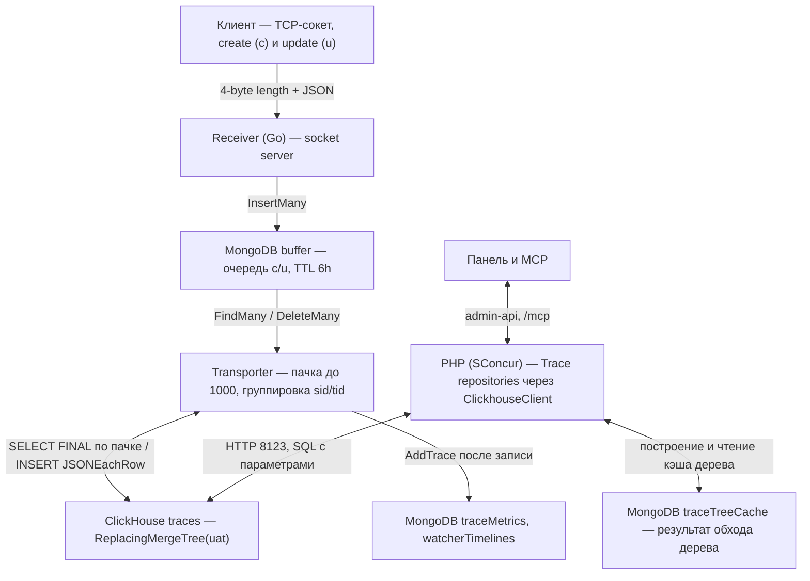
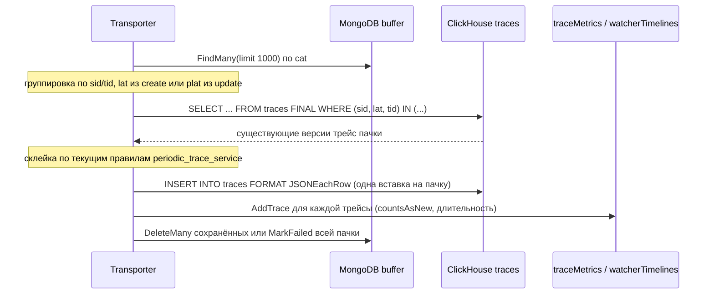
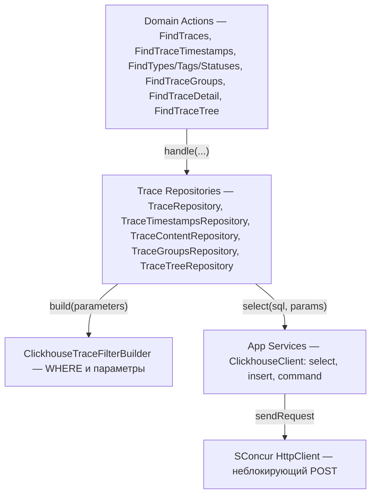

## Context

Мотивация — в `proposal.md`. Здесь описано, как трейсы движутся сейчас и что в этом пути меняется.

Сейчас:

- Receiver кладёт create и update в `buffer` (MongoDB). Транспортёр читает до 1000 записей, группирует их по сервису и трейсу и на каждую трейсу делает `FindOne{sid,tid}`, склейку и upsert в коллекцию `traces_YYYY_MM_DD_HH_HH` по часу `lat` (`periodic_trace_service`). Параллельно идёт не больше 64 сохранений. Новую коллекцию, её индексы и view `_traceTreesView` создаёт receiver (`trace_sharding_service`).
- После записи receiver по склеенной трейсе считает `traceMetrics` (`countsAsNew`) и корзины `watcherTimelines`. Для этого нужно знать, какой трейса была до записи.
- PHP обходит коллекции периода через `PeriodicTraceService`. Перед поиском, графиками и фасетами `TraceDynamicIndexInitializer` требует составной индекс по фильтруемым полям. Если индекса нет, запрос отвечает `412`, и его повторяют.
- `ClearTracesJob` раз в час удаляет коллекции старше `TRACES_LIFETIME_DAYS`.

Ограничения:

- PHP работает под SConcur: блокирующий I/O недопустим. Неблокирующий HTTP-клиент есть (`SConcur\Features\HttpClient\HttpClient`), драйвера ClickHouse нет.
- У receiver нет клиента ClickHouse в `go.mod`.
- `plat` в update по протоколу равен `lat` его create. Ради этого его и ввели: update, сохранённый раньше create, попадает в тот же час.

## Goals / Non-Goals

**Goals:**

- Одна таблица трейсов в ClickHouse, запись из receiver и чтение из PHP. Сущности и DTO, которые получает `Domain`, не меняются.
- Склейка create и update даёт тот же документ, что сейчас, с тем же приоритетом полей.
- Поиск, графики и фасеты отвечают сразу, без индексов под фильтр.

**Non-Goals:**

- Перенос `buffer`, `invalidBuffer`, `traceMetrics`, `watcherTimelines`, кэша дерева и прочих коллекций из MongoDB.
- Перенос трейсов, которые уже лежат в MongoDB, и их удаление: база `tracesPeriodic` остаётся нетронутой.
- Профилирование: receiver его не пишет (`pr` всегда пуст). Эндпоинт `/profiling` остаётся и отвечает `404`, как сейчас для любой трейсы.

## Decisions

### 1. Общая схема



Меняются только стрелки к ClickHouse. `buffer`, `traceMetrics`, `watcherTimelines` и кэш дерева остаются там, где были.

### 2. Таблица

```sql
CREATE TABLE traces
(
    sid    UInt32,
    tid    String,
    ptid   String,                         -- '' вместо null
    tp     LowCardinality(String),         -- '__UNKNOWN', пока не пришёл create
    st     LowCardinality(String),
    tgs    Array(LowCardinality(String)),
    dt     JSON(max_dynamic_paths = 1024), -- для фильтров и агрегаций
    dt_raw String CODEC(ZSTD(3)),          -- для показа: порядок ключей и значения как пришли
    dur    Nullable(Float64),
    mem    Nullable(Float64),
    cpu    Nullable(Float64),
    lat    DateTime64(6, 'UTC'),
    cat    DateTime64(6, 'UTC'),
    uat    DateTime64(6, 'UTC'),

    INDEX tid_bf  tid  TYPE bloom_filter(0.01) GRANULARITY 1,
    INDEX ptid_bf ptid TYPE bloom_filter(0.01) GRANULARITY 1,
    INDEX tgs_bf  tgs  TYPE bloom_filter(0.01) GRANULARITY 1,
    INDEX tp_set  tp   TYPE set(1000)          GRANULARITY 4,
    INDEX st_set  st   TYPE set(100)           GRANULARITY 4,
    INDEX dur_mm  dur  TYPE minmax             GRANULARITY 4
)
ENGINE = ReplacingMergeTree(uat)
PARTITION BY toStartOfHour(lat)
ORDER BY (sid, lat, tid)
```

- **Одна таблица вместо коллекции на час.** В MongoDB шарды давали три вещи: чтение только нужных часов, дешёвое удаление и то, что динамические индексы умирают вместе со своим шардом. В ClickHouse первое даёт ключ сортировки и minmax по `lat` в каждой части, второе — удаление партиции, а третье не нужно. Вместе с шардами уходят `_traceTreesView`, поиск коллекции по `tid`, `tss.*` и батчи `$unionWith`.
- **`ORDER BY (sid, lat, tid)`, а не `(sid, tid)`.** В `ReplacingMergeTree` ключ сортировки — это и ключ склейки. Нужен ключ, который неизменен у трейсы и совпадает у create и update: `lat` такой, потому что update несёт `plat`. Основные запросы (список, графики, группы) фильтруют по `sid` и диапазону `lat`, и с этим ключом они читают узкий диапазон первичного индекса. `(sid, tid)` им не помогал бы. Детальной по `tid` не помог бы ни тот, ни другой ключ: `sid` там неизвестен, её обслуживает bloom-фильтр.
- **Партиция — час.** Партиция в ClickHouse управляет удалением: удалить дёшево можно только её целиком, поэтому точность срока хранения равна размеру партиции. Часовая партиция даёт срок в часах (`TRACES_LIFETIME_HOURS`). Цена — больше частей: пачка, где есть update старых трейс, пишет по части в каждый задетый час. На нашем потоке это единицы частей на вставку. При 72 часах партиций 72; к пределу разумного (порядка тысячи) подходит срок около 40 суток.
- **`dt` хранится дважды.** `JSON` выводит типы, переупорядочивает ключи и не хранит `null`. Для показа `dt_raw` отдаёт ровно то, что прислали. Если корень `dt` не объект, в `dt` пишется `{}`, а значение остаётся только в `dt_raw`.
- **Теги — массив строк** (`tgs.nm` в MongoDB). `hasAll(tgs, …)` даёт то же «трейса несёт каждый тег».

Альтернатива: хранить create и update отдельными строками и склеивать при чтении (`argMaxIf` по правилам). Отклонена: тогда каждый фильтр по `st`, `dur` или `dt` применяется после `GROUP BY (sid, tid)`, то есть к каждому запросу списка и графиков. И receiver перестаёт знать, какой трейса была до записи.

### 3. Запись: склейка в транспортёре



- Вместо 1000 `FindOne` и 1000 upsert — один `SELECT` и один `INSERT` на проход. Семафор на 64 сохранения больше не нужен.
- Правила приоритета полей и тесты `periodic_trace_service` остаются. Меняется источник «существующего документа»: вместо `bson.M` из `FindOne` — строка из `SELECT`, где `dt` приходит как `dt_raw`.
- `cat` берётся из существующей строки, а для новой трейсы — текущее время (сейчас это `$setOnInsert`). `uat` — время записи, оно же версия `ReplacingMergeTree`.
- Вставка синхронная, без `async_insert`: следующий проход должен видеть результат предыдущего. Проходов — несколько в секунду, вставка одна на проход, поэтому мелких частей не больше, чем сейчас.
- Ошибка `SELECT` или `INSERT` помечает неудачной всю пачку (`MarkFailed`, `att + 1`), как сейчас помечается упавшая трейса. После 5 попыток записи уходят в `invalidBuffer`.
- Клиент — HTTP-интерфейс ClickHouse (`POST /?query=…`, basic auth, gzip тела), новый пакет `internal/repositories/clickhouse_trace_repository`. Отдельной Go-библиотеки не нужно: `JSONEachRow` одинаков для записи из Go и чтения из PHP.
- `dt` в receiver хранится как `bson.D`. Для `dt_raw` нужен сериализатор `bson.D`/`bson.A` → JSON с сохранением порядка ключей.
- Удаляются `trace_sharding_service`, почасовые коллекции и view.

### 4. Чтение: клиент и репозитории PHP



- `ClickhouseClient` в `app/Services/Clickhouse` поверх `HttpClient`: `select` (ответ `JSONEachRow` читается построчно), `command` (DDL миграций) и `ClickhouseQueryException` с кодом из `X-ClickHouse-Exception-Code`. Значения передаются только параметрами `{name:Type}` / `param_<name>`. Каждый запрос получает `query_id` с префиксом сценария — по нему его видно в `system.query_log`.
- Репозитории остаются теми же классами с теми же публичными методами и DTO. Поэтому `Domain` и `Infrastructure` не меняются, кроме удаления индексов. Интерфейсы и вторая реализация не заводятся: замена, а не флаг.
- Удаляются `PeriodicTraceService`, `PeriodicTraceCollectionNameService`, `TraceTimestampCollectionBatcher`, `TracePipelineBuilder` и `TraceMetricAggregationFactory`. Их роль берут `ClickhouseTraceFilterBuilder` и SQL в самих репозиториях.

Как сценарии ложатся на SQL:

| Сценарий | Запрос |
|---|---|
| Список | `SELECT … FROM traces FINAL WHERE … ORDER BY lat DESC, tid LIMIT … OFFSET …` |
| Графики | `GROUP BY toStartOfInterval(lat, INTERVAL …)` (для `m` — `toStartOfMonth`), `count()`, `avg`, `min`, `max`, `quantiles(0.5, 0.95, 0.99)` |
| Фасеты | `GROUP BY tp` / `arrayJoin(tgs)` / `GROUP BY st`, `count()`, поиск — `positionCaseInsensitive` |
| Группы и сравнение | `GROUP BY sid, tp, st, toStartOfHour` / `toStartOfTenMinutes`, `quantile(0.95)(dur)`, `argMax(tid, dur)` |
| Диапазон данных | `SELECT min(lat), max(lat) FROM traces` |
| Детальная | `WHERE tid = {tid} ORDER BY uat DESC LIMIT 1` без `FINAL`, `dt_raw` → `TraceDataToObjectBuilder` |
| Дерево | родитель: `SELECT ptid WHERE tid = …`, дети: `WHERE ptid IN {ids:Array(String)}` пачками по 1000, узлы: `WHERE tid IN …` |

Кэш дерева (`traceTreeCache`, `BuildTraceTreeCacheJob`) не меняется: обход идёт через `TraceTreeRepository`, а результат, как и раньше, пишется в MongoDB.

### 5. Фильтр по `data`

| Условие | SQL |
|---|---|
| число `= != > >= < <=` | `accurateCastOrNull(dt.<path>, 'Float64') <op> {v:Float64}` |
| строка `=`, contains, starts, ends | `dt.<path>.:String = / position / startsWith / endsWith` |
| строка `!=` | `dt.<path>.:String != {v}` и поле есть — отсутствующее поле не ответ, как сейчас |
| bool | `dt.<path>.:Bool = {v:Bool}` |
| exists / missing | `JSONHas(dt_raw, 'a', 'b')` / `NOT JSONHas(...)` |
| is null / is not null | `JSONType(dt_raw, 'a', 'b') = 'Null'` / `!=` |

- Числа сравниваются через приведение: `JSON` выводит `Int64` или `Float64` по значению, а сейчас в MongoDB все числа — `float64`. Строка по тому же пути не совпадёт с числовым условием, как и в MongoDB.
- `null` и отсутствие поля `JSON` не различает, поэтому эти четыре условия идут через `dt_raw`. Они разбирают строку на каждой строке периода и медленнее остальных, но задаются редко.
- Путь подставляется в SQL (параметром его не передать), поэтому сначала проверяется по белому списку `[A-Za-z0-9_]` и точки.
- Пути через массивы объектов: MongoDB обходит массив сам, в ClickHouse нужен `arrayExists(x -> …, dt.items[].price)`. `ClickhouseDataPathTypes` раз в 5 минут читает `distinctJSONPathsAndTypes(dt)` на выборке за последние сутки и кэширует результат в Redis. По нему построитель решает, где в пути массив. `distinctJSONPathsAndTypes` видит массивы объектов только на верхнем уровне `dt`, поэтому массив внутри массива не обходится.
- Значение по пути — `Dynamic`: число берётся только из `Int64`/`UInt64`/`Float64` (`dynamicType`), строка и bool — через `dynamicElement`. `accurateCastOrNull` строки `"500"` в число не допускается: MongoDB такую строку числовому условию не отдавала.
- `JSONType(dt_raw, …)` для отсутствующего ключа тоже отвечает `Null`, поэтому «is null» — это `JSONHas(…) AND JSONType(…) = 'Null'`.
- Строковое значение сравнивается как текст (`position`, `startsWith`, `endsWith`), как и в MongoDB, где оно уходило в `$regex` через `preg_quote`.
- Запрет «теги вместе с `data`» снимается: он был ограничением индексов MongoDB (одно поле-массив на индекс).

### 6. Динамические индексы удаляются

Удаляются:
- `TraceDynamicIndexInitializer` и его исключения;
- реестр `traceDynamicIndexes`, репозиторий и модель;
- actions построения, удаления и flush;
- таски `BuildTraceDynamicIndexesTask` и `PublishTraceDynamicIndexStatsTask`;
- команды `trace-dynamic-indexes:monitor:start` и `trace-dynamic-indexes:flush`;
- broadcast'ы, `TraceDynamicIndexController` и маршруты `/admin-api/dynamic-indexes`;
- ответ `412` в `app/Exceptions/Handler.php`;
- в MCP — `GetTraceIndexStatusTool`, `GetTraceIndexesTool`, бриджи индексов, `McpTraceIndexExceptionTranslator` и `McpToolFormatter::indexBuilding`;
- во фронтенде — диалог `dynamic-indexes`, ожидание индекса в `PendingRequestDialog` и `pendingRequestStore`.

Коллекция `traceDynamicIndexes` удаляется миграцией. Строки `Purpose` в `openspec/specs/mcp-trace-queries` и `openspec/specs/mcp-tools` упоминают динамические индексы. Delta их не меняет, поэтому их правят напрямую при архивации. Задача в пуле `tasks` исчезает из `config/sconcur.php`.

### 6a. MCP без индексов

Правило периода держалось на индексах: выравнивание по часам — чтобы индекс переиспользовался, 24 часа — чтобы не строить его по многим коллекциям. Теперь оба ограничения ничего не защищают (требования — в `specs/mcp-trace-queries`):

- `McpTracePeriodResolver` не выравнивает границы. Предел `MAX_HOURS = 24` заменяется сроком хранения `TRACES_LIFETIME_HOURS` из конфигурации Cleaner, и текст `period_too_wide` его называет.
- `aggregate_traces` принимает `data_filter` и разбирает его тем же `McpTraceDataFilterParser`, что `search_traces`. Бридж `FindMcpTraceGroupsAction` передаёт фильтр в `TraceFindGroupsParameters`.
- `resources/mcp/instructions.md`: удаляются правила про индексы, `index_building`, `get_trace_indexes` и `get_trace_index_status`. Правило «at most 24 hours, rounded to whole hours» заменяется на «at most the retention period, exact bounds». Добавляется, что `aggregate_traces` принимает `data_filter`.
- Описания инструментов в их `McpToolSchema` и подсказка `period_too_wide` («сузить период по группам `aggregate_traces` по часам») правятся под новое правило.

### 7. Очистка

Остаётся `ClearTracesJob` раз в час и страница Trace cleaner. `DeleteCollectionsAction` становится удалением партиций: `ALTER TABLE traces DROP PARTITION` для часов старше `TRACES_LIFETIME_HOURS` (по умолчанию 72) — так же, как сейчас удаляются часовые коллекции. `TRACES_LIFETIME_DAYS` удаляется из `config/cleaner.php` и `.env.example`. Число строк перед удалением берётся из `system.parts`. В `ProcessObject` поле `clearedCollectionsCount` считает партиции: API и страница не меняются.

TTL в DDL не используется: он зашил бы срок в схему, а сейчас срок — переменная окружения.

### 8. Dashboard

`DatabaseStatRepository` добавляет базу `clickhouse` в тех же объектах (`DatabaseStatObject` → `DatabaseCollectionStatObject`):
- размер и число строк — из `system.parts` (`active`);
- индексы — skip-индексы из `system.data_skipping_indices` с их размером;
- память — `MemoryTracking` из `system.metrics`.

Фронтенд и API не меняются.

### 9. Инфраструктура

- Сервис `clickhouse` в `docker-compose.yml` (LTS-образ, тег фиксируется при старте работ, не ниже 25.8), том, `ulimits nofile`, `mem_limit`, порт HTTP только внутри сети.
- `docker/clickhouse/config.d` и `users.d`: `max_server_memory_usage`, уменьшенные кэши, выключенные системные логи, кроме `query_log` с TTL 3 дня; профиль `max_memory_usage`, внешняя сортировка и группировка, `do_not_merge_across_partitions_select_final = 1`.
- Миграции ClickHouse: файлы `database/clickhouse/*.sql`, команда `clickhouse:migrate`, таблица `schema_migrations`. Запускается в `make setup` и `make deploy-prod` рядом с `migrate`.
- Переменные окружения:
  - PHP: `CLICKHOUSE_HOST`, `CLICKHOUSE_PORT`, `CLICKHOUSE_DATABASE`, `CLICKHOUSE_USERNAME`, `CLICKHOUSE_PASSWORD`, `CLICKHOUSE_MEM_LIMIT`;
  - receiver: `CLICKHOUSE_URL`, `CLICKHOUSE_DATABASE`, `CLICKHOUSE_USERNAME`, `CLICKHOUSE_PASSWORD`;
  - у receiver удаляется `MONGODB_DB_PERIODIC_TRACES`, у PHP — соединение `mongodb.tracesPeriodic`.
- `make clickhouse-client`.

### 10. Слои Deptrac

Репозитории `Trace` и `Dashboard` зависят от `app/Services/Clickhouse`. Этот путь не входит в `paths` Deptrac, как и `app/Services/Mongo` сейчас, поэтому правила слоёв не меняются. Новых связей между модулями нет.

## Risks / Trade-offs

- [Чтение `FINAL` перед каждой вставкой замедлит транспортёр] → в запросе известны `sid`, `lat` и `tid` каждой трейсы, так что это точечное чтение по первичному ключу. Время прохода мерится на стенде; если его не хватает, сначала пробуем `do_not_merge_across_partitions_select_final` и меньшую пачку.
- [Клиент шлёт update без `plat` или с неверным `plat`] → create и update получают разный `lat` и не склеиваются. Сейчас такой update попадает в чужой шард — дубль тот же, поведение не хуже.
- [`FINAL` в каждом запросе чтения] → `do_not_merge_across_partitions_select_final` и то, что склейка никогда не пересекает партицию. Если дорого, сравнить с чтением без `FINAL` и `LIMIT 1 BY (sid, tid)`.
- [Точечный поиск по `tid` без `sid` (детальная, цепочка до корня дерева до 100 шагов) идёт по bloom-фильтру всей таблицы] → замерить. Если медленно, добавить projection `ORDER BY tid` или `ptid` отдельной миграцией.
- [Фильтры по `data` в краевых случаях — массивы, смешанные типы по одному пути, `null` — разойдутся с MongoDB] → юнит-тесты построителя на каждое условие и сравнение ответов со вторым инстансом на одинаковом запросе.
- [Больше 1024 путей в `dt`] → лишние пути уходят в общий shared-столбец и фильтруются медленнее, но корректно. Число путей видно через `distinctJSONPathsAndTypes`; при необходимости лимит поднимается миграцией.
- [Ответ `HttpClient` грузится в память целиком] → проверить на дереве в 200 тыс. узлов. Выборки по `tid IN` идут пачками по 1000, так что ответ ограничен.
- [Трейсы из MongoDB после перехода недоступны] → принято. Они и так живут 3 дня, а сравнение идёт со вторым инстансом.

## Migration Plan

1. Поднять `clickhouse`, выполнить `clickhouse:migrate`.
2. Выкатить receiver и PHP одновременно (`make deploy-prod`). С этого момента трейсы пишутся и читаются только в ClickHouse.
3. Миграция MongoDB удаляет `traceDynamicIndexes`. База `tracesPeriodic` (коллекции `traces_*`, их индексы и `_traceTreesView`) остаётся как есть: код её больше не читает, Cleaner её не чистит. Что с ней делать, решается отдельно, вне этого change.
4. Сравнить со вторым инстансом SLogger на этой машине (`../slogger.back`, контейнеры `sl-*`): память и диск (`docker stats`, `system.parts` против `$collStats`), время списка, графиков, фасетов, детальной и дерева на одинаковых запросах.

Откат — прежняя версия receiver и PHP. Данные, записанные в ClickHouse, при откате не возвращаются в MongoDB.

## Open Questions

- Кто шлёт трейсы в этот инстанс (`sl-ch-*`) и совпадает ли поток со вторым (`sl-*`)? От этого зависит, сравниваем ли мы на одинаковых данных или только порядок величин. На схему и задачи не влияет.
- Точный тег образа ClickHouse — фиксируется при старте работ.
