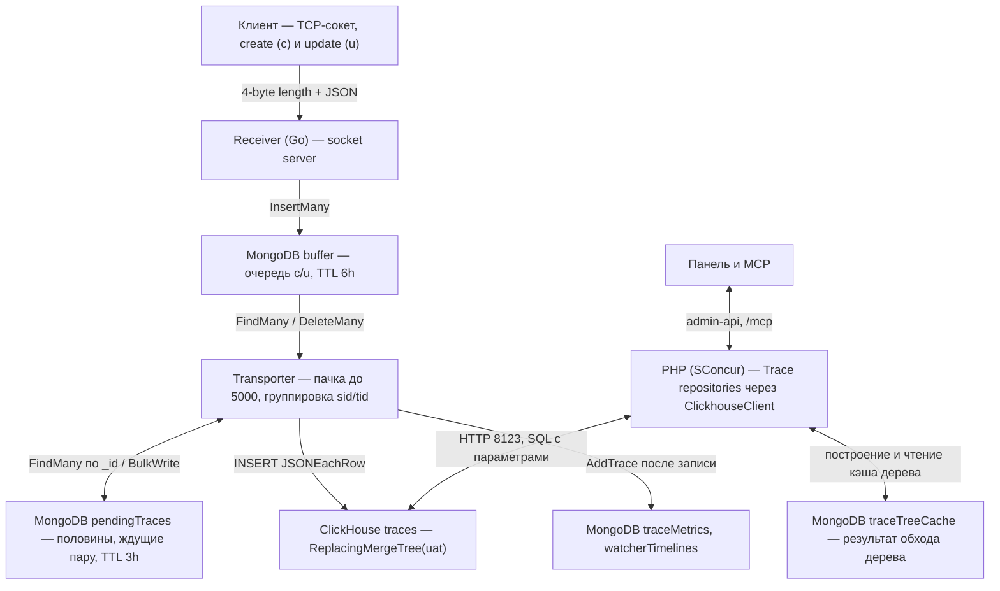
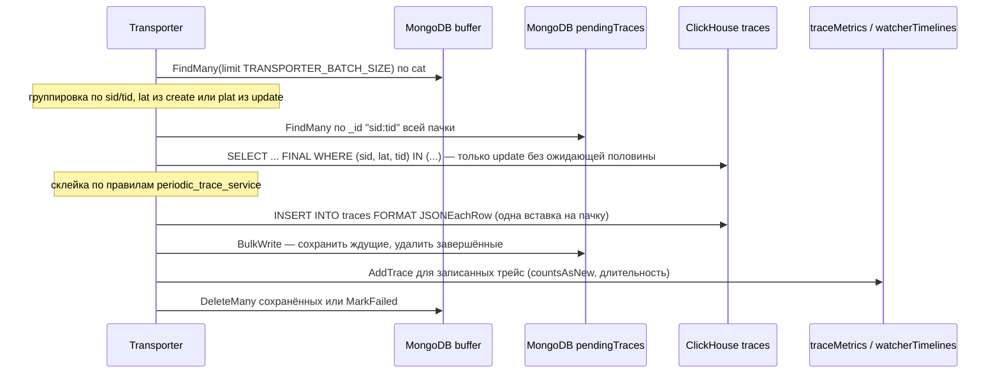
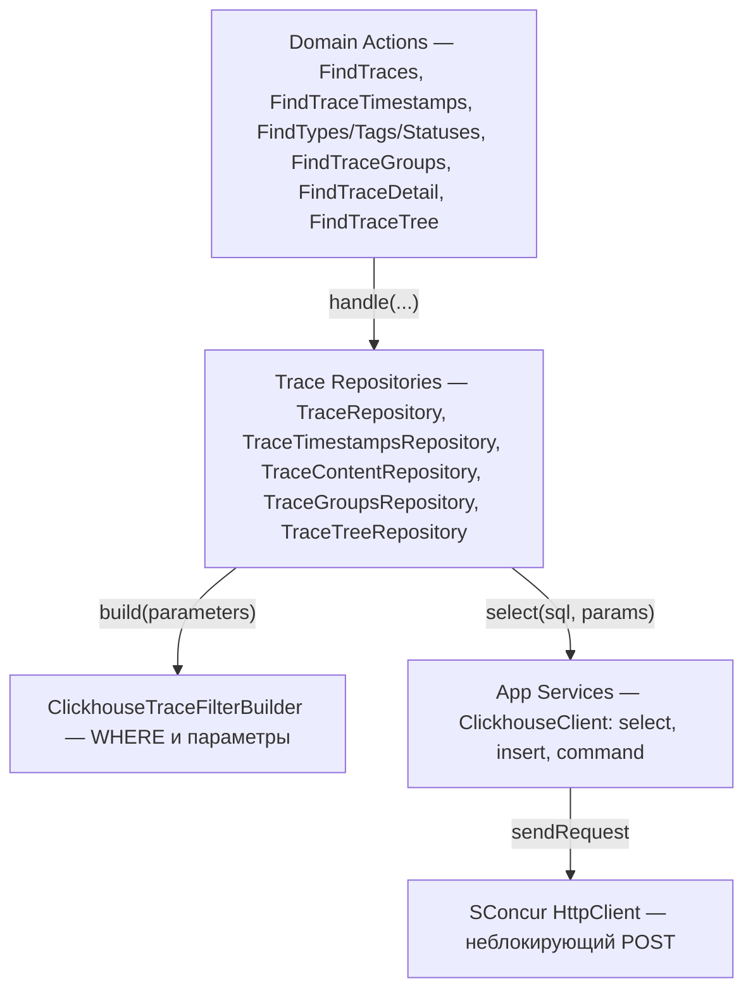

## Context

Мотивация — в `proposal.md`. Здесь описано, как трейсы движутся сейчас и что в этом пути меняется.

Сейчас:

- Receiver кладёт create и update в `buffer` (MongoDB). Транспортёр читает до 1000 записей, группирует их по сервису и трейсу и на каждую трейсу делает `FindOne{sid,tid}`, склейку и upsert в коллекцию `traces_YYYY_MM_DD_HH_HH` по часу `lat` (`periodic_trace_service`). Параллельно идёт не больше 64 сохранений. Новую коллекцию, её индексы и view `_traceTreesView` создаёт receiver (`trace_sharding_service`).
- После записи receiver по склеенной трейсе считает `traceMetrics` (`countsAsNew`) и корзины `watcherTimelines`. Для этого нужно знать, какой трейса была до записи.
- PHP обходит коллекции периода через `PeriodicTraceService`. Перед поиском, графиками и фасетами `TraceDynamicIndexInitializer` требует составной индекс по фильтруемым полям. Если индекса нет, запрос отвечает `412`, и его повторяют.
- `ClearTracesJob` раз в час удаляет коллекции старше `TRACES_LIFETIME_DAYS`.

Ограничения:

- PHP работает под SConcur: блокирующий I/O недопустим. Неблокирующий HTTP-клиент есть (`SConcur\Features\HttpClient\HttpClient`), драйвера ClickHouse нет.
- У receiver нет клиента ClickHouse в `go.mod`.
- `plat` в update по протоколу равен `lat` его create. Ради этого его и ввели: update, сохранённый раньше create, попадает в тот же час.

## Goals / Non-Goals

**Goals:**

- Одна таблица трейсов в ClickHouse, запись из receiver и чтение из PHP. Сущности и DTO, которые получает `Domain`, не меняются.
- Склейка create и update даёт тот же документ, что сейчас, с тем же приоритетом полей.
- Поиск, графики и фасеты отвечают сразу, без индексов под фильтр.

**Non-Goals:**

- Перенос `buffer`, `invalidBuffer`, `traceMetrics`, `watcherTimelines`, кэша дерева и прочих коллекций из MongoDB.
- Перенос трейсов, которые уже лежат в MongoDB, и их удаление: база `tracesPeriodic` остаётся нетронутой.
- Профилирование: receiver его не пишет (`pr` всегда пуст). Эндпоинт `/profiling` остаётся и отвечает `404`, как сейчас для любой трейсы.

## Decisions

### 1. Общая схема



Меняются стрелки к ClickHouse и добавляется `pendingTraces`. `buffer`, `traceMetrics`, `watcherTimelines` и кэш дерева остаются там, где были.

### 2. Таблица

```sql
CREATE TABLE traces
(
    sid    UInt32,
    tid    String,
    ptid   String,                         -- '' вместо null
    tp     LowCardinality(String),
    st     LowCardinality(String),
    tgs    Array(LowCardinality(String)),
    dt     JSON(max_dynamic_paths = 256, SKIP REGEXP '^cache\\.'), -- для фильтров и агрегаций
    dt_raw String CODEC(ZSTD(3)),          -- для показа: порядок ключей и значения как пришли
    dur    Nullable(Float64),
    mem    Nullable(Float64),
    cpu    Nullable(Float64),
    lat    DateTime64(6, 'UTC'),
    cat    DateTime64(6, 'UTC'),
    uat    DateTime64(6, 'UTC'),

    INDEX tid_bf  tid  TYPE bloom_filter(0.01) GRANULARITY 1,
    INDEX ptid_bf ptid TYPE bloom_filter(0.01) GRANULARITY 1,
    INDEX tgs_bf  tgs  TYPE bloom_filter(0.01) GRANULARITY 1,
    INDEX tp_set  tp   TYPE set(1000)          GRANULARITY 4,
    INDEX st_set  st   TYPE set(100)           GRANULARITY 4,
    INDEX dur_mm  dur  TYPE minmax             GRANULARITY 4
)
ENGINE = ReplacingMergeTree(uat)
PARTITION BY toStartOfHour(lat)
ORDER BY (sid, lat, tid)
```

- **Одна таблица вместо коллекции на час.** В MongoDB шарды давали три вещи: чтение только нужных часов, дешёвое удаление и то, что динамические индексы умирают вместе со своим шардом. В ClickHouse первое даёт ключ сортировки и minmax по `lat` в каждой части, второе — удаление партиции, а третье не нужно. Вместе с шардами уходят `_traceTreesView`, поиск коллекции по `tid`, `tss.*` и батчи `$unionWith`.
- **`ORDER BY (sid, lat, tid)`, а не `(sid, tid)`.** В `ReplacingMergeTree` ключ сортировки — это и ключ склейки. Нужен ключ, который неизменен у трейсы и совпадает у create и update: `lat` такой, потому что update несёт `plat`. Основные запросы (список, графики, группы) фильтруют по `sid` и диапазону `lat`, и с этим ключом они читают узкий диапазон первичного индекса. `(sid, tid)` им не помогал бы. Детальной по `tid` не помог бы ни тот, ни другой ключ: `sid` там неизвестен, её обслуживает bloom-фильтр.
- **Партиция — час.** Партиция в ClickHouse управляет удалением: удалить дёшево можно только её целиком, поэтому точность срока хранения равна размеру партиции. Часовая партиция даёт срок в часах (`TRACES_LIFETIME_HOURS`). Цена — больше частей: пачка, где есть update старых трейс, пишет по части в каждый задетый час. На нашем потоке это единицы частей на вставку. При 72 часах партиций 72; к пределу разумного (порядка тысячи) подходит срок около 40 суток.
- **`dt` хранится дважды.** `JSON` выводит типы, переупорядочивает ключи и не хранит `null`. Для показа `dt_raw` отдаёт ровно то, что прислали. Если корень `dt` не объект, в `dt` пишется `{}`, а значение остаётся только в `dt_raw`.
- **`dt`: 256 путей и без `cache.*`.** Каждый динамический путь `JSON` — отдельный подстолбец из нескольких файлов в wide-части, и слияние держит буферы на каждый. `CacheWatcher` пишет запись под её ключом (`cache.<ключ>.value`), и ключи кэша приложения (пользователи, товары, корзины) давали до 1024 путей на часть: в стресс-тесте 12 тысяч файлов в части на 21 МБ и до 1.3 ГБ памяти на её слияние. Пути сверх 256 уходят в общий shared-столбец и фильтруются медленнее, но корректно. `cache.*` в `dt` не пишется: запись кэша ищется по тегу с её ключом и показывается из `dt_raw`.
- **Теги — массив строк** (`tgs.nm` в MongoDB). `hasAll(tgs, …)` даёт то же «трейса несёт каждый тег».

Альтернатива: хранить create и update отдельными строками и склеивать при чтении (`argMaxIf` по правилам). Отклонена: тогда каждый фильтр по `st`, `dur` или `dt` применяется после `GROUP BY (sid, tid)`, то есть к каждому запросу списка и графиков. И receiver перестаёт знать, какой трейса была до записи.

### 3. Запись: склейка в транспортёре



- Вторую половину трейсы транспортёр ищет в `pendingTraces`, а не в ClickHouse. Первый вариант — один `SELECT … FINAL … IN (ключи пачки)` на проход — в стресс-тесте читал до 380 тыс. строк на пачку из 1000: ключи разбросаны по часу, каждый попадает в свою гранулу, и цена росла с размером партиции. Скорость падала с 5 до 2.5 тыс. трейс в секунду. Точечное чтение MongoDB по `_id` от размера таблицы не зависит.
- Исход трейсы в пачке:
  - финальная (есть тип и update либо статус не `started`) — вставляется, её документ в `pendingTraces` удаляется. Дети, задачи и create вместе с update в одной пачке `pendingTraces` не касаются — это около 90% трейс;
  - create, ждущий update, — вставляется, чтобы быть видным как `started`, и сохраняется в `pendingTraces`;
  - update без create — только сохраняется в `pendingTraces`: показать его не с чем, у него нет типа и тегов. В ClickHouse больше не бывает строк `__UNKNOWN`.
- ClickHouse читается только для update, не нашедшего ожидающей половины: create был финальным, или трейса ждала дольше TTL `pendingTraces` (3 часа, долгий job). Это единицы на пачку.
- Строка, записанная раньше (create со `started`), не удаляется: её вытесняет строка с большим `uat` при слиянии частей, а до слияния чтение идёт через `FINAL`. Пакетный lightweight `DELETE` на проход пробовали: это мутация на проход, и на потоке 12 тыс. трейс в секунду они заняли весь фоновый пул, слияния встали, частей стало 1700, ClickHouse упёрся в память. Дубли конечны за счёт ежечасного слияния закрытых часов (раздел 7a).
- Правила приоритета полей и тесты `periodic_trace_service` остаются. Источник «сохранённой половины» — документ `pendingTraces` или строка из `SELECT`, где `dt` приходит как `dt_raw`.
- `cat` берётся из сохранённой половины, а для новой трейсы — текущее время (сейчас это `$setOnInsert`). `uat` — время записи, оно же версия `ReplacingMergeTree`.
- Пачка — до `TRANSPORTER_BATCH_SIZE` записей (по умолчанию 5000), вставка одна на пачку: меньше крупных вставок — меньше частей, которые ClickHouse потом сливает.
- Ошибки:
  - недоступность хранилища — сеть, таймаут, коды ClickHouse 159, 202, 209, 210, 241, 242, 252 (таймаут, число запросов, сокет, память, read-only, число частей) — не тратит попытки: пачка ждёт и повторяется как есть, пауза удваивается от 1 до 30 секунд. Иначе 5 попыток сгорают за секунды перезапуска ClickHouse, и пачки уходят в `invalidBuffer` (в стресс-тесте так ушли 10% трейс);
  - прочие ошибки пачки помечают её неудачной (`MarkFailed`, `att + 1`), как раньше; после 5 попыток записи уходят в `invalidBuffer`.
  - `errs.Err` сохраняет только текст ошибки, поэтому недоступность распознаётся по тексту.
- `pendingTraces`: документ на сервис и трейсу, `_id` = `"<sid>:<tid>"`, склеенное на сейчас состояние и `hu` (был ли update). TTL-индекс `uat_1` на 3 часа по времени последней записи. Коллекцию и индекс создаёт Laravel-миграция, как у `buffer`: receiver, создававший индекс при первом подключении, терял его, когда коллекцию удаляли под ним (`migrate:fresh`).
- Клиент — HTTP-интерфейс ClickHouse (`POST /?query=…`, basic auth, gzip тела), пакет `internal/repositories/clickhouse_trace_repository`. Отдельной Go-библиотеки не нужно: `JSONEachRow` одинаков для записи из Go и чтения из PHP.
- `dt` в receiver хранится как `bson.D`. Для `dt_raw` нужен сериализатор `bson.D`/`bson.A` → JSON с сохранением порядка ключей.
- Удаляются `trace_sharding_service`, почасовые коллекции и view.

### 4. Чтение: клиент и репозитории PHP



- `ClickhouseClient` в `app/Services/Clickhouse` поверх `HttpClient`: `select` (ответ `JSONEachRow` читается построчно), `command` (DDL миграций) и `ClickhouseQueryException` с кодом из `X-ClickHouse-Exception-Code`. Значения передаются только параметрами `{name:Type}` / `param_<name>`. Каждый запрос получает `query_id` с префиксом сценария — по нему его видно в `system.query_log`.
- Репозитории остаются теми же классами с теми же публичными методами и DTO. Поэтому `Domain` и `Infrastructure` не меняются, кроме удаления индексов. Интерфейсы и вторая реализация не заводятся: замена, а не флаг.
- Удаляются `PeriodicTraceService`, `PeriodicTraceCollectionNameService`, `TraceTimestampCollectionBatcher`, `TracePipelineBuilder` и `TraceMetricAggregationFactory`. Их роль берут `ClickhouseTraceFilterBuilder` и SQL в самих репозиториях.

Как сценарии ложатся на SQL:

| Сценарий | Запрос |
|---|---|
| Список | `SELECT … FROM traces FINAL WHERE … ORDER BY lat DESC, tid LIMIT … OFFSET …` |
| Графики | `GROUP BY toStartOfInterval(lat, INTERVAL …)` (для `m` — `toStartOfMonth`), `count()`, `avg`, `min`, `max`, `quantiles(0.5, 0.95, 0.99)` |
| Фасеты | `GROUP BY tp` / `arrayJoin(tgs)` / `GROUP BY st`, `count()`, поиск — `positionCaseInsensitive` |
| Группы и сравнение | `GROUP BY sid, tp, st, toStartOfHour` / `toStartOfTenMinutes`, `quantile(0.95)(dur)`, `argMax(tid, dur)` |
| Диапазон данных | `SELECT min(lat), max(lat) FROM traces` |
| Детальная | `WHERE tid = {tid} ORDER BY uat DESC LIMIT 1` без `FINAL`, `dt_raw` → `TraceDataToObjectBuilder` |
| Дерево | родитель: `SELECT ptid WHERE tid = …`, дети: `WHERE ptid IN {ids:Array(String)}` пачками по 1000, узлы: `WHERE tid IN …` |

Кэш дерева (`traceTreeCache`, `BuildTraceTreeCacheJob`) не меняется: обход идёт через `TraceTreeRepository`, а результат, как и раньше, пишется в MongoDB.

### 5. Фильтр по `data`

| Условие | SQL |
|---|---|
| число `= != > >= < <=` | `accurateCastOrNull(dt.<path>, 'Float64') <op> {v:Float64}` |
| строка `=`, contains, starts, ends | `dt.<path>.:String = / position / startsWith / endsWith` |
| строка `!=` | `dt.<path>.:String != {v}` и поле есть — отсутствующее поле не ответ, как сейчас |
| bool | `dt.<path>.:Bool = {v:Bool}` |
| exists / missing | `JSONHas(dt_raw, 'a', 'b')` / `NOT JSONHas(...)` |
| is null / is not null | `JSONType(dt_raw, 'a', 'b') = 'Null'` / `!=` |

- Числа сравниваются через приведение: `JSON` выводит `Int64` или `Float64` по значению, а сейчас в MongoDB все числа — `float64`. Строка по тому же пути не совпадёт с числовым условием, как и в MongoDB.
- `null` и отсутствие поля `JSON` не различает, поэтому эти четыре условия идут через `dt_raw`. Они разбирают строку на каждой строке периода и медленнее остальных, но задаются редко.
- Путь подставляется в SQL (параметром его не передать), поэтому сначала проверяется по белому списку `[A-Za-z0-9_]` и точки.
- Пути через массивы объектов: MongoDB обходит массив сам, в ClickHouse нужен `arrayExists(x -> …, dt.items[].price)`. `ClickhouseDataPathTypes` раз в 5 минут читает `distinctJSONPathsAndTypes(dt)` на выборке за последние сутки и кэширует результат в Redis. По нему построитель решает, где в пути массив. `distinctJSONPathsAndTypes` видит массивы объектов только на верхнем уровне `dt`, поэтому массив внутри массива не обходится.
- Массив скаляров хранится под типом его элементов (`Array(Nullable(String))`, `Array(Nullable(Int64))`, `UInt64`, `Float64`, `Bool`) или как `Array(Dynamic)`, если элементы разные. Построитель читает каждый вариант через `dynamicElement`, приводит к `Array(Dynamic)` и проверяет условие через `arrayExists` — как MongoDB, который сам обходил такой массив. Ограничения «два массива на индекс» в ClickHouse нет: индексов под фильтр нет, условия по нескольким массивам и тегам проверяются в одном `WHERE`.
- Значение по пути — `Dynamic`: число берётся только из `Int64`/`UInt64`/`Float64` (`dynamicType`), строка и bool — через `dynamicElement`. `accurateCastOrNull` строки `"500"` в число не допускается: MongoDB такую строку числовому условию не отдавала.
- `JSONType(dt_raw, …)` для отсутствующего ключа тоже отвечает `Null`, поэтому «is null» — это `JSONHas(…) AND JSONType(…) = 'Null'`.
- Строковое значение сравнивается как текст (`position`, `startsWith`, `endsWith`), как и в MongoDB, где оно уходило в `$regex` через `preg_quote`.
- Запрет «теги вместе с `data`» снимается: он был ограничением индексов MongoDB (одно поле-массив на индекс).

### 6. Динамические индексы удаляются

Удаляются:
- `TraceDynamicIndexInitializer` и его исключения;
- реестр `traceDynamicIndexes`, репозиторий и модель;
- actions построения, удаления и flush;
- таски `BuildTraceDynamicIndexesTask` и `PublishTraceDynamicIndexStatsTask`;
- команды `trace-dynamic-indexes:monitor:start` и `trace-dynamic-indexes:flush`;
- broadcast'ы, `TraceDynamicIndexController` и маршруты `/admin-api/dynamic-indexes`;
- ответ `412` в `app/Exceptions/Handler.php`;
- в MCP — `GetTraceIndexStatusTool`, `GetTraceIndexesTool`, бриджи индексов, `McpTraceIndexExceptionTranslator` и `McpToolFormatter::indexBuilding`;
- во фронтенде — диалог `dynamic-indexes`, ожидание индекса в `PendingRequestDialog` и `pendingRequestStore`.

Коллекции `traceDynamicIndexes` больше нет: её миграция создания удалена вместе с остальными миграциями удалённых фич (раздел 9). Строки `Purpose` в `openspec/specs/mcp-trace-queries` и `openspec/specs/mcp-tools` упоминают динамические индексы. Delta их не меняет, поэтому их правят напрямую при архивации. Задача в пуле `tasks` исчезает из `config/sconcur.php`.

### 6a. MCP без индексов

Правило периода держалось на индексах: выравнивание по часам — чтобы индекс переиспользовался, 24 часа — чтобы не строить его по многим коллекциям. Теперь оба ограничения ничего не защищают (требования — в `specs/mcp-trace-queries`):

- `McpTracePeriodResolver` не выравнивает границы. Предел `MAX_HOURS = 24` заменяется сроком хранения `TRACES_LIFETIME_HOURS` из конфигурации Cleaner, и текст `period_too_wide` его называет.
- `aggregate_traces` принимает `data_filter` и разбирает его тем же `McpTraceDataFilterParser`, что `search_traces`. Бридж `FindMcpTraceGroupsAction` передаёт фильтр в `TraceFindGroupsParameters`.
- `resources/mcp/instructions.md`: удаляются правила про индексы, `index_building`, `get_trace_indexes` и `get_trace_index_status`. Правило «at most 24 hours, rounded to whole hours» заменяется на «at most the retention period, exact bounds». Добавляется, что `aggregate_traces` принимает `data_filter`.
- Описания инструментов в их `McpToolSchema` и подсказка `period_too_wide` («сузить период по группам `aggregate_traces` по часам») правятся под новое правило.

### 7. Очистка

Остаётся `ClearTracesJob` раз в час и страница Trace cleaner. `DeleteCollectionsAction` становится удалением партиций: `ALTER TABLE traces DROP PARTITION` для часов старше `TRACES_LIFETIME_HOURS` (по умолчанию 72) — так же, как сейчас удаляются часовые коллекции. `TRACES_LIFETIME_DAYS` удаляется из `config/cleaner.php` и `.env.example`. Число строк перед удалением берётся из `system.parts`. В `ProcessObject` поле `clearedCollectionsCount` считает партиции: API и страница не меняются.

TTL в DDL не используется: он зашил бы срок в схему, а сейчас срок — переменная окружения.

### 7a. Ежечасное слияние закрытых часов

Фоновые слияния `ReplacingMergeTree` не обещают момента, когда две строки трейсы окажутся в одной части: час может так и остаться в нескольких частях. `OptimizeTracesJob` (модуль `Cleaner`, очередь `traces-clearing`, в 10 минут каждого часа) через `Cleaner\OptimizeTracesAction` → `Trace\OptimizePartitionsAction` → `TraceRepository::optimizePartitions` выполняет `OPTIMIZE TABLE traces PARTITION ID … FINAL` для каждого часа, закрытого больше часа назад и лежащего больше чем в одной части, по одной партиции за раз.

- Час ждёт ещё один, прежде чем его сливать: в него ещё приходят update долгих запросов и job'ов.
- Час в одной части пропускается, поэтому повторный запуск ничего не стоит, если в старый час не пришли запоздавшие трейсы. Если в партиции идёт фоновое слияние, `OPTIMIZE` пропускается без ошибки, и час берёт следующий запуск.
- Стоимость в стресс-тесте: час в 500 тыс. трейс — около 7 секунд и 0.8 ГБ памяти; 24 часа под потоком 12 тыс. трейс в секунду — 179 секунд, до 10 секунд на час, без ошибок.
- После слияния в часе одна строка на трейсу, и `FINAL` в нём нечего склеивать.

### 8. Dashboard

`DatabaseStatRepository` добавляет базу `clickhouse` в тех же объектах (`DatabaseStatObject` → `DatabaseCollectionStatObject`):
- размер и число строк — из `system.parts` (`active`);
- индексы — skip-индексы из `system.data_skipping_indices` с их размером;
- память — `MemoryTracking` из `system.metrics`.

Фронтенд и API не меняются.

### 9. Инфраструктура

- Сервис `clickhouse` в `docker-compose.yml` (LTS-образ, тег фиксируется при старте работ, не ниже 25.8), том, `ulimits nofile`, `mem_limit`, порт HTTP только внутри сети.
- `docker/clickhouse/config.d` и `users.d`:
  - `max_server_memory_usage` 5 ГБ при `CLICKHOUSE_MEM_LIMIT` 6g (пик своей памяти ClickHouse на прогоне 12 млн — 1.8 ГБ), уменьшенные кэши, выключенные системные логи, кроме `query_log` с TTL 1 день;
  - `background_pool_size` 4 (по умолчанию 16): слияния берут память пропорционально числу столбцов, и 16 сразу не оставляли её запросам. Пороги `merge_tree` в свободных слотах пула (`number_of_free_entries_in_pool_to_execute_mutation`, `…_to_execute_optimize_entire_partition`, `…_to_lower_max_size_of_merge`) — 4: больше, чем слотов (4 × 2), сервер не запускается;
  - профиль: `max_memory_usage`, внешняя сортировка и группировка, `do_not_merge_across_partitions_select_final = 1`, `log_queries_cut_to_length` 10000 — `query_log` хранит текст с подставленными параметрами, и запрос по тысячам ключей занимал бы в нём мегабайт.
- MongoDB: `--wiredTigerCacheSizeGB` по умолчанию 5 (было 10: под нагрузкой кэш растёт к этому пределу, а трейсы теперь в ClickHouse) и `--wiredTigerCollectionBlockCompressor zstd` для всех коллекций, в том числе созданных неявно первой записью: `buffer` под нагрузкой держит миллион трейс, а компрессор коллекции после создания не меняется. На прогоне 1 млн с кэшем 1 ГБ память MongoDB — до 653 МБ вместо 1.1 ГБ, пик диска — 124 МБ вместо 197 МБ, скорость та же.
- Миграции сжаты: одна миграция создания на таблицу или коллекцию, сразу в текущем состоянии, под существующим именем файла её создания. Миграции изменений (`add_*`, `reconcile_*`, `replace_*`, `relax_*`, `drop_*`, `rename_*`, `move_*`) и миграции удалённых фич (`trace_clearing_settings`, `traceDynamicIndexes`, коллекция `logs`) удалены. Внешний ключ `watchers.notification_channel_id` создаёт миграция `notification_channels`: таблица `watchers` создаётся раньше. Соединение `mongodb.logs` и `MONGO_DATABASE_LOGS` удалены: логи читаются с диска. Схема после `migrate:fresh` совпадает со схемой до сжатия.
- Миграции ClickHouse — обычные Laravel-миграции (`database/migrations`), DDL отправляется через `ClickhouseClient`: `migrate` применяет их вместе с остальными. Отдельной команды, каталога `database/clickhouse` и таблицы `schema_migrations` нет. Свой `migrate:fresh` удаляет таблицы ClickHouse вместе с коллекциями MongoDB, чтобы они не пережили таблицу `migrations`, и принимает `--force`.
- Переменные окружения:
  - PHP: `CLICKHOUSE_HOST`, `CLICKHOUSE_PORT`, `CLICKHOUSE_DATABASE`, `CLICKHOUSE_USERNAME`, `CLICKHOUSE_PASSWORD`, `CLICKHOUSE_MEM_LIMIT`;
  - receiver: `CLICKHOUSE_URL`, `CLICKHOUSE_DATABASE`, `CLICKHOUSE_USERNAME`, `CLICKHOUSE_PASSWORD`, `MONGODB_COLL_PENDING_TRACES` (по умолчанию `pendingTraces`), `TRANSPORTER_BATCH_SIZE` (по умолчанию 5000);
  - у receiver удаляется `MONGODB_DB_PERIODIC_TRACES`, у PHP — соединение `mongodb.tracesPeriodic`.
- `make clickhouse-client`.
- Генератор нагрузки `servers/receiver/cmd/loadgen`: шлёт деревья трейс всех типов вотчеров через сокет receiver, с долей «неудобных» (update раньше create, create дважды, create без update), следит за размером `buffer` и пишет прогресс в JSON.

### 10. Слои Deptrac

Репозитории `Trace` и `Dashboard` зависят от `app/Services/Clickhouse`. Этот путь не входит в `paths` Deptrac, как и `app/Services/Mongo` сейчас, поэтому правила слоёв не меняются. Межмодульная связь `Cleaner` → `Trace` (`ClearTracesAction` → `DeletePartitionsAction`, `OptimizeTracesAction` → `OptimizePartitionsAction`) записана в `.ai/README.md`.

## Risks / Trade-offs

- [Две строки у трейсы, записанной в два шага, до слияния частей] → чтение через `FINAL`, ежечасный `OPTIMIZE … FINAL` закрытых часов. `FINAL` из чтения поэтому не убирается.
- [`OPTIMIZE … FINAL` раз в час] → около 7 секунд и 0.8 ГБ на час в 500 тыс. трейс, по одной партиции. Если в этот момент система уже у лимита памяти, тяжёлый запрос панели может получить ошибку 241; запись её пережидает.
- [Update долгого job'а приходит позже TTL `pendingTraces`] → транспортёр читает трейсу из ClickHouse; update без create, пролежавший 3 часа, отбрасывается.
- [Трейсы, пришедшие, пока таблица `traces` пересоздаётся (`migrate:fresh`)] → код 60 не считается недоступностью, и после 5 попыток записи уходят в `invalidBuffer`: в стресс-тесте 106 собственных трейс панели за 6 секунд.
- [Клиент шлёт update без `plat` или с неверным `plat`] → create и update получают разный `lat` и не склеиваются. Сейчас такой update попадает в чужой шард — дубль тот же, поведение не хуже.
- [`FINAL` в каждом запросе чтения] → `do_not_merge_across_partitions_select_final` и то, что склейка никогда не пересекает партицию. Если дорого, сравнить с чтением без `FINAL` и `LIMIT 1 BY (sid, tid)`.
- [Точечный поиск по `tid` без `sid` (детальная, цепочка до корня дерева до 100 шагов) идёт по bloom-фильтру всей таблицы] → замерить. Если медленно, добавить projection `ORDER BY tid` или `ptid` отдельной миграцией.
- [Фильтры по `data` в краевых случаях — массивы, смешанные типы по одному пути, `null` — разойдутся с MongoDB] → юнит-тесты построителя на каждое условие.
- [Больше 256 путей в `dt`] → лишние пути уходят в общий shared-столбец и фильтруются медленнее, но корректно. Число путей видно через `distinctJSONPathsAndTypes`; при необходимости лимит поднимается миграцией.
- [Карта путей для фильтра по `data` строится в запросе пользователя раз в 5 минут] → после уменьшения числа путей холодное построение — 0.4 секунды (было 6). Перенос в фон — отдельная задача.
- [Ответ `HttpClient` грузится в память целиком] → проверено на дереве в 200 тыс. узлов: построение 56 секунд, воркеры до 362 МБ, страница детей 0.02–0.04 секунды.
- [Трейсы из MongoDB после перехода недоступны] → принято. Они и так живут 3 дня.

## Migration Plan

Переход не накатывается обновлением на работающий инстанс: версия с ClickHouse ставится начисто. Поэтому миграции не несут совместимости со старыми установками (раздел 9).

1. Поднять стек (`make setup`): `migrate` создаёт таблицы MySQL, коллекции MongoDB, таблицу `traces` в ClickHouse и коллекцию `pendingTraces`.
2. Старый инстанс с трейсами в MongoDB не обновляется. Его база `tracesPeriodic` этой версией не читается и не чистится.
3. Нагрузить приём и чтение `loadgen` на этом инстансе: 12 млн трейс за сутки, отказ ClickHouse посреди приёма, дерево в 200 тыс. узлов, время списка, графиков, фасетов, детальной и дерева. Сравнение со вторым инстансом (`../slogger.back`) заменено этим тестом. Результаты — в `.ai/plans/clickhouse-traces-prototype.md`, раздел «Результаты».

Отката как такового нет: прежний инстанс продолжает работать на прежней версии.

## Open Questions

Нет. Тег образа зафиксирован — `clickhouse/clickhouse-server:26.8.14.3`. Сравнение со вторым инстансом заменено стресс-тестом на этом (Migration Plan, п. 4).
